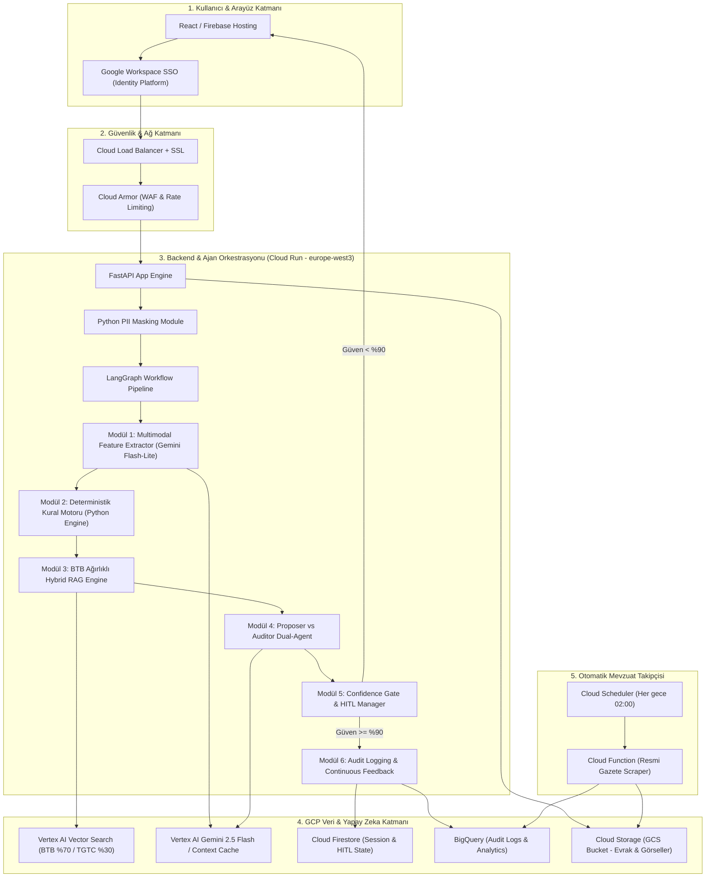

# 🏛️ GÜMRÜK TARİFE İSTATİSTİK POZİSYONU (GTİP) TESPİT VE KARAR DESTEK SİSTEMİ
## Uçtan Uca GCP Bulut Mimarisi, KVKK/Regülasyon Uyum Planı ve Google Workspace Ekosistem Stratejisi

---

## 1. YÖNETİCİ ÖZETİ VE SİSTEM VİZYONU

Bu doküman, Türk Gümrük Mevzuatı (TGTC), Genel Yorum Kuralları (GİR) ve Ticaret Bakanlığı emsal Bağlayıcı Tarife Bilgisi (BTB) kararlarını esas alarak 12 haneli **GTİP tespiti yapan yapay zeka destekli karar mekanizması** için uçtan uca mimari tasarımı sunmaktadır.

Sistem, yapay zekanın "uydurma" (hallucination) veya yanlış GTİP sallama riskini tamamen ortadan kaldıracak şekilde **Kıdemli Gümrük Müşavir Yardımcısı** mantığıyla kurgulanmıştır.

### 🌟 Ana Mimari İlkeler
1. **%100 Google Cloud Platform (GCP) Ekosistemi:** Sunucusuz (Serverless), yüksek ölçeklenebilir ve yönetilen servis altyapısı.
2. **Sıfır Uydurma Riskli Hibrit Karar Motoru:** Deterministik Python kural motoru + Vertex AI BTB Vektör Araması + LangGraph Çift Ajanlı Denetim.
3. **KVKK ve Regülasyon Tam Uyumu:** GCP Standart Sözleşmesi (SCC), KVKK bildirimi ve Gemini API öncesi Python tabanlı PII (Kişisel Veri) Maskeleme.
4. **Veri Lokasyonu ve Ultra Düşük Gecikme:** Türkiye omurgası için optimize edilmiş `europe-west3` (Frankfurt) sabit GCP bölgesi (~35 - 45 ms ping).
5. **Google Workspace Ekosistem Entegrasyonu:** Kurumsal SSO, Google Drive belge entegrasyonu, Google Chat bildirimleri ve Looker Studio analitik panoları.

---

## 2. REGÜLASYON, KVKK VE GÜVENLİK MİMARİSİ

Gümrük evrakları (Fatura, Çeki Listesi, Konşimento, Teknik Belge) şirket ticari sırları ile şahıs/firma verilerini içerir. KVKK uyarınca bu verilerin korunması ve yurt dışına aktarımı kritik önem taşır.

```text
[Kullanıcı Evrak Yükleme] 
       │
       ▼
[Cloud Run API (Python FastAPI)]
       │
       ├─► 1. PII Maskeleme Motoru (T.C. No, İsim, Telefon, Vergi No, Adres Maskelenir)
       │       │
       │       ▼
       ├─► 2. Anonimleştirilmiş Payload ──► Vertex AI Gemini API (europe-west3)
       │
       └─► 3. Orijinal Hassas Veriler ──► Şifrelenmiş Cloud Firestore (Kriptografik Anahtar ile Saklama)
```

### 🛡️ 2.1. KVKK Yurt Dışı Aktarımı ve Hukuki Uyum
* **Google Cloud SCC (Standart Sözleşme):** Google Cloud Enterprise Sözleşmesi kapsamında Veri İşleyen/Veri Sorumlusu **Standard Contractual Clauses (SCC)** dijital olarak imzalanır.
* **5 Günlük KVKK Bildirimi:** Standart sözleşmenin imzalanmasını müteakip 5 iş günü içerisinde Kişisel Verileri Koruma Kurumu'na (KVKK) resmi bildirim ve taahhütname sunulur.

### 🔒 2.2. Python Tabanlı Ön-İşleme (Pre-LLM PII Maskeleme Pipeline)
Veriler Vertex AI Gemini modellerine gönderilmeden önce Cloud Run üzerindeki Python servisinde yerel olarak işlenir ve hassas veriler maskelenir:

```python
# PII Maskeleme Örneği (Python Pipeline)
import re

def mask_pii_data(raw_text: str) -> str:
    # T.C. Kimlik No Maskeleme (11 Haneli Rakam)
    text = re.sub(r'\b[1-9]\d{10}\b', '[MASKED_TCKN]', raw_text)
    # E-posta Maskeleme
    text = re.sub(r'[\w\.-]+@[\w\.-]+\.\w+', '[MASKED_EMAIL]', text)
    # Telefon Maskeleme
    text = re.sub(r'(\+?90|0)?[ -]?\(?\d{3}\)?[ -]?\d{3}[ -]?\d{2}[ -]?\d{2}', '[MASKED_PHONE]', text)
    # Vergi Kimlik No (10 Haneli Rakam)
    text = re.sub(r'\b\d{10}\b', '[MASKED_VKN]', text)
    return text
```
* **Sonuç:** Gemini LLM modeli hiçbir zaman T.C. No, şahıs ismi, e-posta veya vergi numarası görmez; sadece ürünün teknik tanımını, gramajını, bileşimini ve fotoğrafını işler.

### 🌐 2.3. Bölge Seçimi ve Veri Yerleşimi (Data Residency)
* **Sabit GCP Bölgesi:** `europe-west3` (Frankfurt, Almanya)
* **Neden Frankfurt?**
  * **En Düşük Gecikme:** Türk Telekom ve Superonline fiber uluslararası çıkışları doğrudan Frankfurt omurgasına bağlıdır (~35-45 ms).
  * **Veri Uyum Hizalaması:** AB Veri Koruma Yönergeleri (GDPR) standartlarında en üst düzey güvenlik sertifikasyonuna sahiptir.
  * **Servis Eksiksizliği:** Vertex AI Vector Search, Gemini 2.5 Flash / Flash-Lite, Cloud Run, Firestore ve BigQuery servislerinin tamamı bu bölgede eksiksiz ve yüksek kullanılabilirlikle (Multi-AZ) mevcuttur.

---

## 3. UÇTAN UCA GCP SİSTEM MİMARİSİ

Sistem tamamen sunucusuz (Serverless) ve olay güdümlü (Event-Driven) bir GCP mimarisine dayanmaktadır.



---

## 4. MİMARİ MODÜLLER VE İŞLEYİŞ DETAYLARI

### 🧩 Modül 1: Multimodal Feature Extractor (Gemini Flash-Lite)
* **Amacı:** Görsel (GCS URI) ve serbest metin evraktan teknik verileri çıkarıp Pydantic JSON nesnesine dönüştürmek. **GTİP tahmini yapmaz.**
* **Pydantic Şeması:**
```python
from pydantic import BaseModel, Field
from typing import Optional, Dict, List

class ProductFeatures(BaseModel):
    product_name: str = Field(description="Ürünün ticari adı")
    primary_material: str = Field(description="Baskın malzeme: Pamuk, Plastik, Çelik vb.")
    composition_percentages: Optional[Dict[str, float]] = Field(description="Karışım oranları: {'cotton': 0.60, 'polyester': 0.40}")
    intended_use: str = Field(description="Kullanım amacı: Oyuncak, Kişisel Bakım vb.")
    is_set_or_kit: bool = Field(description="Ürün bir set/takım halinde mi?")
    is_disassembled: bool = Field(description="Ürün demonte/sökülmüş halde mi?")
    technical_specifications: Dict[str, str] = Field(description="Voltaj, ağırlık, boyut vb. teknik veriler")
```

### 🧩 Modül 2: Deterministik Kural Motoru (Python Logic Engine)
LLM çıktılarına katı gümrük kurallarının uygulandığı Python kod katmanıdır:
1. **GİR 3b (Baskın Malzeme Algoritması):** Karışım oranı $\ge \%50$ olan malzeme dışındaki Fasıllar arama uzayından elenir (`Hard Exclusion`). Örn: `%60 Pamuk / %40 Polyester` $\implies$ Sentetik Kumaş Fasılları (Fasıl 55) elenir, Sadece Pamuk (Fasıl 52) kalır.
2. **Yasaklı Fasıl Matrisi (Hard Exclusion Matrix):** `intended_use == "Oyuncak"` ise Fasıl 39 (Plastik) kapatılır, Fasıl 95 zorunlu tutulur.
3. **GİR 2a (Demonte Kuralı):** Demonte ürünlerde parçaların bağımsız GTİP alması engellenir, birleşik ana ürün Fasılları zorunlu tutulur.

### 🧩 Modül 3: BTB Ağırlıklı Hybrid RAG (Vertex AI Vector Search)
* **Metadata Filter:** Kural motorunun onayladığı `allowed_chapters` vektör aramasına filtre olarak uygulanır.
* **Ağırlıklı Arama Skoru:**
$$\text{Final Score} = 0.70 \times \text{Score}_{\text{BTB}} + 0.30 \times \text{Score}_{\text{TGTC}}$$
* Ticaret Bakanlığı emsal kararları (%70) ve TGTC İzahnameleri (%30) taranarak en olası 3 aday GTİP belirlenir.

### 🧩 Modül 4: Cross-Validation & Auditor Agent (LangGraph Çift Ajan)
* **Proposer Agent:** RAG çıktısına dayanarak en iyi 12 haneli GTİP kodunu önerir.
* **Auditor Agent:** Seçilen GTİP'in resmi tebliğ ve izahname şartlarını okur, `ProductFeatures` verisi ile çapraz kontrol yapar.
* Eksik veri tespit edilirse `missing_parameters` listesini doldurur ve güven skorunu düşürür.

### 🧩 Modül 5: Confidence Gate & Human-in-the-Loop (HITL)
* **Güven Skoru $\ge \%90$:** Karar doğrudan gümrük müşavirine onaylatılmak üzere ekrana sunulur (Emsal BTB gerekçesiyle birlikte).
* **Güven Skoru $<\%90$ veya Eksik Parametre Var:** Sistem durur (`WAITING_FOR_USER`). Arayüzde dinamik soru açılır:
  * *Örn Soru:* *"Ahmet Bey, bu kumaşın metrekare ağırlığı 130 gramın altında mı üstünde mi?"*
  * *Seçenekler:* `[A] 130 gr/m² altında`, `[B] 130 gr/m² üstünde`.
* Müşavir seçtiği an LangGraph akışı kaldığı düğümden (Modül 2) devam ederek nokta atışı nihai GTİP'i üretir.

### 🧩 Modül 6: Audit Logging & Continuous Feedback Pipeline
* Tüm analiz oturumu adımları `Cloud Firestore` ve `BigQuery` `gtip_audit_logs` tablosuna aktarılır.
* İnsan gümrük uzmanı tarafından onaylanan yeni GTİP kararları, haftalık periyotlarla `Vertex AI Vector Search` indeksine "Kurumsal Emsal Karar" olarak yeniden indekslenir.

---

## 5. OTOMATİK RESMİ GAZETE GÜNCELLİK MİMARİSİ

Türk Gümrük Tarife Cetveli her yıl 31 Aralık'ı 1 Ocak'a bağlayan gece ve yıl içinde Resmi Gazete tebliğleriyle güncellenir.

```text
[Cloud Scheduler (Her gece 02:00)]
       │
       ▼
[Cloud Function (Python Scraper)]
       │
       ├─► Değişiklik Yok ──► (İşlem Sonlanır)
       │
       └─► Yeni Tebliğ / Cumhurbaşkanı Kararı Var!
               │
               ▼
   [Cloud Storage (GCS)] ──► [Admin Alert (Google Chat) & Versiyonlu Index Pipeline]
```
* **Versiyonlu Vektör İndeksi:** Eski veri silinmez. Firestore'da `valid_until: "2026-12-31"` şeklinde saklanır. Vertex AI'da `gtc-index-2026`, `gtc-index-2027` indeks versiyonları tutulur.

---

## 6. MALİYET VE BÜTÇE KONTROL STRATEJİSİ

Sistem %100 Sunucusuz (Serverless) yapıda olduğu için **7/24 açık kalan pahalı sanal sunucu (VM) maliyeti yoktur.**

### 💸 Maliyet Düşüren 4 Ana Unsur
1. **Gemini Flash-Lite Seçimi:** Düşük token maliyeti.
2. **Vertex AI Context Caching:** Statik TGTC mevzuatı ve GİR kuralları önbellekte tutulur. **Input token maliyeti %75-80 oranında düşer.**
3. **Cloud Run Min-Instances = 0:** Gece veya istek gelmeyen saatlerde sunucu maliyeti $0'dır.
4. **GCP Budget Alerts:** 50$ ve 100$ aylık bütçe uyarıları. `max-instances: 10` sınırı ile beklenmedik trafik maliyetleri engellenir.

### 📊 Aylık 10.000 Sorgu İçin Tahmini Maliyet Tablosu

| GCP Bileşeni | Kullanım Miktarı | Tahmini Aylık Maliyet |
| :--- | :--- | :--- |
| **Vertex AI (Gemini Flash-Lite)** | 10.000 sorgu x (Context Cached Token + New Token) | ~$1.50 - $3.00 |
| **Cloud Run (Backend API)** | 10.000 istek (~1-2 sn ortalama) | ~$0.50 - $2.00 (Free Tier sınırında) |
| **Vertex AI Vector Search** | Standart arama indeks kullanımı | ~$10.00 - $25.00 |
| **Cloud Firestore** | Oturum ve HITL State Yönetimi | ~$0.20 - $1.00 (Free Tier sınırında) |
| **BigQuery & GCS** | Audit logları ve doküman depolama | ~$1.00 - $3.00 |
| **TOPLAM TAHMİNİ ALTYAPI MALİYETİ** | **Aylık 10.000 Canlı Analiz İçin** | **~$15 - $35 / Ay** |

---

## 7. GOOGLE WORKSPACE VE EKOSİSTEM DÖNÜŞÜM STRATEJİSİ

Şirketin Google Workspace ekosistemine geçirilmesi durumunda sistem ile elde edilecek entegrasyonlar:

```text
[Google Drive Shared Folders] ──► (Otomatik Fatura / Belge Dinleyici)
                                          │
                                          ▼
[GTİP Tespit Sistemi (Cloud Run)] ──► [Google Chat Alert Bot (HITL / Mevzuat Uyarısı)]
                                          │
                                          ▼
[BigQuery Data Warehouse] ──► [Looker Studio Müşavirlik KPI & GTİP Panosu]
```

### 🤝 7.1. Google Workspace SSO & Merkezi Kimlik Yönetimi
* **Google Identity Platform (OIDC / OAuth 2.0):** Şirket personeli `ahmet@firma.com` Google kurumsal e-postası ile tek tıkla sisteme giriş yapar.
* **Rol Tabanlı Erişim (RBAC):**
  * *Gümrük Müşavir Yardımcısı:* Fatura yükler, HITL sorularını yanıtlar.
  * *Kıdemli Müşavir:* Nihai GTİP kararını onaylar / imzalar.
  * *Sistem Yöneticisi:* Mevzuat güncellemelerini ve bütçeyi yönetir.

### 📁 7.2. Google Drive & Docs Entegrasyonu
* Müşterilerden gelen fatura ve çeki listeleri Google Drive ortak klasörüne (`Google Drive API`) düşer düşmez sistem tarafından otomatik okunur ve analiz başlatılır.

### 💬 7.3. Google Chat Bildirim & Onay Botu
* Düşük güven skorlu bir GTİP tespiti gerektiğinde veya Resmi Gazete'de yeni bir tebliğ yayımlandığında ilgili Müşavirin Google Chat alanına (Space) anında bilgilendirme mesajı düşer.

### 📊 7.4. BigQuery + Looker Studio Analitik Panoları
* BigQuery üzerindeki veriler doğrudan **Looker Studio**'ya bağlanır.
* **Müşavirlik KPI Panosu:**
  * Günlük analiz edilen fatura ve kalem sayısı.
  * Yapay zekanın ilk seferde doğru bildiği GTİP oranı (% Accuracy).
  * En çok tereddüt yaşanan ve HITL sorusu sorulan ürün kategorileri.
  * Müşavir bazlı ortalama GTİP tespit süreleri (45 dakikadan 3 saniyeye düşüş takibi).

---

## 8. SONUÇ VE SONRAKİ ADIMLAR

Bu kurgulanan mimari;
1. **Sıfır Uydurma Riskli** hukuki dayanaklı karar desteği sunar.
2. **KVKK ve Regülasyon** engellerini GCP Standart Sözleşmesi, PII Maskeleme ve `europe-west3` sabit bölgesi ile aşar.
3. **Google Workspace** dönüşümü ile şirket içi belge akışını ve iletişimi mükemmel bir sinerjiye ulaştırır.
4. **Sunucusuz GCP** yapısı sayesinde aylık 15-35$ gibi sembolik bir altyapı maliyeti sunar.
