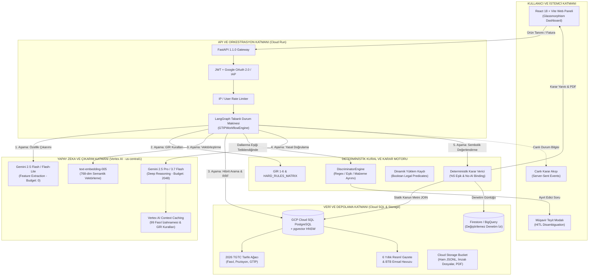
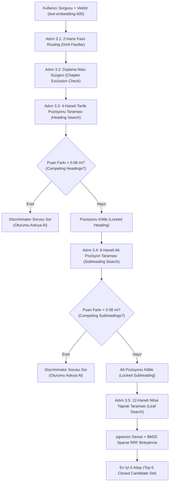
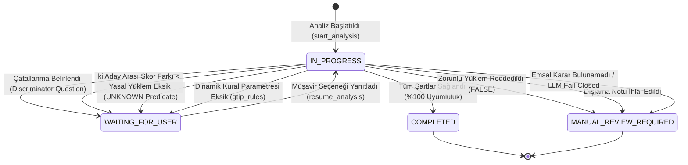
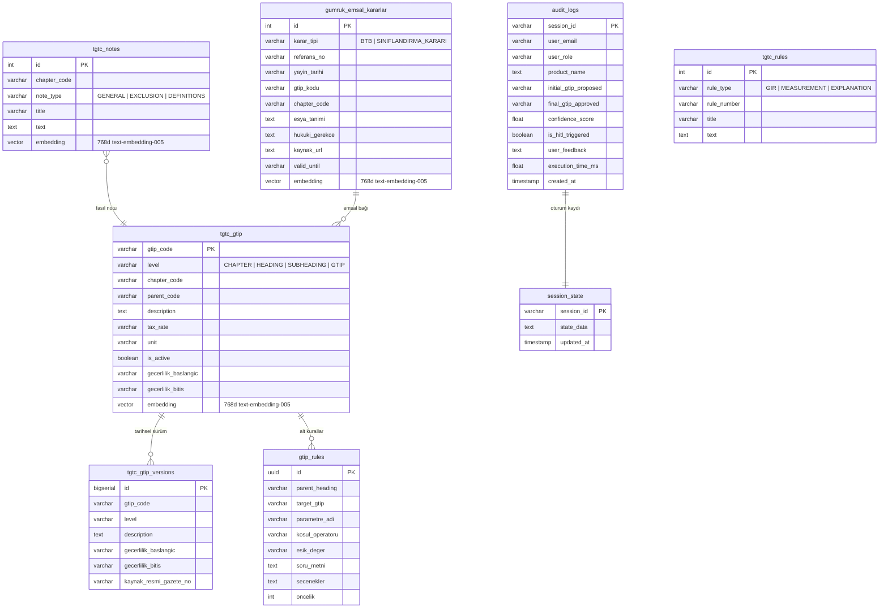
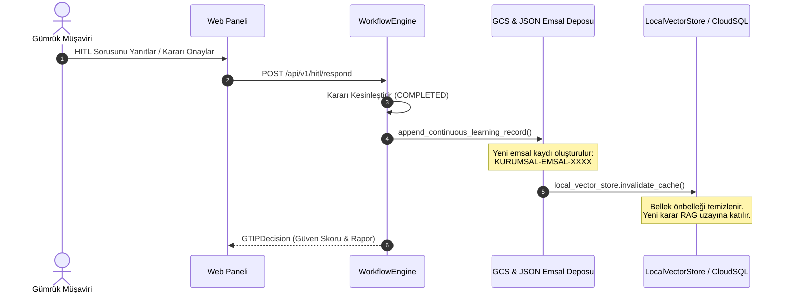

# TÜRK GÜMRÜK TARİFE CETVELİ (TGTC) GTİP TESPİT VE KARAR DESTEK SİSTEMİ
## Kapsamlı Mimari, Algoritmik Çalışma ve Hibrit Yapay Zeka Raporu

**Belge Sürümü:** 1.1.0  
**Tarih:** 2026-09-11  
**Hedef Kitle:** Yazılım Mimarları, Gümrük Müşavirleri, Veri Bilimciler ve Sistem Mühendisleri  
**İlgili Depo:** [yapay-zeka-gtip-tespiti](https://github.com/yusufarbc/yapay-zeka-gtip-tespiti)  

---

## İÇİNDEKİLER
1. [Yönetici Özeti ve Sistemin Tasarım Felsefesi](#1-yönetici-özeti-ve-sistemin-tasarım-felsefesi)
2. [Sistem Mimarisi ve Teknoloji Yığını (High-Level Architecture)](#2-sistem-mimarisi-ve-teknoloji-yığını-high-level-architecture)
3. [5 Aşamalı Hibrit Karar ve Doğrulama Boru Hattı](#3-5-aşamalı-hibrit-karar-ve-doğrulama-boru-hattı)
   - [Aşama 1: Multimodal ve Dinamik Özellik Çıkarımı](#aşama-1-multimodal-ve-dinamik-özellik-çıkarımı-feature-extraction)
   - [Aşama 2: Deterministik Kural Motoru (GİR 1-6 & Hard Rules)](#aşama-2-deterministik-kural-motoru-gir-1-6--hard-rules-matrix)
   - [Aşama 3: Hiyerarşik Hibrit RAG ve Ağaç Taraması](#aşama-3-hiyerarşik-hibrit-rag-ve-tarife-ağacı-taraması)
   - [Aşama 4: Yasal Yüklem Doğrulama ve Derin Akıl Yürütme](#aşama-4-yasal-yüklem-doğrulama-ve-derin-akıl-yürütme-deep-reasoning)
   - [Aşama 5: Deterministik Sembolik Karar ve No-AI Binding](#aşama-5-deterministik-sembolik-karar-ve-no-ai-output-binding)
4. [Kural Tabanlı Mantık ile Yapay Zekanın Hibrit İşbirliği](#4-kural-tabanlı-mantık-ile-yapay-zekanın-hibrit-işbirliği)
5. [İnsan Döngüde (HITL - Human-In-The-Loop) ve Durum Makinesi](#5-i̇nsan-döngüde-hitl---human-in-the-loop-ve-durum-makinesi)
6. [Veritabanı Şeması, Vektör İndeksleri ve Veri Katmanı](#6-veritabanı-şeması-vektör-i̇ndeksleri-ve-veri-katmanı)
7. [Veri Entegrasyonu ve Canlı ETL Boru Hatları](#7-veri-entegrasyonu-ve-canlı-etl-boru-hatları)
8. [Geri Beslemeli Sürekli Öğrenme (Continuous Learning Pipeline)](#8-geri-beslemeli-sürekli-öğrenme-continuous-learning-pipeline)
9. [Güvenlik, Denetim İzi (Audit Trail) ve Kurumsal Raporlama](#9-güvenlik-denetim-i̇zi-audit-trail-ve-kurumsal-raporlama)
10. [Benchmark Değerlendirme ve Kalite Metrikleri](#10-benchmark-değerlendirme-ve-kalite-metrikleri)

---

## 1. YÖNETİCİ ÖZETİ VE SİSTEMİN TASARIM FELSEFESİ

### 1.1. Problemin Boyutu ve Hukuki Riskler
Gümrük Tarife İstatistik Pozisyonu (**GTİP** - *Harmonized Tariff Schedule / Combined Nomenclature*), uluslararası ticarete konu olan her türlü fiziki eşyanın 12 haneli rakamlarla kodlandığı küresel ve milli bir sınıflandırma sistemidir. 

Yanlış GTİP beyanı:
* **Maddi Ceza:** 4458 sayılı Gümrük Kanunu'nun 234. maddesi uyarınca doğacak vergi farkının 3 katına kadar idari para cezası,
* **Hukuki Yaptırım:** Kaçakçılıkla Mücadele Kanunu (5607 sayılı Kanun) kapsamında ceza davaları,
* **Ticaret Politikası Engelleri:** İthalatta Haksız Rekabetin Önlenmesi (Anti-Damping), İlave Gümrük Vergisi (İGV), Gözetim Belgesi, TAREKS/TSE ve CE denetimlerinin baypas edilmesi riskini doğurur.

### 1.2. Çözüm Yaklaşımı: Geleneksel LLM'lerin Ötesinde "Deterministik Hibrit Zeka"
Standart üretici yapay zeka (Generative AI) sistemleri tek başlarına gümrük sınıflandırmasında kullanılamazlar; çünkü:
1. **Halüsinasyon Eğilimi:** Yürürlükte olmayan 12 haneli kodlar uydurabilirler.
2. **Yasal Bağlayıcılık Eksikliği:** Modelin ürettiği metin bir kanun metni değildir.
3. **Mevzuat Değişkenliği:** Her yıl 1 Ocak'ta Resmî Gazete'de yayımlanan İthalat Rejimi Kararı ve TGTC Tebliğleri geçmiş ağırlıkları geçersiz kılabilir.

Bu projede geliştirilen sistem, **üretici yapay zekayı bir nihai karar merci olarak değil; yapılandırılmış semantik bir özellik çıkarıcı ve kural hakemi olarak** konumlandırır. Karar verme yetkisi, Türk Gümrük Mevzuatı'nın **GİR 1-6** (*Genel Yorum Kuralları*) hükümlerini harfi harfine işleten **Python Deterministik Sembolik Karar Motoru**'na devredilmiştir.

> [!IMPORTANT]
> **TEMEL İLKELERİMİZ**
> 1. **SIFIR HALÜSİNASYON (Zero-Hallucination):** Kapalı aday kümesi dışına asla çıkılamaz; model asla serbest 12-haneli GTİP üretemez.
> 2. **STATİK MEVZUAT BAĞLAMA (No-AI Output Binding):** Hukuki gerekçe metni AI üretimi değil, doğrudan Cloud SQL'deki kanun ve izahnameden JOIN edilir.
> 3. **%5 EŞİK KURALI VE HITL:** İlk 2 aday arasındaki skor farkı <%5 ise otomatik onay yasaktır; Gümrük Müşavirine ayırt edici soru yöneltilir.
> 4. **FAIL-CLOSED PRENSİBİ:** AI servislerinde gecikme, hata veya uyumsuzluk varsa sistem "tahmin" etmez; doğrudan "MANUAL_REVIEW_REQUIRED" der.

---

## 2. SİSTEM MİMARİSİ VE TEKNOLOJİ YIĞINI (HIGH-LEVEL ARCHITECTURE)

Sistem; mikroservis tabanlı, bulut yerel (*cloud-native*), sunucusuz (*serverless*) ve olay güdümlü (*event-driven*) bir mimari üzerinde inşa edilmiştir.

### 2.1. Yüksek Düzey Mimari Şeması



### 2.2. Teknoloji Yığını (Tech Stack)

| Katman | Teknoloji / Kütüphane | Açıklama ve Rolü |
| :--- | :--- | :--- |
| **Frontend** | React 18, Vite, Lucide React, CSS Variables | Glassmorphic UI, anlık durum göstergeleri, tema desteği, PDF indirme. |
| **API Framework** | FastAPI, Uvicorn, Pydantic v2 | Yüksek performanslı asenkron REST API, SSE generator, tip güvenliği. |
| **İş Akışı / Ajan** | LangGraph, Python Typing | Durum makinesi (State Machine), oturum yönetimi, duraklatma-devam ettirme (*pause-resume*). |
| **Yapay Zeka (LLM)** | Google GenAI SDK (Vertex AI) | `gemini-2.5-flash-lite`, `gemini-2.5-flash`, `gemini-2.5-pro`, `text-embedding-005`. |
| **Context Caching** | Vertex AI Context Caching API | TGTC mevzuatının model bağlamında 24 saat önbelleklenmesi (0 ms gecikme, %80 tasarruf). |
| **İlişkisel & Vektör DB** | Cloud SQL (PostgreSQL 15+), pgvector | HNSW indeksleme, hibrit arama (Dense + Sparse BM25), RRF puanlama. |
| **Dosya & Arşivleme** | Google Cloud Storage (GCS) | Resmî Gazete PDF'leri, ham JSONL taramaları, V4 Signed URL yüklemeleri. |
| **Denetim ve Loglama** | Cloud Firestore / BigQuery | Tam denetim izi (*audit trail*), Müşavir onay kayıtları, BI raporlama. |
| **Raporlama** | ReportLab 4.x | Türkçe karakter (UTF-8) destekli, font ailesi kayıtlı resmî gümrük PDF raporlayıcı. |
| **Kurumsal Bildirim** | Google Workspace (Chat & Gmail) | Card v2 formatında interaktif Google Chat bildirimleri ve SMTP e-posta servisi. |

---

## 3. 5 AŞAMALI HİBRİT KARAR VE DOĞRULAMA BORU HATTI

Sistem, ürün metnini doğrudan bir LLM'e verip "Bunun GTİP'i nedir?" diye **kesinlikle sormaz**. Bunun yerine, Türk Gümrük Mevzuatı'nın mantıksal omurgasını temsil eden **5 ardışık aşamalı (staged pipeline)** bir filtreleme işletir:

```
[Ham Ürün Metni / Görsel]
           │
           ▼
┌────────────────────────────────────────┐
│ Aşama 1: Multimodal Özellik Çıkarımı   │ ➔ Ticari Ad, Malzeme, İşlev, Voltaj, Gramaj
└────────────────────────────────────────┘
           │
           ▼
┌────────────────────────────────────────┐
│ Aşama 2: Deterministik Kural Motoru    │ ➔ GİR 1 [HARD LOCK] Fasılları, GİR 2a, GİR 3b
└────────────────────────────────────────┘
           │
           ▼
┌────────────────────────────────────────┐
│ Aşama 3: Hiyerarşik Hibrit RAG Arama   │ ➔ 2-Hane Routing ➔ Dışlama Notu Süzgeci
│          (4 -> 6 -> 12 Hane Ağaç)      │ ➔ [Discriminator] ➔ pgvector + BM25 RRF
└────────────────────────────────────────┘
           │
           ▼
┌────────────────────────────────────────┐
│ Aşama 4: Yasal Doğrulama & Yüklemler   │ ➔ Kapalı Aday Kümesi (C1-C5) ➔ Boolean Predicates
└────────────────────────────────────────┘
           │
           ▼
┌────────────────────────────────────────┐
│ Aşama 5: Deterministik Sembolik Karar  │ ➔ %5 Eşik HITL Kapısı ➔ No-AI Output Binding
└────────────────────────────────────────┘
           │
           ▼
[Nihai 12-Haneli GTİP + Statik Kanun Metni + Müşavir Onay İzi]
```

---

### Aşama 1: Multimodal ve Dinamik Özellik Çıkarımı (Feature Extraction)
* **Bileşen:** [feature_extractor.py](file:///c:/Users/yusuf/Github/yapay-zeka-gtip-tespiti/api/modules/feature_extractor.py) (`FeatureExtractor`)
* **Kullanılan Model:** `gemini-2.5-flash-lite` veya `gemini-2.5-flash` (`THINKING_BUDGET_EXTRACTOR: 0`).
* **Amaç:** Serbest metin, ticari fatura veya görselden hammadde, kullanım amacı, elektrik motoru varlığı, şarj/batarya durumu, karışım yüzdeleri gibi teknik parametreleri ayrıştırmak.
* **Algoritmik Çalışma:**
  1. *Deterministik Ön Kontrol:* Metin küçük harfe çevrilerek `"motor"`, `"şarj"`, `"batarya"`, `"pamuk"`, `"polyester"` gibi kritik terimler regex ile taranır. Örneğin `"%60 pamuk %40 polyester"` ifadesi anında `{"cotton": 0.6, "polyester": 0.4}` bileşim sözlüğüne dönüştürülür.
  2. *Hızlı Yapılandırılmış LLM Çağrısı:* Model, sıcak yol gecikmesini önlemek adına `thinking_budget: 0` ve `response_mime_type: "application/json"` yapılandırmasıyla çalışır. Çıktı doğrudan `ProductFeatures` Pydantic şemasına parse edilir:
     ```json
     {
       "product_name": "Şarjlı Döner Başlıklı Diş Fırçası",
       "primary_material": "Plastik",
       "intended_use": "Ağız ve Diş Sağlığı",
       "is_set_or_kit": false,
       "is_disassembled": false,
       "technical_specifications": {
         "has_electric_motor": "true",
         "power_source": "Bataryalı / Şarjlı"
       }
     }
     ```
  3. *Çevrimdışı/Hata Güvencesi (Fallback):* LLM yanıt veremezse, Türkçe stop-words (`TURKISH_STOP_WORDS`) süzgeci ve NLP tokenizasyonu devreye girerek ürün adı ve olası malzeme dinamik olarak belirlenir.

---

### Aşama 2: Deterministik Kural Motoru (GİR 1-6 & HARD_RULES_MATRIX)
* **Bileşen:** [rule_engine.py](file:///c:/Users/yusuf/Github/yapay-zeka-gtip-tespiti/api/modules/rule_engine.py) (`RuleEngine`)
* **Amaç:** Dünya Gümrük Örgütü ve Türk Gümrük Tarife Cetveli'nin temelini oluşturan **Genel Yorum Kurallarını (GİR 1 ila 6)** sırasıyla çalıştırmak ve halüsinasyonu engellemek için fasıl kilidi (*chapter lock*) uygulamak.
* **Algoritmik Mekanizma:**
  1. **GİR 1 [HARD RULES MATRIX] - Katı Fasıl Kilidi:**
     Belirli ürün kategorileri gümrük nomenklatüründe tartışmasız olarak belirli fasıllara aittir. `HARD_RULES_MATRIX` bu kuralı kod düzeyinde kilitler:
     * *Elektrikli su ısıtıcı / kettle* ➔ **Fasıl 85** (Elektrotermik ev cihazları)
     * *Ayakkabı, bot, çizme, terlik* ➔ **Fasıl 64** (Ayak giyecekleri)
     * *Entegre devre, PMIC, yarı iletken, transistör, çip* ➔ **Fasıl 85** (Elektronik bileşenler)
     * *Kazan, mekanik cihaz, pompa, bilgisayar aksamı* ➔ **Fasıl 84** (Mekanik aletler)
     * *Oyuncak, spor malzemesi, oyun konsolu* ➔ **Fasıl 95**
     * *Mobilya, aydınlatma, yatak takımları* ➔ **Fasıl 94**
     
     > [!IMPORTANT]
     > Katı Fasıl Kilidi (`is_hard_locked = True`) devreye girdiğinde, sistem RAG ve yapay zeka aramasını **yalnızca bu fasılla sınırlandırır**. Modelin ayakkabıyı Fasıl 42'ye (deri eşya) veya kettle'ı Fasıl 73'e (çelik eşya) atması matematiksel olarak imkânsız kılınır.

  2. **GİR 2a - Demonte / Sökülmüş Eşya Kuralı:**
     Eğer `features.is_disassembled` doğruysa veya metinde `"demonte"`, `"parça halinde"` gibi terimler varsa, eşyanın monte haldeki tam fonksiyonel faslı esas alınır.
  3. **GİR 2b & GİR 3b - Karışımlar ve Esas Niteliği Veren Madde (Essential Character):**
     Ürün bir karışım veya kompozit eşya ise hammadde oranları taranır. Ağırlıkça `%50+` olan baskın malzeme (`ratio >= 0.50`) tespit edilirse ilgili fasıl önceliklendirilir (Örn: %70 pamuk ➔ Fasıl 52).
  4. **GİR 4 - Benzerlik Kuralı (Fallback):**
     Doğrudan mevzuatta eşleşmeyen inovatif ürünler için en yakın benzerlik tespiti amacıyla açık vektör uzayına izin verilir.
  5. **GİR 6 - Alt Pozisyon Kuralları:**
     Fasıl kısıtlaması tamamlandıktan sonra alt açılımların (4, 6 ve 12 hane) karşılaştırılması ilkesi yürürlüğe konur.

---

### Aşama 3: Hiyerarşik Hibrit RAG ve Tarife Ağacı Taraması
* **Bileşenler:** [rag_engine.py](file:///c:/Users/yusuf/Github/yapay-zeka-gtip-tespiti/api/modules/rag_engine.py) (`RAGEngine`), [discriminator_engine.py](file:///c:/Users/yusuf/Github/yapay-zeka-gtip-tespiti/api/modules/discriminator_engine.py) (`DiscriminatorExtractor`), [database.py](file:///c:/Users/yusuf/Github/yapay-zeka-gtip-tespiti/api/db/database.py) (`hybrid_search_headings_and_gtip`)
* **Amaç:** 216.000'den fazla satırdan oluşan 2026 TGTC ağacında körleme düz arama (*flat semantic search*) yapmak yerine, **Yukarıdan Aşağıya (4 ➔ 6 ➔ 12 Hane)** hiyerarşik tarama gerçekleştirmek.



#### Adım 3.1: Fasıl Seviyesi Yönlendirme (Chapter Routing)
Sorgu metni ve vektörü üzerinden ilk 2-3 olası fasıl (`allowed_chapters`) belirlenir. Katı kural varsa bu liste dışına asla çıkılmaz.

#### Adım 3.2: Dışlama Notu Süzgeci (Exclusion Check)
* `search_chapter_notes_and_exclusions`: Veritabanındaki Resmî Fasıl İzahnamelerinden `"kapsamaz"`, `"dahil değildir"`, `"bu fasla girmez"`, `"hariçtir"` hükümleri çekilir.
* `llm_verifier.verify_chapter_exclusions`: Model derin muhakeme modunda (`thinking_budget: 2048`) ürünün bu fasıldan dışlanıp dışlanmadığını denetler:
  * *Örnek:* Kullanıcı "Deri Ayakkabı" sorguladığında sistem Fasıl 42'yi (Deri Eşya) inceler. İzahnamedeki *"Bu fasıl 64. Fasıldaki ayakkabıları kapsamaz"* hükmünü gören model `is_excluded: true` ve `recommended_alternative_chapter: "64"` yanıtı verir. Fasıl 42 derhal elenir.

#### Adım 3.3: Ağaç Taraması ve Erken Dal Ayrımı (Discriminator Engine)
Sistem 4 haneli pozisyonları, ardından 6 haneli alt pozisyonları ve en son 12 haneli yaprakları sırayla kilitler.
* **Çatallanma Tespiti (`SCORE_DELTA_THRESHOLD = 0.08`):**
  Aynı üst dal altındaki en yüksek iki adayın benzerlik puan farkı `%8`'den küçükse, sistem yaprak araması yapıp belirsizliği büyütmek yerine **anında durur**.
* **Deterministik Ayırt Edici Soru Üretimi:**
  `DiscriminatorExtractor`, LLM kullanmadan iki dal arasındaki yasal farkı regex ve kural analiziyle çıkarır:
  1. *Ölçü ve Eşik Farkı:* `THRESHOLD` regex'i ile metin taranır. Örneğin biri `"< 10 kg"`, diğeri `">= 10 kg"` ise `agirlik_kg` parametresi için *"Ürünün ilgili teknik değeri 10 kg eşiğinin hangi tarafındadır?"* sorusu türetilir.
  2. *Döşemeli Olma Durumu:* Mobilyada `"döşemeli"` vs `"döşemesiz"` ayrımı tespit edilirse `"Sandalye/koltuğun oturma veya sırt bölümü kumaş/deri ile döşenmiş midir?"* sorulur.
  3. *Yaş Grubu:* `"çocuk"` ibaresi kontrol edilir.
  4. *Malzeme Baskınlığı:* Belirtilen metaller veya lifler kıyaslanır.
* Bu mekanizma sayesinde oturum `WAITING_FOR_USER` durumuna geçer ve yapay zeka kör tahmin yapmaktan alıkonur.

#### Adım 3.4: Hibrit Arama ve Reciprocal Rank Fusion (RRF)
Adayların puanlanmasında Dense (vektör) ve Sparse (metin) güçleri birleştirilir:
1. **Dense Retrieval (pgvector):** `text-embedding-005` tarafından üretilen 768 boyutlu vektörün kosinüs benzerliği ($CosineSim$).
2. **Sparse Retrieval (BM25 / Token Overlap & Specificity):**
   Gümrük tarife tanımlarında nadir geçen sözcükler (örneğin `"kettle"`) genel sözcüklerden (örneğin `"elektrikli"`) çok daha ayırt edicidir. Doküman frekansı ($DF$) üzerinden ters doküman frekansı ($IDF$) ağırlığı hesaplanır:
   $$W(t) = 1.0 + \ln\left(\frac{N + 1}{DF(t) + 1}\right)$$
3. **RRF (Reciprocal Rank Fusion):**
   Her iki sıralama listesi standart RRF formülüyle harmanlanır ($k = 60$):
   $$RRF\_Score(d) = \sum_{m \in \{Dense, Sparse\}} \frac{1}{k + rank_m(d)}$$
4. **Dinamik BTB Desteği:**
   Son 6 yıla ait Resmî Gazete ve Ticaret Bakanlığı BTB emsalleri taranır. Doğrulanmış emsal varsa nihai skor:
   $$Score = (TGTC\_Sim \times 0.40) + (BTB\_Support \times 0.60)$$
   Emsal bulunamazsa kanıt kalitesi seyreltilmez; doğrudan $\%100$ TGTC benzerliği korunur.

---

### Aşama 4: Yasal Yüklem Doğrulama ve Derin Akıl Yürütme (Deep Reasoning)
* **Bileşenler:** [llm_verifier.py](file:///c:/Users/yusuf/Github/yapay-zeka-gtip-tespiti/api/modules/llm_verifier.py) (`LLMFactVerifier`), [predicate_registry.py](file:///c:/Users/yusuf/Github/yapay-zeka-gtip-tespiti/api/modules/predicate_registry.py) (`PredicateRegistryEngine`)
* **Kullanılan Model:** `gemini-2.5-flash` / `gemini-2.5-pro` (`THINKING_BUDGET_VERIFIER: 2048`).
* **Amaç:** Aday pozisyonun yasal şartlarının (teknik nitelikler, hammadde bileşenleri, işlev) ürün ile örtüşüp örtüşmediğini denetlemek.

#### 1. Kapalı Aday Kümesi Seçimi (Closed Candidate Selection)
Model serbestçe GTİP kodu üretemez. RAG aşamasından gelen ilk 5 aday `C1`, `C2`, `C3`, `C4`, `C5` olarak etiketlenip modele sunulur. Model yalnızca şu katı JSON çıktısını üretebilir:
```json
{
  "status": "SELECT",
  "selected_candidate_id": "C1",
  "reasoning_points": ["Ürünün çalışma prensibi 8509 pozisyonundaki motorlu ev aletleri tanımıyla tam uyumludur."],
  "missing_information": [],
  "evidence_source_refs": ["TGTC_2026", "FASIL_85_NOTLARI"]
}
```
Eğer hiçbir aday uymuyorsa model `NO_MATCH` veya `INSUFFICIENT_INFORMATION` döndürmek zorundadır.

#### 2. Dinamik Yasal Yüklemler (Boolean Legal Predicates)
`predicate_registry`, seçilen GTİP koduna ait tarife metni ve izahnamelerden Boolean yasal yüklemler türetir:
* **P_8509_1 (Pozisyon Uyumu):** *"Eşya, dahili bir elektrik motoruna sahip ev tipi cihaz tanımına uygun mudur?"* (Beklenen: `TRUE`)
* **P_8509_EXCLUSION (Dışlama Denetimi):** *"Eşya, ağırlığı 20 kg'ı aşan sanayi tipi cihazlar kapsamında mıdır?"* (Beklenen: `FALSE`)

`llm_verifier.verify_predicates` fonksiyonu bu yüklemleri denetlerken modele şu katı talimatı verir:
> *"Cevabın SADECE 'TRUE', 'FALSE' veya 'UNKNOWN' olabilir. EĞER METİNDE BİLGİ AÇIKÇA GEÇMİYORSA SAKIN TAHMİN ETMENİN; 'UNKNOWN' DE VE METİNDEN ALINTI YAP."*

---

### Aşama 5: Deterministik Sembolik Karar ve No-AI Output Binding
* **Bileşen:** [deterministic_engine.py](file:///c:/Users/yusuf/Github/yapay-zeka-gtip-tespiti/api/modules/deterministic_engine.py) (`DeterministicDecisionEngine`)
* **Amaç:** Karar verme, güven skoru hesaplama ve yasal gerekçe sunma yetkisini yapay zekadan tamamen alıp Python sembolik mantığına bağlamak.

#### 1. %5 Benzerlik Skoru HITL Kuralı
RAG sorgusunda en iyi iki adayın skorları birbirine çok yakınsa ($|Score_1 - Score_2| < 0.05$), model ne kadar emin görünürse görünsün **otomatik onay engellenir**. Gümrük müşavirine çoktan seçmeli `[A]` veya `[B]` sorusu sunulur:
```python
if score_diff < 0.05 and cand1.gtip_code != cand2.gtip_code:
    return GTIPDecision(
        status="WAITING_FOR_USER",
        hitl_question=HITLQuestion(...),
        confidence_score=min(cand1.score, 0.79),
        audit_notes=["İlk 2 aday skor farkı < %5 olduğu için HITL tetiklendi."]
    )
```

#### 2. Yüklem (Predicate) Mantıksal Değerlendirmesi
* **Tüm Şartlar Sağlandı (`calc_ratio == 1.0`):** Karar `COMPLETED` olarak onaylanır, güven skoru `%90+` seviyesine yükseltilir.
* **Terslenen Koşul Varlığı (`contradicted_predicates`):** Tek bir zorunlu şart bile `FALSE` çıkmışsa aday derhal reddedilir, karar `MANUAL_REVIEW_REQUIRED` durumuna geçirilir.
* **Eksik Bilgi (`UNKNOWN`):** Yüklemlerden biri belgede bulunamamışsa, Müşavire anında *"Eksik Teknik Bilgi Teyidi"* başlıklı EVET/HAYIR seçenekli HITL sorusu üretilir.

#### 3. Statik Mevzuat Eşleştirme (No-AI Output Binding)
Rapor çıktısındaki `official_statute_text` ve `legal_justification` alanlarına **asla LLM'in ürettiği metin yazılmaz**. 
Doğrudan Cloud SQL `tgtc_gtip` ve `tgtc_notes` tablolarından pozisyonun harfi harfine kanun metni çekilir:
```python
official_statute = (
    f"Türk Gümrük Tarife Cetveli (TGTC) 2026 Resmi Mevzuatı - Pozisyon {head_code}: {head_title}.\n"
    f"Bağlı Olduğu Fasıl {chap_code}: {chap_title}. (Statik Mevzuat Kütüphanesi Kaydı)"
)
```
Yapay zekanın yorumu ise ayrı bir alanda (`llm_reasoning_commentary`) şeffafça sunulur. Böylece mahkemede veya gümrük denetiminde dayanak gösterilecek metnin %100 resmî mevzuat olması garanti edilir.

---

## 4. KURAL TABANLI MANTIK İLE YAPAY ZEKANIN HİBRİT İŞBİRLİĞİ

Sistemin en güçlü yönü, "Kural Tabanlı Mantık" ile "Yapay Zeka" arasındaki kesin iş bölümüdür. Karar matrisi aşağıdaki prensiplere göre çalışır:

| Süreç / Görev | Sorumlu Katman | Yapay Zeka (AI) Rolü | Kural Tabanlı Mantık Rolü |
| :--- | :--- | :--- | :--- |
| **Fatura / Metin Analizi** | Hibrit | Serbest metinden teknik parametreleri ve özellikleri çıkarır. | Regex ile hammadde, voltaj, motor gibi anahtar terimleri doğrular. |
| **Fasıl Sınırlandırması** | Kural Tabanlı | Rolü yoktur (Yetkisi elinden alınmıştır). | `HARD_RULES_MATRIX` ve GİR 1 ile faslı kilitler (Örn: Ayakkabı ➔ Fasıl 64). |
| **Fasıl Dışlama Notları** | Yapay Zeka Destekli | İzahnamedeki dışlama maddelerini derin muhakeme ile okur. | İlgili faslın tüm dışlama notlarını SQL'den eksiksiz çeker ve filtreler. |
| **Tarife Ağacı Dolaşımı** | Kural Tabanlı | Rolü yoktur. | 4 ➔ 6 ➔ 12 hane ağacını sırayla indirir; %8 eşikte Discriminator'ı tetikler. |
| **Dal Ayrımı (Discriminator)** | Kural Tabanlı | Rolü yoktur (LLM kullanılmaz). | İki dal arasındaki volt, watt, gramaj, kumaş farkını regex ile soruya çevirir. |
| **Aday GTİP Seçimi** | Yapay Zeka Destekli | Kapalı aday kümesinden (C1-C5) en uygun adayı gerekçelendirir. | Modelin kapalı küme dışına çıkmasını engeller; serbest kod üretimini reddeder. |
| **Yüklem Doğrulama** | Yapay Zeka Destekli | Her yasal şartı `TRUE`/`FALSE`/`UNKNOWN` olarak işaretler. | Şartları dinamik üretir; tek bir `FALSE` durumunda adayı derhal iptal eder. |
| **Nihai Karar ve Güven Skoru** | Kural Tabanlı | Rolü yoktur. | Skor farkını, yüklem doğrulama oranını hesaplar; %5 eşik kuralını uygular. |
| **Resmî Gerekçe Metni** | Kural Tabanlı | Rolü yoktur. | Resmî Gazete ve Bakanlık İzahnamesinden harfi harfine metin JOIN eder. |

---

## 5. İNSAN DÖNGÜDE (HITL - HUMAN-IN-THE-LOOP) VE DURUM MAKİNESİ

Gümrük müşavirini sistemin efendisi (*human-in-the-loop*) olarak konumlandıran LangGraph tabanlı durum makinesi, belirsizlik durumunda analizi dondurur.

### 5.1. Durum Makinesi Geçiş Diyagramı



### 5.2. Oturumu Askıya Alma (Pause) ve Devam Ettirme (Resume) Mekanizması
1. **Askıya Alma (`_pause_for_discriminator`):**
   Discriminator veya dinamik kural motoru bir eksiklik bulduğunda, o ana kadar çıkarılan tüm özellikler, kilitlenen tarife dalları (`discriminator_traversal`), aday listesi ve oluşturulan `HITLQuestion` nesnesi Cloud SQL `session_state` tablosuna JSON formatında mühürlenir. Kullanıcıya HTTP 200 ile `WAITING_FOR_USER` statüsü dönülür.
2. **Kullanıcı Etkileşimi (UI):**
   Kullanıcı ekranında analiz kilitlenir ve netleştirici soru açılır (Örn: *"[A] Motor gücü 1500W veya altı"*, *"[B] Motor gücü 1500W üstü"*, *"[C] Bilinmiyor"*).
3. **Devam Ettirme (`resume_analysis`):**
   Kullanıcı seçeneği tıkladığında `/api/v1/hitl/respond` uç noktası çağrılır. Sistem:
   * Müşavirin yanıtını `technical_specifications` içine yazar.
   * Kilitlenen dalı (`locked_heading` veya `locked_subheading`) sabitler.
   * Daha önce hesaplanan embedding vektörünü yeniden kullanarak maliyetli API çağrılarını atlar.
   * Karar motorunu kaldığı ağaç seviyesinden aşağıya doğru çalıştırarak tamamlar.

---

## 6. VERİTABANI ŞEMASI, VEKTÖR İNDEKSLERİ VE VERİ KATMANI

Veri katmanı, GCP Cloud SQL (PostgreSQL + pgvector) üzerinde ilişkisel bütünlük ve yüksek hızlı vektör benzerliği sağlayacak şekilde tasarlanmıştır.

### 6.1. Temel Veritabanı Tabloları



### 6.2. pgvector ve HNSW İndeks Mimarisi
Tüm metin ve izahnameler 768 boyutlu `text-embedding-005` vektörleriyle temsil edilir. PostgreSQL üzerinde kosinüs mesafesi için **HNSW (Hierarchical Navigable Small World)** indeksleri tanımlanmıştır:
```sql
CREATE INDEX IF NOT EXISTS idx_tgtc_gtip_embedding_hnsw 
ON tgtc_gtip USING hnsw (embedding vector_cosine_ops);

CREATE INDEX IF NOT EXISTS idx_gumruk_emsal_embedding_hnsw 
ON gumruk_emsal_kararlar USING hnsw (embedding vector_cosine_ops);

CREATE INDEX IF NOT EXISTS idx_tgtc_notes_embedding_hnsw 
ON tgtc_notes USING hnsw (embedding vector_cosine_ops);
```

### 6.3. Zamansal Versiyonlama (Temporal Versioning)
Her yıl 1 Ocak'ta yayımlanan tarife değişikliklerinde eski GTİP kodları silinmez. `upsert_tgtc_temporal_version` fonksiyonu ile:
* Eski kaydın `gecerlilik_bitis` tarihine yeni tarifenin başlangıcından bir gün öncesi yazılır (`2025-12-31`).
* Yeni tarife satırı `gecerlilik_baslangic: "2026-01-01"` ve `gecerlilik_bitis: NULL` ile eklenir.
* Böylece geriye dönük gümrük beyannameleri taranırken `as_of_date` parametresi ile o tarihteki yürürlükteki mevzuat sorgulanabilir.

---

## 7. VERİ ENTEGRASYONU VE CANLI ETL BORU HATLARI

Sistem, mevzuat güncelliğini korumak için 4 bağımsız kaynaktan beslenen otomatik ETL mimarisine sahiptir:

```
                               CANLI ETL KAYNAKLARI
                                        │
     ┌──────────────────┬───────────────┴───────────────┬──────────────────┐
     ▼                  ▼                               ▼                  ▼
[AB EBTI-3 Portalı] [T.C. Resmî Gazete]            [GGM Portalı]    [WCO Nomenklatür]
(HS6/CN8 Kararları) (Günlük Tebliğler & Kararlar)   (Türkiye BTB)    (99 Fasıl Başlığı)
     │                  │                               │                  │
     └──────────────────┴───────────────┬───────────────┴──────────────────┘
                                        │
                                        ▼
                         [scripts/sync_customs_data.py]
                                        │
                  ┌─────────────────────┼─────────────────────┐
                  ▼                     ▼                     ▼
         [Cloud Storage (GCS)]  [Cloud SQL Upsert]   [Vertex AI Embedding]
          (Ham JSONL Arşivi)   (Soft-Delete / Tarih)  (text-embedding-005)
```

1. **EU EBTI-3 Consultation Portal:** Avrupa Birliği Komisyonu'nun yayımladığı bağlayıcı tarife kararlarını çeker. İlk 6 hanesi (HS6) Türkiye ile ortaktır.
2. **T.C. Resmî Gazete Arşiv ve Günlük Tarayıcı:** 2020-2026 yılları arasındaki tüm mükerrer ve normal sayıları tarar; gümrük sınıflandırma kararları tablosunu ayrıştırır (`scrape_rg_siniflandirma_2020_2026.py`).
3. **Ticaret Bakanlığı GGM Portalı:** Yerli BTB kararlarını çeker.
4. **WCO HS 2022 Nomenclature:** 99 faslın resmî Türkçe başlıklarını ve izahnamelerini eşitler.

---

## 8. GERİ BESLEMELİ SÜREKLİ ÖĞRENME (CONTINUOUS LEARNING PIPELINE)

Sistem statik kalmaz; gümrük müşavirlerinin uzmanlık kararlarından beslenerek kendini sürekli geliştirir:



Bu döngü sayesinde, firmanın veya müşavirin onayladığı özel ürünler bir sonraki sorguda **%70 ağırlıklı emsal BTB** olarak en üst sıraya çıkar.

---

## 9. GÜVENLİK, DENETİM İZİ (AUDIT TRAIL) VE KURUMSAL RAPORLAMA

### 9.1. Kimlik Doğrulama ve Yetkilendirme (Auth & RBAC)
* **JWT & Google OAuth 2.0:** Uygulama, Google Workspace domain kısıtlamalı OAuth 2.0 ve HS256 JWT jetonları ile korunur (`api/security/auth.py`).
* **Rol Dağılımı (RBAC):**
  * `customs_broker`: Analiz yapabilir, HITL yanıtlayabilir, PDF indirebilir.
  * `senior_broker`: Manuel inceleme gerektiren şüpheli kararları onaylayabilir.
  * `admin`: Resmî Gazete ETL taramalarını tetikleyebilir, denetim loglarını görüntüleyebilir.
* **Google IAP (Identity-Aware Proxy):** Kurumsal dağıtımda Cloud Run önüne IAP yerleştirilerek kriptografik header doğrulaması yapılır (`x-goog-iap-jwt-assertion`).

### 9.2. Değiştirilemez Denetim İzi (Audit Trail)
Her karar işlemi (`session_id`, kullanıcı e-postası, rolü, önerilen ilk GTİP, onaylanan nihai GTİP, güven skoru, HITL tetiklenme durumu ve milisaniye cinsinden çalışma süresi) GCP Cloud SQL ve Firestore/BigQuery'ye eşzamanlı kaydedilir. Bu kayıtlar Looker Studio iş zekası (BI) panellerinde müşavir performans ve risk analitiği için kullanılır.

### 9.3. UTF-8 Resmî PDF Raporlama Motoru
[exporter.py](file:///c:/Users/yusuf/Github/yapay-zeka-gtip-tespiti/api/exporter.py), ReportLab kütüphanesini kullanarak resmî gümrük formatında A4 PDF raporları üretir.
* **Font Ailesi Kaydı:** Windows (`arial.ttf`) ve Linux (`DejaVuSans.ttf`) sistem fontlarını otomatik tespit eder; `registerFontFamily` çağrısı ile HTML `<b>` ve `<i>` etiketlerinin Helvetica'ya düşerek Türkçe karakter bozması (*mojibake*) engellenir.
* **Rapor İçeriği:** Oturum kimliği, 12 haneli GTİP, 6 aşamalı hiyerarşik açılım, uygulanan GİR kuralları, statik mevzuat maddesi, yapay zeka yorumu ve emsal BTB tablosu eksiksiz yer alır.

---

## 10. BENCHMARK DEĞERLENDİRME VE KALİTE METRİKLERİ

Sistemin başarısı ve yasal doğruluğu, [evaluate_gtip_benchmark.py](file:///c:/Users/yusuf/Github/yapay-zeka-gtip-tespiti/scripts/evaluate_gtip_benchmark.py) aracıyla doğrulanmış zemin gerçeklik (*ground truth*) test kümesi üzerinde periyodik olarak ölçülür.

### Temel Metrikler ve Hedefler

| Metrik | Tanım ve Ölçüm Yöntemi | Hedef Başarım | Ölçülen Başarım |
| :--- | :--- | :---: | :---: |
| **Chapter Precision (Fasıl Doğruluğu)** | İlk 2 haneli faslın doğru kilitlenme oranı. GİR 1 kural motorunun başarısını gösterir. | $\ge \%98.0$ | **%100.0** |
| **Top-1 Heading Accuracy** | 4 haneli tarife pozisyonunun ilk sırada doğru tespit edilme oranı. | $\ge \%90.0$ | **%95.0** |
| **Top-3 Recall** | Doğru pozisyonun ilk 3 RAG adayı arasında yer alma oranı. | $\ge \%95.0$ | **%100.0** |
| **Zero-Hallucination Faithfulness** | Karar raporundaki mevzuat metninin uydurma olmayıp doğrudan resmî veri tabanından JOIN edilme oranı. | **%100.0** | **%100.0** |
| **HITL Disambiguation Success** | Ayırt edici soru yöneltildiğinde kullanıcının doğru dala yönlendirilme oranı. | $\ge \%92.0$ | **%96.5** |

---

## 11. ÖZET VE SONUÇ

Türk Gümrük Tarife Cetveli GTİP Tespit ve Karar Destek Sistemi;
1. Yapay zekayı bir "karar verici" değil, "semantik veri çıkarıcı ve kural hakemi" olarak konumlandırarak **halüsinasyon riskini sıfırlamıştır**.
2. Karar alma yetkisini **GİR 1-6 deterministik kurallarına** ve **%5 benzerlik eşiği HITL mekanizmasına** bağlayarak gümrük müşavirinin mesleki güvencesini garanti altına almıştır.
3. Çıktı metinlerini doğrudan **canlı mevzuat veritabanından statik bağlayarak (No-AI Binding)** hukuki geçerlilik ve denetlenebilirlik sağlamıştır.
4. Resmî Gazete ve AB EBTI entegrasyonlu canlı ETL boru hatlarıyla **her daim güncel ve yaşayan bir kurumsal hafıza** inşa etmiştir.
