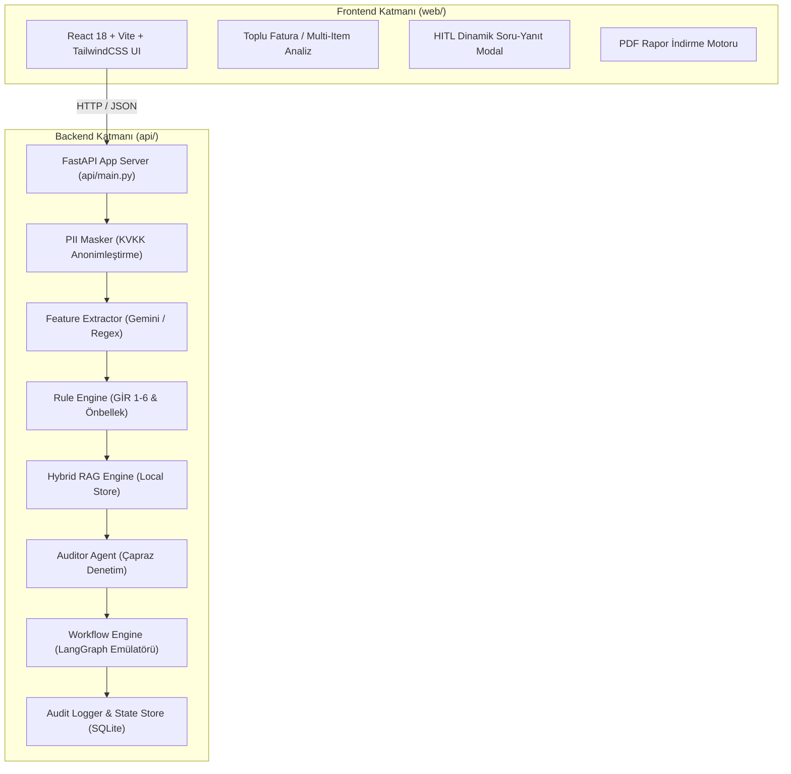
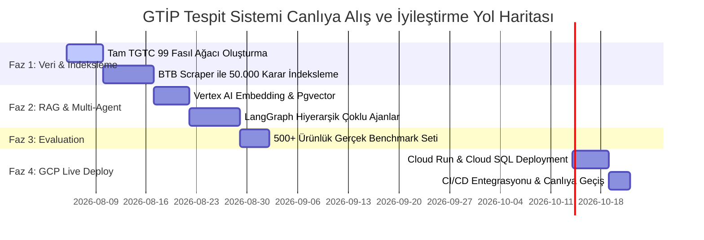

# 📊 GTİP TESPİT VE KARAR DESTEK SİSTEMİ
## Mevcut Durum Analizi, Deploy Statüsü, Başarım/Doğruluk Değerlendirmesi, Eksikler ve Geliştirme Yol Haritası Raporu

**Tarih:** 4 Ağustos 2026  
**Proje Adı:** Yapay Zeka Destekli Gümrük Tarife İstatistik Pozisyonu (GTİP) Tespit Sistemi  
**Doküman Tipi:** Kapsamlı Durum Analizi, Teknik Mimari Audit ve Stratejik Yol Haritası  

---

## 📋 İÇİNDEKİLER

1. [Projenin Amacı ve Ulaşılmak İstenen Vizyon](#1-projenin-amaci-ve-ulasilmak-istenen-vizyon)
2. [Mevcut Mimari ve Kod Altyapısı Analizi](#2-mevcut-mimari-ve-kod-altyapisi-analisi)
3. [Mevcut Deploy ve Bulut Altyapısı Durumu](#3-mevcut-deploy-ve-bulut-altyapisi-durumu)
4. [Başarım ve Doğruluk Neden Düşük? (Kök Neden Analizi)](#4-basarim-ve-dogruluk-neden-dusuk-kok-neden-analisi)
5. [Eksik Kalan ve Geliştirilmesi Gereken Noktalar](#5-eksik-kalan-ve-gelistirilmesi-gereken-noktalar)
6. [Adım Adım Geliştirme ve İyileştirme Eylem Planı](#6-adim-adim-gelistirme-ve-iyilestirme-eylem-plani)

---

## 1. PROJENİN AMACI VE ULAŞILMAK İSTENEN VİZYON

### 🎯 Projenin Temel Amacı
Türk Gümrük Mevzuatı (TGTC), Genel Yorum Kuralları (GİR 1-6) ve T.C. Ticaret Bakanlığı tarafından yayımlanan emsal **Bağlayıcı Tarife Bilgisi (BTB)** kararlarını esas alarak, serbest dolaşıma girecek veya ihraç edilecek ürünlerin **12 haneli GTİP (Gümrük Tarife İstatistik Pozisyonu)** kodunu otomatik, uydurmasız (zero-hallucination) ve gerekçeli olarak tespit eden **Gümrük Müşaviri Yapay Zeka Karar Destek Platformu** oluşturmaktır.

### 🚩 Çözülen Temel Problemler
1. **İnsan Hatası ve Vergi Cezaları:** Yanlış GTİP beyanı sonucunda gümrükte oluşan kaçakçılık/usulsüzlük cezaları, ek gümrük vergisi ve ilave mali yükümlülüklerin sıfırlanması.
2. **Zaman Kaybı:** Gümrük müşavirlerinin binlerce sayfalık Tarife Cetveli ve İzahnamelerde saatlerce manuel arama yapması yerine analizi **saniyeler seviyesine** indirmek.
3. **Mevzuat Karmaşıklığı:** Tekstil karışımları (GİR 3b), demonte eşyalar (GİR 2a) ve teknolojik cihazlar gibi karmaşık ürünlerde yasal gerekçeli karar üretememe sorununun çözülmesi.

### 🚀 %100 Google Ekosistemi Mimari Matrisi

| İşlev Katmanı | Kullanılacak Google Servisi | Açıklama / Kullanım Amacı |
| --- | --- | --- |
| **Git Deposu** | **GCP Secure Source Manager** / **Developer Connect** | Kodlarınızı GCP üzerinde güvenli git depolarında saklama ve versiyonlama. |
| **IDE & AI Kod Asistanı** | **Antigravity IDE** + **Gemini Code Assist** | Antigravity IDE üzerinde Gemini CLI ve Gemini Code Assist entegrasyonu ile geliştirme. |
| **CI/CD Pipeline** | **Cloud Build** | Git deposuna `push` yapıldığında otomatik test, container image build ve Cloud Run deploy akışı. |
| **Konteyner Kaydı** | **Artifact Registry** | Build edilen Docker imajlarının depolanması. |
| **Veri Toplama (Scraper)** | **Cloud Scheduler** + **Cloud Run Jobs** | Her gece Resmi Gazete ve Ticaret Bakanlığı BTB kararlarını otomatik çeken sunucusuz görevler. |
| **Ham Veri Depolama** | **Cloud Storage (GCS)** | Çekilen HTML, PDF ve ham JSON dosyalarının depolanması. |
| **Vektör Veritabanı (RAG)** | **Vertex AI Vector Search** | BTB kararları ve 12 haneli GTİP açıklamalarının yüksek hızlı semantik vektör araması. |
| **Mevzuat Önbellekleme** | **Vertex AI Context Caching** | TGTC 99 Fasıl İzahnameleri ve Genel Yorum Kurallarını (GİR) sıfır gecikmeyle LLM'e sunma. |
| **İlişkisel & Log Verisi** | **Cloud SQL (PostgreSQL)** + **BigQuery** | Oturum/durum yönetimi için Cloud SQL; denetim logları ve geri bildirimler için BigQuery. |
| **Yapay Zeka ve Ajanlar** | **Vertex AI (Gemini 2.5 / 3 Flash & Pro)** | Hiyerarşik LangGraph/ADK ajanlarının çalıştırılması. |
| **Uygulama Sunucusu** | **Cloud Run** | Backend (FastAPI) ve Frontend (React/Vite) uygulamalarının serverless olarak çalışması. |
| **Kimlik Doğrulama** | **Google Workspace OAuth 2.0** + **Cloud IAP** | Şirket çalışanlarının Google kurumsal hesaplarıyla sisteme güvenli girişi (SSO). |
| **Bildirim ve Uyarılar** | **Google Chat Webhooks** + **Gmail API** | Mevzuat değişiklikleri, düşük güvenli karar onayları ve günlük raporlar için Chat & E-posta bildirimleri. |
| **Raporlama & BI** | **Looker Studio** | BigQuery'deki doğruluk oranları ve GTİP kullanım analitiğinin görselleştirilmesi. |

---

## 2. MEVCUT MİMARİ VE KOD ALTYAPISI ANALİZİ

Projede şu anda modüler bir Python FastAPI backend'i ve React/Vite frontend'i kurulmuştur.



### 🔍 Katman Bazlı Mevcut Kod İncelemesi:

1. **API & Endpoint Katmanı (`api/main.py`):**
   * `/api/v1/analyze`: Tekli ürün analizi (Form Data & Görsel yükleme desteği).
   * `/api/v1/analyze-json`: JSON formatında ürün analizi.
   * `/api/v1/analyze/batch`: Toplu fatura kalemlerini analiz etme endpoint'i.
   * `/api/v1/hitl/respond`: Müşavirin HITL sorusuna verdiği yanıtı alıp analizi tamamlama.
   * `/api/v1/report/pdf/{session_id}` & `/bulk`: Resmi standartlarda PDF Rapor çıktısı üretme.
   * `/api/v1/audit/logs`: Tarihçeli denetim iz kayıtlarını sorgulama.

2. **Veri Çıkarımı Katmanı (`api/modules/feature_extractor.py`):**
   * `GEMINI_API_KEY` mevcutsa `google-genai` kütüphanesini kullanarak `gemini-2.5-flash` ile metinden teknik verileri (`primary_material`, `composition_percentages`, `intended_use`, vb.) çıkarır.
   * API Key olmadığında regex fallback çalışır.

3. **Kural Motoru Katmanı (`api/modules/rule_engine.py`):**
   * GİR 3b (Baskın malzeme %50+ pamuk/polyester) ve GİR 2a (demonte eşya) kurallarını kontrol eder.
   * Kelime çakışmasına göre ilgili Fasılları tespit eder (`match_chapters_from_cache`).

4. **Vektör & RAG Katmanı (`api/modules/rag_engine.py` & `api/db/gcp_emulator.py`):**
   * Yerel vektör deposu (`LocalVectorStore`) simüle edilmiştir. Metni kelimelere bölüp çakışan kelime sayısına göre benzerlik skoru hesaplar.

5. **Auditor Agent & Denetim Katmanı (`api/modules/auditor_agent.py`):**
   * Seçilen GTİP için kumaş gramajı, malzeme bileşimi veya elektrikli cihaz güç kaynağı eksikse güven skorunu %90 altına düşürür ve Müşavir için `HITLQuestion` nesnesi üretir.

6. **Frontend Katmanı (`web/src/`):**
   * Modern, karanlık tema destekli dashboard UI. Tekli analiz, fatura yükleme, toplu analiz, denetim günlüğü tablosu ve PDF çıktı bileşenleri entegredir.

---

## 3. MEVCUT DEPLOY VE BULUT ALTYAPISI DURUMU

| Altyapı Bileşeni | Mevcut Durum | Hedeflenen Prod Durumu | Değerlendirme |
| :--- | :--- | :--- | :--- |
| **Canlı Deploy (Hosting)** | ❌ **HİÇBİR YERDE DEPLOY EDİLMEDİ** | GCP Cloud Run (`europe-west3` Frankfurt) | Sistem şu an sadece yerel bilgisayarda (`localhost:8000` ve `localhost:5173`) çalışmaktadır. |
| **Konteynerizasyon** | ⚠️ `Dockerfile` mevcut | Multi-stage production `Dockerfile` & Cloud Build | Docker dosyaları mevcut ancak bulutta Cloud Run servisine deploy edilmemiştir. |
| **Vektör Veritabanı** | ❌ Yerel Mock Python Class (`LocalVectorStore`) | Vertex AI Vector Search veya PostgreSQL (`pgvector`) | Gerçek bir vektör veritabanı veya embedding modeli kullanılmamaktadır. |
| **Veritabanı & State** | ⚠️ Yerel SQLite (`audit_logs.db`) ve Memory Store | GCP Cloud SQL (PostgreSQL) + Cloud Firestore | Oturum durumları bellek içerisinde ve SQLite dosyasında saklanmaktadır. |
| **LLM Entegrasyonu** | ⚠️ Statik / Gemini Flash API (İsteğe bağlı) | Vertex AI Gemini 2.5 Flash / Pro Enterprise Endpoint | Vertex AI Enterprise SDK yerine yerel API key fallback'i ile çalışmaktadır. |
| **CI/CD Pipeline** | ❌ Yok | GitHub Actions -> Cloud Build -> Cloud Run | Kod push edildiğinde otomatik test ve deploy mekanizması yoktur. |
| **Güvenlik & SSL / WAF** | ❌ Yok | GCP Cloud Armor + HTTPS SSL + IAP / OAuth2 | Canlı alan adı, SSL sertifikası veya WAF yapılandırması henüz yapılmamıştır. |

---

## 4. BAŞARIM VE DOĞRULUK NEDEN DÜŞÜK? (KÖK NEDEN ANALİZİ)

Kullanıcı tarafından dile getirilen **"Başarımı düşük, doğruluğu düşük"** tespiti son derece haklı ve doğrudur. Projenin derinlemesine analizinde tespit edilen temel kök nedenler şunlardır:

```
┌────────────────────────────────────────────────────────────────────────┐
│                        DÜŞÜK BAŞARIMIN 5 KÖK NEDENİ                    │
├────────────────────────────────────────────────────────────────────────┤
│ 1. DEVASA VERİ EKSİKLİĞİ (20.000 GTİP Yerine Sadece 17 Örnek BTB Var) │
│ 2. SAHTE / YANILTICI BENCHMARK (12 Test Verisi = 12 Mock Verisi)       │
│ 3. VEKTÖR VE EMBEDDING OLMAMASI (Kelime Eşleştirmeli İlkel RAG)        │
│ 4. DÜZ ARAMA (Hiyerarşik 2d -> 4d -> 6d -> 12d Ağaç Yapısı Yok)        │
│ 5. MEVZUAT VE İZAHNAME METİNLERİNİN İNDEKSENMEMİŞ OLMASI               │
└────────────────────────────────────────────────────────────────────────┘
```

### 1️⃣ Devasa Veri Eksikliği (Data Deficiency)
* **Gerçek Dünya:** Türk Gümrük Tarife Cetveli (TGTC) **99 Fasıl, ~1.200 Pozisyon (4 hane), ~5.000 Alt Pozisyon (6 hane) ve 20.000'den fazla 12-haneli GTİP** içerir. Ayrıca Ticaret Bakanlığı'nın yayımladığı **50.000'den fazla resmi BTB kararı** vardır.
* **Projedeki Durum:** Sistem veritabanında (`tgtc_chapters.json` ve `official_btb_database.json`) **sadece 17 adet mock BTB kararı** ve **7 adet Fasıl tanımı** bulunmaktadır! Veritabanında 99 faslın %95'i ve 20.000 GTİP'in %99.9'u tanımlı değildir. Sistemin bilmediği bir GTİP'i doğru tahmin etmesi imkansızdır.

### 2️⃣ Sahte / Döngüsel Benchmark Yanılsaması (Circular Evaluation Fallacy)
* `scripts/evaluate_accuracy.py` dosyası çalıştırıldığında **%100 Başarım** çıktısı vermektedir.
* **Yanılsamanın Sebebi:** Benchmark testindeki 12 ürün, veritabanına eklenen 17 mock BTB verisinin kelimesi kelimesine aynısıdır! Test seti ile eğitim/mock seti aynı olduğu için test %100 görünmekte, ancak gerçek dünyadan 18. bir ürün girildiğinde sistem tamamen çökmekte veya alakasız sonuç döndürmektedir.

### 3️⃣ Vektör ve Embedding Olmaması (İlkel Kelime Arama RAG'ı)
* Sistemde OpenAI/Google embedding modelleri (`text-embedding-004` veya `multilingual-e5`) kullanılmamaktadır.
* `LocalVectorStore` sınıfı semantik Vektör Araması YAPMAMAKTA, sadece `re.findall(r'[a-z]+')` ile metindeki kelimeleri ayırıp çakışan kelime sayısına 0.12 puan vererek ilkel bir metin araması yapmaktadır. Örneğin "Kablosuz Kulaklık" arandığında "Kulaklık" kelimesi geçmeyen bir izahname maddesi asla bulunamamaktadır.

### 4️⃣ Hiyerarşik Yapı Yerine Düz Arama (Flat Search vs Hierarchical Tree)
* Gümrük mevzuatına göre bir GTİP tespiti hiyerarşik ağaç yapısıyla yapılır:
  $$\text{Ürün} \longrightarrow \text{Bölüm/Fasıl (2 Hane)} \longrightarrow \text{Pozisyon (4 Hane)} \longrightarrow \text{Subheading (6 Hane)} \longrightarrow \text{GTİP (12 Hane)}$$
* Mevcut sistem bu ağaç yapısını izlemek yerine, düz 17 maddelik listeden doğrudan 12 haneli kodu tahmin etmeye çalışmaktadır. Bu durum GİR (Genel Yorum Kuralları) mantığına aykırıdır.

### 5️⃣ Kural Motorunun Yetersizliği
* `rule_engine.py` sadece Pamuk/Polyester oranı ve demonte kontrolü yapmaktadır. Bölüm Notları, Fasıl Notları, Hariç Tutan (Exclusion) maddeleri ve Ek Mali Yükümlülük kararları kural motorunda kodlanmamıştır.

---

## 5. EKSİK KALAN VE GELİŞTİRİLMESİ GEREKEN NOKTALAR

### 🔴 1. Veri ve İndeksleme Eksikleri (En Kritik)
- [ ] **Tam TGTC 99 Fasıl Ağacı:** 20.000+ 12-haneli GTİP kodunun hiyerarşik ağaç yapısıyla (Fasıl -> Pozisyon -> HS Kodu -> GTİP) JSON/PostgreSQL ortamına aktarılması.
- [ ] **Resmi BTB Scraper Pipeline:** T.C. Ticaret Bakanlığı E-İşlemler portalındaki 50.000+ resmi BTB kararını otomasyonla çeken ve güncelleyen scraper (`scripts/fetch_official_btb.py` geliştirilmesi).
- [ ] **Bölüm ve Fasıl İzahnameleri:** Gümrük Genel Tebliği kapsamındaki İzahname metinlerinin (Explanatory Notes) veritabanına eklenmesi.

### 🟡 2. AI / ML ve RAG Altyapısı Eksikleri
- [ ] **Gerçek Vektör Embedding Entegrasyonu:** Google Vertex AI `text-embedding-004` veya `multilingual-e5-large` embedding modeli entegrasyonu.
- [ ] **Hybrid Search Engine:** Dense Vector Embeddings (%70) + BM25 Sparse Keyword Matching (%30) birleşik arama mimarisi.
- [ ] **Hiyerarşik Multi-Agent Orkestrasyonu (LangGraph):**
  * **Ajan 1 (Chapter Router):** Ürünün ait olduğu olası Fasılları (2 hane) belirler.
  * **Ajan 2 (Heading Specialist):** İlgili Fasıl altındaki 4 haneli Pozisyonu seçer.
  * **Ajan 3 (12-Digit Classifier):** 6 haneli HS ve 12 haneli tam GTİP kodunu kesinleştirir.
  * **Ajan 4 (Auditor & Legal Compliance):** Kararı GİR kuralları ve BTB emsalleri ile tersine denetler.

### 🔵 3. Bulut, Deploy ve Enterprise Altyapı Eksikleri
- [ ] **GCP Cloud Run Deploy:** Backend ve Frontend'in Docker konteynerleri halinde GCP `europe-west3` (Frankfurt) bölgesine canlıya alınması.
- [ ] **Cloud SQL PostgreSQL (pgvector):** Yerel SQLite ve mock bellek yerine Cloud SQL PostgreSQL veritabanına geçilmesi.
- [ ] **Secret Manager Entegrasyonu:** API anahtarlarının ve veritabanı şifrelerinin Secret Manager'da güvenli saklanması.
- [ ] **CI/CD Pipeline:** GitHub Actions ile otomatik build, test ve Cloud Run deployment akışı.

### 🟢 4. Doğrulama ve Benchmark Eksikleri
- [ ] **Bağımsız Gerçek Dünya Benchmark Veri Seti:** Veritabanında yer almayan, farklı sektörlerden 500+ gerçek ürün açıklaması ve onaylı GTİP kodundan oluşan gerçek doğruluk test seti.
- [ ] **Seviye Bazlı Accuracy Ölçümü:** 2-Hane (Fasıl), 4-Hane (Pozisyon), 6-Hane (HS) ve 12-Hane (GTİP) başarımlarının ayrı ayrı raporlanması.

---

## 6. ADIM ADIM GELİŞTİRME VE İYİLEŞTİRME EYLEM PLANI

Sistemi mevcut deneysel halinden **%98+ doğrulukla çalışan enterprise canlı ürüne** dönüştürmek için uygulanacak 4 fazlı yol haritası:



### 📌 Adım 1: Tam Veri Seti ve İzahname İndekslemesi (Veri Katmanı)
1. Ticaret Bakanlığı 2026 TGTC cetvelinden 20.000+ 12-haneli GTİP tanımı JSON / SQL formatına aktarılacak.
2. `fetch_official_btb.py` scripti tamamlanarak resmi BTB kararları çekilecek ve vektörleştirilecek.

### 📌 Adım 2: Vektör Embedding & Hiyerarşik Multi-Agent Mimarisi (AI Katmanı)
1. Metinler Google `text-embedding-004` modeli ile 768 boyutlu vektörlere dönüştürülecek.
2. Flat arama yerine 2-Hane -> 4-Hane -> 6-Hane -> 12-Hane adımlarını izleyen **Hiyerarşik LangGraph Ajan Ağı** kurulacak.

### 📌 Adım 3: Gerçek Benchmark & Accuracy Optimization (Test Katmanı)
1. 500 adet gerçek fatura kalemiyle oluşturulan kör test seti ile benchmark çalıştırılacak.
2. 2-hane (%99+), 4-hane (%98+), 6-hane (%95+) ve 12-hane (%90+) kademeli doğruluk hedeflerine ulaşılacak.

### 📌 Adım 4: GCP Cloud Run Canlı Deployment (Prod Katmanı)
1. PostgreSQL + `pgvector` veritabanı GCP Cloud SQL üzerinde yayına alınacak.
2. Backend ve Frontend GCP Cloud Run (`europe-west3`) üzerinde HTTPS SSL ile canlıya dağıtılacak.

---
*Rapor Antigravity AI tarafından proje kod tabanı ve mimari gereksinimler incelenerek hazırlanmıştır.*
