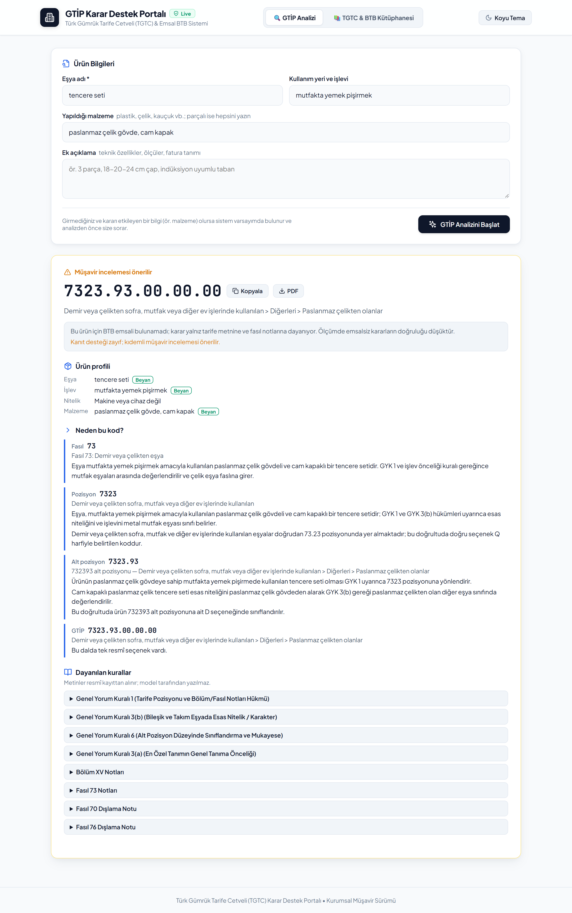
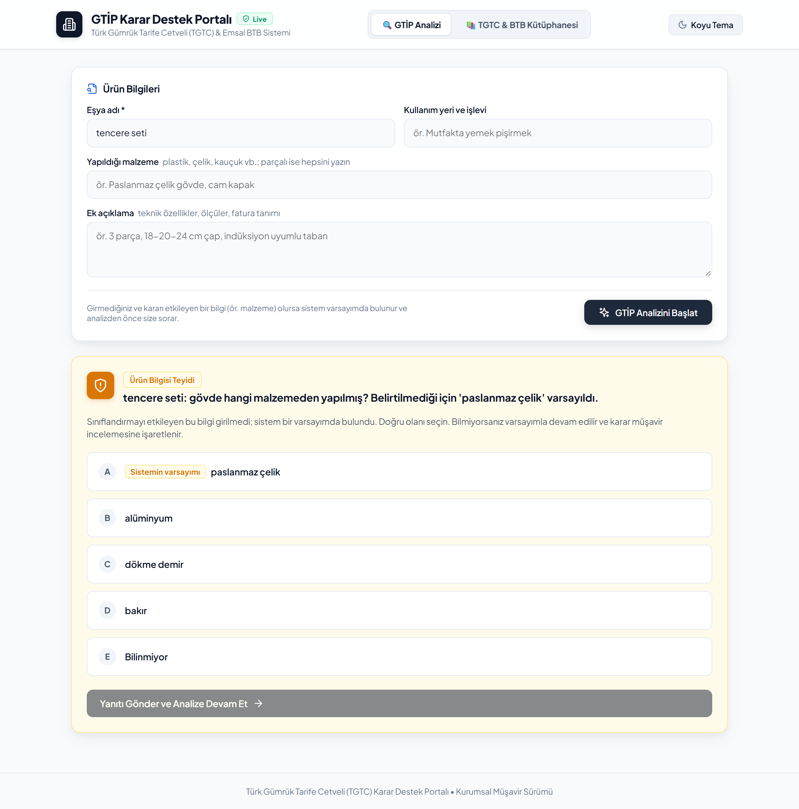
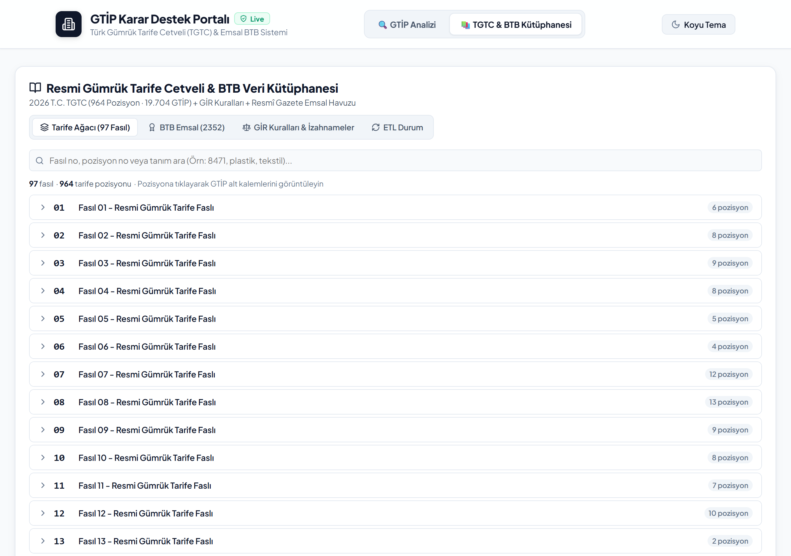
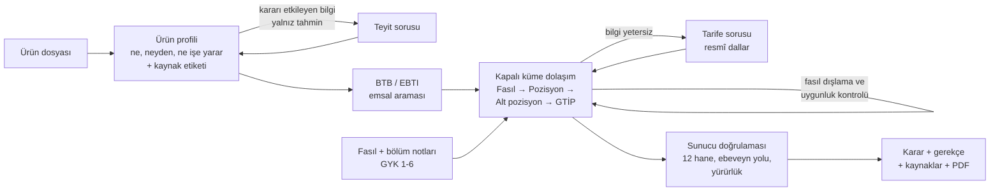

# GTİP Karar Destek Sistemi

Bir eşyanın tanımından **12 haneli Türk GTİP kodunu** (Gümrük Tarife İstatistik Pozisyonu) bulan, kararını resmî tarife metnine, fasıl/bölüm notlarına ve gerçek Bağlayıcı Tarife Bilgisi (BTB) kararlarına dayandıran bir karar destek sistemi.

LLM'e "bu ürünün GTİP'i ne?" diye sormak kolay; zor olan, cevabın **var olan, yürürlükteki bir kod** olmasını, gerekçesinin resmî metne dayanmasını ve emin olunmadığında sistemin tahmin yürütmek yerine **doğru soruyu sormasını** sağlamak. Bu proje o kısmı ele alıyor.



> Sistem Eylül 2026'ya kadar Google Cloud Run üzerinde canlı çalıştı. Servisler kapatıldı; aşağıdaki ekran görüntüleri canlı sürümden alındı. Proje yerelde çalıştırılabilir (bkz. [Yerelde çalıştırma](#yerelde-çalıştırma)).

---

## Ne yapıyor?

| | |
|---|---|
| **Ürün dosyası** | Eşya adı, kullanım yeri/işlevi, malzeme ve serbest açıklama alınır. Eksik ama kararı etkileyen bilgi (ör. tencerenin gövde malzemesi) varsa sistem varsayımda bulunur ve **analize başlamadan kullanıcıya teyit ettirir**. |
| **Kapalı küme seçim** | Model GTİP kodu *yazmaz*. Tarife ağacında Fasıl → Pozisyon → Alt pozisyon → 12 haneli yaprak sırasıyla, her seviyede sunucunun verdiği resmî seçenekler arasından seçim yapar. Uydurma kod üretmek yapısal olarak imkânsızdır. |
| **Resmî dayanak** | Her seçimde ilgili fasıl ve bölüm notları (dışlama hükümleri öncelikli) ve Genel Yorum Kuralları modele verilir. Sonuç ekranındaki kural metinleri modelden değil, resmî kayıttan gelir. |
| **Emsal (BTB)** | 2.355 gerçek BTB kararı arasından benzer olanlar bulunur; güçlü emsaller aday pozisyonları daraltır. |
| **Soru sorma (HITL)** | Bilgi gerçekten yetersizse sistem, resmî tarife dallarından oluşan seçeneklerle müşavire soru sorar ve cevaba göre kaldığı yerden devam eder. |
| **Denetim izi** | Her seviyede neden o dalın seçildiği, dayanılan kural ve notlar, emsaller ve güven skoru kaydedilir; karar PDF olarak indirilebilir. |

<table>
<tr>
<td width="50%"><br><sub>Malzeme girilmediğinde sistem varsayımını teyit ettirir.</sub></td>
<td width="50%"><br><sub>2026 TGTC (97 fasıl, 19.704 GTİP) ve BTB emsal kütüphanesi.</sub></td>
</tr>
</table>

## Nasıl çalışıyor?



Tasarımın ana ilkesi: **model yalnız seçer, kodu sunucu üretir ve doğrular.** Model her seviyede önce gerekçesini, sonra kararını yazar (aksi halde gerekçe ile karar çelişebiliyordu). Ayrıntılı tasarım, veri katmanı ve her kararın ölçüm gerekçesi [mimari raporda](MIMARI_VE_ALGORITMIK_RAPOR.md).

## Ölçüm

Her önemli değişiklik aynı holdout üzerinde ölçüldü: **120 gerçek BTB kararı**, fasıllara dengeli dağıtılmış, tohum 42. Numunenin kendi kararı emsal havuzundan çıkarılır (sızıntı yok). Ham raporlar [`benchmark_results/`](benchmark_results/) altında.

**Seçim modeli karşılaştırması** (aynı kod ve imaj, yalnız model değişti):

| Model | Fasıl | Pozisyon | GTİP (12 hane) | Soru oranı | Ortanca süre |
|---|---|---|---|---|---|
| gemini-2.5-flash | %55.8 | %49.2 | %34.2 | %14.2 | 16.6 sn |
| **gemini-3.5-flash-lite** (seçilen) | %65.0 | %56.7 | %40.0 | %10.0 | **9.1 sn** |
| gemini-3.5-flash | %70.8 | %64.2 | %52.5 | %5.0 | 16.2 sn |

3.5-flash en doğrusu, ancak token maliyeti flash-lite'ın yaklaşık 5 katı; maliyet/doğruluk dengesi için flash-lite seçildi.

**Ölçümün yön değiştirdiği kararlar** (her biri ablasyonla doğrulandı):

- **Ürün profili adımı ilk hâliyle doğruluğu düşürdü.** Tek tek kapatılan üç yeni adımdan (profil, fasıl dışlama, fasıl uygunluk) sorunun profilde olduğu görüldü: detaylı BTB tanımlarının %13'ünde gereksiz malzeme sorusu soruluyordu (melodika, çocuk kitabı, mum). Soru yalnız "malzeme tarife pozisyonunu değiştiriyor mu?" kontrolünden geçerse sorulacak şekilde değiştirildi: soru oranı %13.3 → %0.8, fasıl doğruluğu %54.2 → %62.5.
- **"Gürültüyü azaltmak" için profilden çıkarılan tahmini işlev satırı doğruluğa katkı veriyormuş.** Çıkarılınca fasıl doğruluğu %62.5 → %55.8'e düştü (ör. airsoft bilyesi 9306 yerine 3926); geri eklendi.
- **Benchmark numuneleri koşudan koşuya değişiyordu.** Veritabanı satırları sırasız geldiği için aynı tohum farklı numuneler seçiyordu; iki koşu 120 numunenin yalnız 60'ında örtüşüyordu. Düzeltilene kadar koşular karşılaştırılamazdı.
- **Sıcaklık 0'da tekrar döngüsü.** Belirli bir girdide model aynı gerekçe cümlesini sonsuz tekrarladı ve istek her denemede zaman aşımına düştü. Çıktı tavanı ve kesilen yanıtta farklı örneklemeyle yeniden deneme eklendi.
- **Ürüne özel kurallar kaldırıldı.** "Cam balkon için Fasıl 76" gibi sabit kurallar yerine genel ilkeler (işlev malzemeden önce gelir, dışlama notları) ve fasıl uygunluk kontrolü kullanıldı.

## Teknoloji

- **Backend:** Python, FastAPI, SQLAlchemy (PostgreSQL + pgvector; yerelde SQLite), Pydantic
- **LLM:** Google Gemini (`google-genai`), Vertex AI veya Gemini API anahtarı
- **Frontend:** React 18, Vite
- **Altyapı (arşiv):** Cloud Run, Cloud SQL, Cloud Storage, Cloud Run Jobs (ETL ve benchmark), Cloud Build, GitHub Actions (pytest + frontend build). Dağıtım notları: [docs/GCP_DAGITIM.md](docs/GCP_DAGITIM.md)

## Veri

| Kaynak | Konum |
|---|---|
| 2026 Türk Gümrük Tarife Cetveli (97 fasıl, 964 pozisyon, 19.704 GTİP) ve fasıl/bölüm notları | `2026 TGTC/`, `api/data/` |
| 2.355 BTB kararı (Ticaret Bakanlığı, kamuya açık) | `data/btb_kararlari_export_2026-09-29.json` |
| Benchmark raporları | `benchmark_results/` |

## Yerelde çalıştırma

Gereksinimler: Python 3.11+, Node.js 20+, bir Gemini erişimi (Gemini API anahtarı veya Vertex AI yetkili bir Google Cloud projesi).

```bash
# 1. Backend bağımlılıkları
python -m venv .venv
.venv/Scripts/python -m pip install -r api/requirements.txt      # Linux/macOS: .venv/bin/python

# 2. Ortam
export ENVIRONMENT=development
export JWT_SECRET_KEY=local-development-only-change-me
export USE_GCP_EMULATOR=false
export GEMINI_API_KEY=<anahtarınız>          # veya: gcloud auth application-default login
                                             #       + GCP_PROJECT_ID=<proje> VERTEX_AI_LOCATION=global

# 3. BTB kararlarını yerel veritabanına yükle (DATABASE_URL yoksa SQLite kullanılır)
.venv/Scripts/python -m scripts.load_btb_export

# 4. API
.venv/Scripts/python -m uvicorn api.main:app --host 127.0.0.1 --port 8000

# 5. Arayüz (ikinci terminal)
cd web && npm ci && npm run dev              # http://localhost:5173
```

API'yi doğrudan denemek için:

```bash
curl -X POST http://127.0.0.1:8000/api/v1/analyze-json \
  -H "Content-Type: application/json" \
  -d '{"dossier": {"product_name": "tencere seti", "material": "paslanmaz çelik gövde, cam kapak"}}'
```

Model olmadan (ör. CI'da) çalıştırmak için `USE_GCP_EMULATOR=true` verin; bu modda seçimler deterministik yer tutuculardır ve gerçek sınıflandırma yapılmaz.

## Testler

```bash
.venv/Scripts/python -m pytest tests        # 182 test, ağ gerektirmez
npm --prefix web run build
```

## Sınırlar

- En iyi yapılandırmada bile 12 haneli tam kod doğruluğu %40–52 aralığında; sistem müşavirin yerine geçmek için değil, gerekçeli bir ilk öneri ve denetim izi üretmek için tasarlandı. Emsali olmayan kararlar ekranda "müşavir incelemesi önerilir" olarak işaretlenir.
- Benchmark detaylı BTB tanımlarından oluşuyor; kullanıcıların yazdığı kısa, eksik girdilerdeki başarı ayrıca ölçülmedi.
- Yalnız eşya adı girildiğinde bazı ürünlerde (ör. "cam balkon sistemi") flash-lite yanlış fasla gidebiliyor; malzeme girildiğinde doğru fasla gidiyor.

## Proje yapısı

```
api/            FastAPI uygulaması
  graph/        karar hattı ve durum makinesi (workflow.py)
  modules/      kapalı küme seçici, emsal araması, ürün profili, fasıl notları
  schemas/      Pydantic şemaları
  db/           veri modeli ve TGTC bilgi tabanı
web/            React arayüzü
scripts/        ETL, benchmark, dağıtım ve veri yükleme betikleri
tests/          pytest
benchmark_results/  ölçüm raporları
docs/           ekran görüntüleri ve GCP dağıtım notları
```

## Lisans

[MIT](LICENSE)
