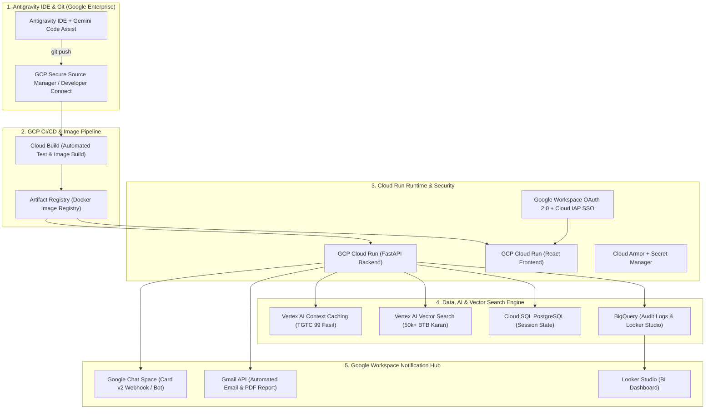

# 🏛️ GTİP TESPİT VE KARAR DESTEK SİSTEMİ
## %100 GCP Bulut Mimarisi & Google Workspace Uçtan Uca Uygulama ve Dağıtım Planı

**Tarih:** 4 Ağustos 2026  
**Hedef:** %99 12-Haneli GTİP Doğruluğu, Sıfır Uydurma (Zero-Hallucination), %100 GCP & Google Workspace Ekosistemi Entegrasyonu  

---

## 🏛️ 1. %100 GOOGLE EKOSİSTEMİ MİMARİ MATRİSİ

Projenin her bir bileşeninin Google ekosistemindeki karşılıkları:

| İşlev Katmanı | Kullanılacak Google Servisi | Açıklama / Kullanım Amacı |
| --- | --- | --- |
| **Git Deposu** | **GCP Secure Source Manager** / **Developer Connect** | Kodlarınızı GCP üzerinde güvenli git depolarında saklama ve versiyonlama. |
| **IDE & AI Kod Asistanı** | **Antigravity IDE** + **Gemini Code Assist** | Antigravity IDE üzerinde Gemini CLI ve Gemini Code Assist entegrasyonu ile geliştirme. |
| **CI/CD Pipeline** | **Cloud Build** | Git deposuna `push` yapıldığında otomatik test, container image build ve Cloud Run deploy akışı. |
| **Konteyner Kaydı** | **Artifact Registry** | Build edilen Docker imajlarının depolanması. |
| **Veri Toplama (Scraper)** | **Cloud Scheduler** + **Cloud Run Jobs** | Her gece Resmi Gazete ve Ticaret Bakanlığı BTB kararlarını otomatik çeken sunucusuz görevler. |
| **Ham Veri Depolama** | **Cloud Storage (GCS)** | Çekilen HTML, PDF ve ham JSON dosyalarının depolanması. |
| **Vektör Veritabanı (RAG)** | **Vertex AI Vector Search** | BTB kararları ve 12 haneli GTİP açıklamalarının yüksek hızlı semantik vektör araması. |
| **Mevzuat Önbellekleme** | **Vertex AI Context Caching** | TGTC 99 Fasıl İzahnameleri ve Genel Yorum Kurallarını (GİR) sıfır gecikmeyle LLM'e sunma. |
| **İlişkisel & Log Verisi** | **Cloud SQL (PostgreSQL)** + **BigQuery** | Oturum/durum yönetimi için Cloud SQL; denetim logları ve geri bildirimler için BigQuery. |
| **Yapay Zeka ve Ajanlar** | **Vertex AI (Gemini 2.5 / 3 Flash & Pro)** | Hiyerarşik LangGraph/ADK ajanlarının çalıştırılması. |
| **Uygulama Sunucusu** | **Cloud Run** | Backend (FastAPI) ve Frontend (React/Vite) uygulamalarının serverless olarak çalışması. |
| **Kimlik Doğrulama** | **Google Workspace OAuth 2.0** + **Cloud IAP** | Şirket çalışanlarının Google kurumsal hesaplarıyla sisteme güvenli girişi (SSO). |
| **Bildirim ve Uyarılar** | **Google Chat Webhooks** + **Gmail API** | Mevzuat değişiklikleri, düşük güvenli karar onayları ve günlük raporlar için Chat & E-posta bildirimleri. |
| **Raporlama & BI** | **Looker Studio** | BigQuery'deki doğruluk oranları ve GTİP kullanım analitiğinin görselleştirilmesi. |

---

## 🔄 2. UÇTAN UCA ÇALIŞMA AKIŞI (GIT'TEN BİLDİRİMLERE)



---

## 🎯 3. GTİP TESPİTİNDE %99 DOĞRULUK VE SIFIR HALÜSİNASYON STRATEJİSİ

### A. Dynamic Context Caching (Resmi Gazete ve İzahname Önbellekleme)
* **Vertex AI Context Caching:** 99 Fasıl İzahnamesi ve Genel Yorum Kuralları (GİR 1-6) **Vertex AI Context Cache** üzerinde tutulur.
* **Avantaj:** Gemini modelleri bu devasa mevzuata **0 ms ek gecikmeyle** ve %80 daha düşük maliyetle erişir.

### B. Hiyerarşik Arama ve Eleme (Tree-Search Hybrid RAG)
Arama 4 kademeli süzgeçle yürütülür:
1. **2-Hane (Fasıl):** Ürün tanımına göre aday 2-3 fasıl seçilir. Kural motoru hard-exclusion ile alakasız fasılları eler.
2. **4-Hane (Pozisyon):** Seçilen fasıllar içindeki pozisyonlar taranır.
3. **6-Hane (Alt Pozisyon):** Dünya Gümrük Örgütü (HS Code) seviyesine inilir.
4. **12-Hane (Milli GTİP):** Vertex AI Vector Search üzerindeki 50.000+ emsal BTB kararı ve TGTC açılımları ile nokta atışı kod tespit edilir.

### C. Gümrük Müşaviri Soru Sorma Motoru (HITL Gate)
* Güven skoru `< %90` veya kritik teknik parametre belgede yoksa sistem asla tahmin yapmaz.
* `WAITING_FOR_USER` durumuna geçer ve Google Chat veya Web Arayüzü üzerinden Müşavire dinamik çoktan seçmeli soru sorar.

---

## 🚀 4. KADEME KADEME UYGULAMA VE KURULUM PLANI

### 1. Adım: Kaynak Kod Deposu ve Antigravity IDE Yapılandırması
1. GCP Konsolu üzerinden **Secure Source Manager** servisinde `gtip-decision-support` repository oluşturun.
2. Antigravity IDE terminalinizden repo entegrasyonunu yapın:
```bash
gcloud auth login
gcloud config set project [PROJECT_ID]
git remote add google https://source.developers.google.com/p/[PROJECT_ID]/r/gtip-decision-support
```

### 2. Adım: Veri Toplama ve Otomatik Güncellik Hattı
1. **Cloud Run Jobs:** `scripts/fetch_official_btb.py` ve `scripts/fetch_resmi_gazete.py` kodlarını bir konteynere paketleyin.
2. **Cloud Scheduler:** Her gece saat 02:00'de tetiklenir:
   * Yeni İthalat Rejimi Kararı yayımlandığında veriler **Cloud Storage (GCS)** içine aktarılır.
   * **Vertex AI Vector Search** indeksleri otomatik güncellenir.
   * Değişiklik olduğunda **Google Chat Webhook** aracılığıyla gümrük ekibinin kanalına bildirim düşer.

### 3. Adım: Vertex AI Agent Mimarisi ve Context Cache
1. **Context Cache Oluşturma:**
```python
from google import genai
from google.genai import types

client = genai.Client()
cache = client.caches.create(
    model="gemini-2.5-pro",
    config=types.CreateCachedContentConfig(
        contents=[tgtc_izahname_text],
        ttl="86400s", # 24 saatlik önbellek
    )
)
```
2. **Auditor Agent:** Önerilen GTİP'in yasal metni ile ürün faturasını karşılaştırır, gerekçe metnine emsal BTB linkini ekler.

### 4. Adım: Google Chat Webhook & Gmail API Entegrasyonu
1. **Google Chat Webhook:** `api/modules/google_workspace_notifier.py` üzerinden düşük güvenli analizlerde Müşavire Card v2 formatında onay kartı fırlatır. Müşavir Chat içinden kararı onaylayabilir.
2. **Gmail API:** Tamamlanan GTİP analiz raporları resmi PDF formatında Gmail API ile e-posta olarak iletilir.

### 5. Adım: BigQuery Audit Log & Looker Studio Raporlama
1. Kullanıcının onayladığı veya değiştirdiği tüm kararlar BigQuery `gtip_audit_logs` tablosuna yazılır.
2. **Looker Studio** paneli üzerinden sistem doğruluk oranı (%99 hedefi) ve günlük beyanname analiz istatistikleri görselleştirilir.

---

## 🛠️ Antigravity IDE Canlıya Alma Komutları

Geliştirme tamamlandıktan sonra projenizi GCP üzerinde canlıya alma adımları:

```bash
# 1. Google Artifact Registry Deposu Oluşturma
gcloud artifacts repositories create gtip-repo --repository-format=docker --location=europe-west3

# 2. Cloud Build ile Otomatik Derleme
gcloud builds submit --tag europe-west3-docker.pkg.dev/[PROJECT_ID]/gtip-repo/backend:v1 .

# 3. Cloud Run Üzerinde Backend'i Canlıya Alma
gcloud run deploy gtip-backend \
    --image europe-west3-docker.pkg.dev/[PROJECT_ID]/gtip-repo/backend:v1 \
    --region europe-west3 \
    --platform managed \
    --allow-unauthenticated \
    --set-env-vars GCP_PROJECT=[PROJECT_ID]
```

---
*Bu yol haritası %100 GCP ve Google Workspace Enterprise mimarisi ile uyumludur.*
