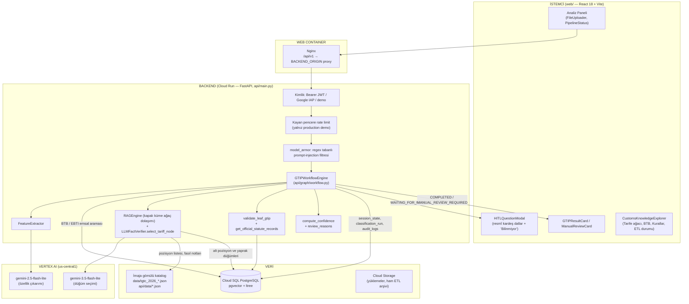
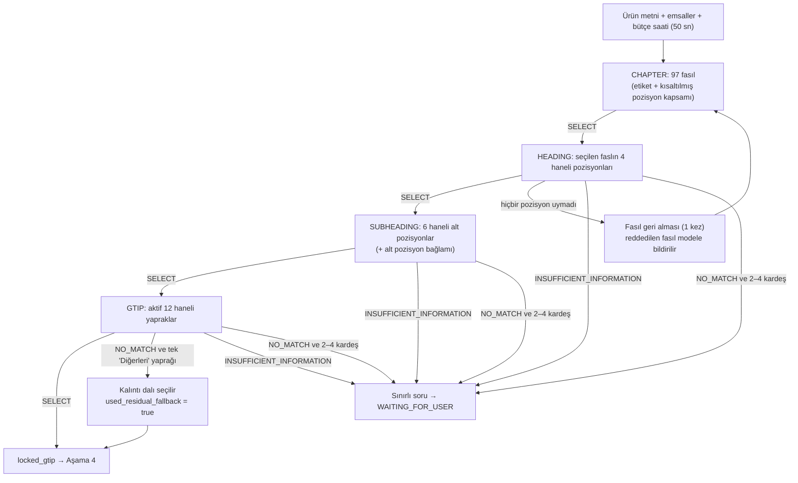
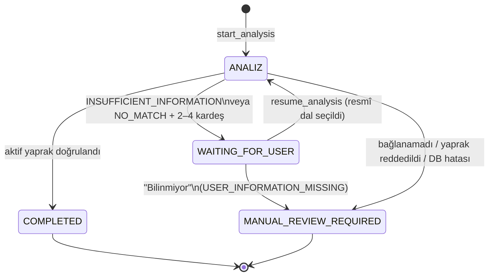
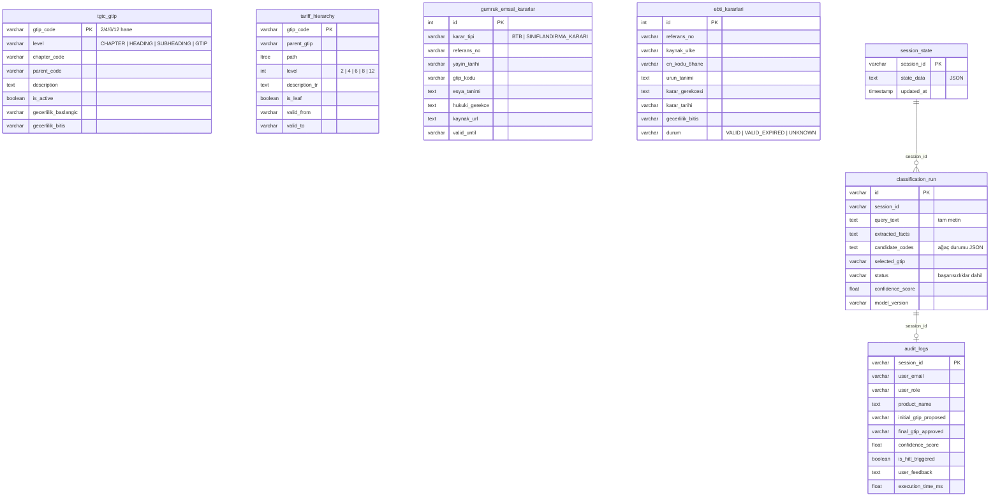

# TÜRK GÜMRÜK TARİFE CETVELİ (TGTC) GTİP TESPİT VE KARAR DESTEK SİSTEMİ

## Mimari ve Algoritmik Çalışma Raporu

**Belge Sürümü:** 2.2.0
**Tarih:** 2026-09-29
**Kapsanan kod durumu:** `main` dalı (seçim modeli `gemini-3.5-flash-lite`)

> [!NOTE]
> Sistem Eylül 2026 sonuna kadar Google Cloud üzerinde çalıştı; servisler kapatıldı. Bu rapor çalışan sürümün mimarisini ve ölçümlerini belgeler. Cloud Run, Cloud SQL ve job'lara yapılan atıflar o dönemi anlatır; yerel kurulum için [README](../README.md).
**Hedef Kitle:** Yazılım mimarları, gümrük müşavirleri, veri bilimciler ve sistem mühendisleri
**İlgili Depo:** [yapay-zeka-gtip-tespiti](https://github.com/yusufarbc/yapay-zeka-gtip-tespiti)

> [!NOTE]
> **Sürüm 1.1.0'dan bu yana değişenler.** Önceki rapor, artık kodda bulunmayan bileşenleri anlatıyordu:
> `rule_engine.py` (HARD_RULES_MATRIX), `predicate_registry.py` (Boolean yüklemler), `deterministic_engine.py`
> (%5 eşik kuralı), pgvector + BM25 + RRF ile aday puanlama, LLM tabanlı dışlama doğrulaması, sürekli öğrenme
> döngüsü ve canlı uluslararası arama. Bunların hiçbiri bugün karar yolunda değildir. Sistem artık
> **kapalı küme ağaç dolaşımı** yapıyor: model her seviyede yalnız sunucunun verdiği seçenek kimliklerinden birini
> seçiyor. Bu belge bu mimariyi, gerçek ölçüm sonuçlarını ve bilinen sınırları anlatır.

---

## İÇİNDEKİLER

1. [Yönetici Özeti ve Tasarım İlkeleri](#bolum-1)
2. [Sistem Mimarisi ve Teknoloji Yığını](#bolum-2)
3. [Karar Hattı: Uçtan Uca Akış](#bolum-3)
4. [Yapay Zeka ile Deterministik Katmanın İş Bölümü](#bolum-4)
5. [İnsan Döngüde (HITL) ve Durum Makinesi](#bolum-5)
6. [Veri Katmanı](#bolum-6)
7. [Veri Entegrasyonu ve ETL İşleri](#bolum-7)
8. [Geri Bildirim ve Karar Kaydı](#bolum-8)
9. [Güvenlik, Denetim İzi, Raporlama ve İzleme](#bolum-9)
10. [Benchmark ve Ölçülen Başarım](#bolum-10)
11. [Bilinen Sınırlar ve Teknik Borç](#bolum-11)
12. [Özet](#bolum-12)

---

<a id="bolum-1"></a>

## 1. YÖNETİCİ ÖZETİ VE TASARIM İLKELERİ

### 1.1. Problem ve Hukuki Risk
Gümrük Tarife İstatistik Pozisyonu (**GTİP**), eşyanın 12 haneli kodla sınıflandırıldığı milli nomenklatürdür.
İlk 6 hane Armonize Sistem (HS), ilk 8 hane AB Kombine Nomenklatürü (CN) ile ortaktır.

Yanlış GTİP beyanının sonuçları:
* **Maddi ceza:** 4458 sayılı Gümrük Kanunu'nun 234. maddesi uyarınca vergi farkına bağlı idari para cezası.
* **Cezai yaptırım:** 5607 sayılı Kaçakçılıkla Mücadele Kanunu kapsamında dava riski.
* **Ticaret politikası tedbirlerinin atlanması:** İlave gümrük vergisi (İGV), anti-damping, gözetim, TAREKS/TSE denetimleri.

### 1.2. Yaklaşım: Kodu Model Değil Sunucu Üretir
Üretici bir dil modeli (LLM) tek başına GTİP tespitinde kullanılamaz. Yürürlükte olmayan kodlar uydurabilir,
ürettiği metin hukuki dayanak değildir ve tarife her yıl değişir.

Bu sistemde model **hiçbir zaman GTİP kodu yazmaz**. Sunucu, resmî 2026 TGTC ağacının her seviyesinde (fasıl →
pozisyon → alt pozisyon → 12 haneli yaprak) kardeş düğümleri harf kimlikleriyle (`A`, `B`, … `AA`) modele sunar.
Model yalnız bir harf döndürür. Sunucu bu harfi kendi düğümüne çözer, ebeveyn–çocuk yolunu korur ve sonucu ancak
kod, veritabanında **yürürlükteki aktif bir 12 haneli yaprak** ise kabul eder.

> [!IMPORTANT]
> **TEMEL İLKELER (kodda uygulanan hâliyle)**
> 1. **Kapalı küme:** Model yalnız sunucunun verdiği `option_id` değerini döndürebilir. Küme dışı kimlik gelirse seçim geçersizdir ([llm_verifier.py](../api/modules/llm_verifier.py)).
> 2. **Yaprak doğrulama kapısı:** Seçilen kod `validate_leaf_gtip` ile 12 hane, `is_leaf`/`GTIP` seviyesi ve yürürlük tarihi açısından doğrulanır. Doğrulanamazsa karar `MANUAL_REVIEW_REQUIRED` olur ([database.py](../api/db/database.py)).
> 3. **Model mevzuat metni yazmaz:** GİR metinleri, fasıl/pozisyon/alt pozisyon/yaprak metinleri ve fasıl notları kayıtlı resmî kaynaktan okunur (`get_official_statute_records`).
> 4. **Emsal delildir, bağlayıcı değildir:** BTB ve AB EBTI kararları modele delil olarak verilir. Skora doğrudan ağırlık olarak girmez (`BTB_WEIGHT = 0.0`). Tek istisna, tüm birebir eşleşmelerin aynı aktif yaprağı gösterdiği BTB kısa yoludur.
> 5. **Fail-closed:** Model hatası, zaman aşımı, sözleşme ihlali veya doğrulama hatası tahmine değil `NO_MATCH`, soruya ya da manuel incelemeye dönüşür.
> 6. **Ölçülmemiş iddia yok:** Güven skoru etiketli veriyle kalibre edilir. Doğruluk, gerçek BTB kararlarından oluşan bir holdout üzerinde ölçülür (bkz. Bölüm 10).

---

<a id="bolum-2"></a>

## 2. SİSTEM MİMARİSİ VE TEKNOLOJİ YIĞINI

Sistem GCP üzerinde sunucusuz çalışır. Backend ve web ayrı Cloud Run servisleridir. Veri toplama ve ölçüm işleri
Cloud Run Job olarak aynı imajla çalışır.

### 2.1. Yüksek Düzey Mimari



### 2.2. Teknoloji Yığını

| Katman | Teknoloji | Rolü |
| :--- | :--- | :--- |
| **Frontend** | React 18, Vite 8, axios, lucide-react | Analiz paneli, HITL modalı, sonuç kartı, bilgi gezgini. İstek zaman aşımı 75 sn. |
| **Web sunumu** | Nginx (`web/nginx.conf.template`) | Statik dosyalar ve `/api/v1` → `BACKEND_ORIGIN` proxy. İmaja ortam URL'si gömülmez. |
| **API** | FastAPI (sürüm `1.1.0`), Uvicorn, Pydantic v2 | REST uç noktaları, SSE, toplu analiz, PDF. |
| **Orkestrasyon** | Düz Python sınıfı `GTIPWorkflowEngine` | Analizi başlatma, duraklatma, devam ettirme. (LangGraph kullanılmaz; senkron akış `asyncio.to_thread` ile çalışır.) |
| **LLM** | Google GenAI SDK, Vertex AI (ADC) | `REASONING_LLM_MODEL = gemini-3.5-flash-lite` (seçim; aynı 120 BTB numunesinde GTİP %40.0, 2.5-flash %34.2; 3.5-flash %52.5 ama ~5 kat pahalı), `EXTRACTOR_LLM_MODEL = gemini-2.5-flash-lite` (çıkarım). |
| **Veritabanı** | Cloud SQL PostgreSQL, SQLAlchemy 2, `vector`, `ltree`, `uuid-ossp` uzantıları | Tarife yaprakları, emsaller, oturum durumu, karar kayıtları. |
| **Dosya deposu** | Cloud Storage | Görsel yüklemeleri (`uploads/YYYY/MM/DD/`), ETL ham JSONL arşivi. |
| **Denetim** | Cloud SQL `audit_logs` (varsayılan) veya Firestore `gtip_audit_logs` | `AUDIT_BACKEND` ile seçilir. |
| **Raporlama** | ReportLab | Türkçe fontlu (Arial/DejaVu) A4 PDF, tekil ve toplu. |
| **Loglama** | `api/logging_config.py` | Cloud Logging uyumlu yapılandırılmış JSON, `severity` alanı dolu. |
| **Bildirim** | Google Chat webhook (Card v2), SMTP | Yalnız ETL senkron sonuç kartı için kullanılır. |
| **CI** | GitHub Actions (`.github/workflows/test.yml`) | Çevrimdışı `pytest` (SQLite + stub seçici) ve web derlemesi. |

---

<a id="bolum-3"></a>

## 3. KARAR HATTI: UÇTAN UCA AKIŞ

Sistem ürün metnini LLM'e verip "GTİP nedir?" diye sormaz. Akış aşağıdaki gibidir:

```
[Ürün tanımı (+ isteğe bağlı görsel)]
        │
        ▼
 Aşama 0  Giriş kapısı ─────────── kimlik, rate limit, model_armor temizliği
        │
        ▼
 Aşama 1  Özellik çıkarımı ──────── deterministik kısa yol  |  flash-lite JSON
        │
        ▼
 Aşama 2  Emsal toplama ─────────── BTB (Cloud SQL) + AB EBTI (Cloud SQL)
        │
        ├── Tüm birebir BTB eşleşmeleri aynı aktif yaprağı mı gösteriyor? ── Evet ──┐
        │                                                                          │
        ▼ Hayır                                                                    │
 Aşama 3  Kapalı küme ağaç dolaşımı (50 sn bütçe)                                  │
          En iyi BTB ≥ 0.80 ise: emsallerin ilk 3 pozisyonu → HEADING'den başla   │
            (bağlanamazsa tam dolaşıma dön)                                        │
          Aksi halde: CHAPTER → HEADING → SUBHEADING → GTIP                        │
          (her seviyede: SELECT | INSUFFICIENT_INFORMATION | NO_MATCH)             │
        │                                                                          │
        ├── Soru üretildi ──► WAITING_FOR_USER (oturum saklanır)                    │
        ▼                                                                          │
 Aşama 4  Sunucu doğrulaması ve mevzuat bağlama ◄─────────────────────────────────┘
          validate_leaf_gtip + get_official_statute_records
        │
        ▼
 Aşama 5  Güven skoru ve inceleme işareti
        │
        ▼
[COMPLETED (PASSED | MANUAL_REVIEW işareti)  |  MANUAL_REVIEW_REQUIRED]
```

---

### Aşama 0: Giriş Kapısı
* **Bileşenler:** [main.py](../api/main.py), [auth.py](../api/security/auth.py), [rate_limit.py](../api/security/rate_limit.py), [model_armor.py](../api/security/model_armor.py)
* Kimlik sırası: `Authorization: Bearer` JWT, ardından `x-goog-iap-jwt-assertion` (yalnız `IAP_AUDIENCE` tanımlıysa).
  Geliştirmede `X-User-Email` ve `X-User-Role` başlıkları kabul edilir. Production'da kimlik yoksa istek `401` alır.
  Tek istisna `ALLOW_PUBLIC_DEMO_ACCESS=true` durumudur; o zaman oturum `demo_` önekli bir demo kullanıcısıdır.
* **Rate limit:** Yalnız production'daki demo kullanıcılarına uygulanır. İstemci IP'si başına dakikalık kayan pencere
  kullanılır (`PUBLIC_DEMO_RATE_LIMIT_PER_MINUTE=10`, toplu analizde bunun yarısı).
* **model_armor:** Adı Vertex AI Model Armor'ı çağrıştırsa da yerel bir **regex filtresidir**. "override gtip to …",
  "force classification as …" gibi talimat enjeksiyonu kalıplarını reddeder ve kontrol karakterlerini temizler.

### Aşama 1: Özellik Çıkarımı
* **Bileşen:** [feature_extractor.py](../api/modules/feature_extractor.py) (`FeatureExtractor.extract_features`)
* **Çıktı:** `ProductFeatures` (ürün adı, ticari ad, baskın malzeme, işlev, aksesuar/ambalaj, kompozisyon, kullanım amacı,
  set/demonte bayrakları, teknik özellikler).
* **Algoritma:**
  1. *Regex ön çıkarımı:* Voltaj (`220V`), güç (`1500W`), ağırlık (`kg/gr`) ve pamuk/polyester yüzdesi ayrıştırılır.
  2. *Deterministik kısa yol:* Metin kısa ve tek ürünlükse model çağrılmaz. Koşullar: en fazla 240 karakter ve 24 kelime,
     fatura işaretleri yok, en fazla 1 satır sonu ve 2 iki nokta. Görsel yüklendiyse kısa yol kullanılmaz. Özellikler
     açık malzeme sözlüğünden (`_EXPLICIT_MATERIALS`) kurulur; yalnız kullanıcının yazdığı malzeme alınır. Ürüne özel
     varsayım yapılmaz (önceki "cam balkon → alüminyum / mimari sistem" kuralı kaldırıldı).
  3. *LLM çıkarımı:* Uzun veya belge benzeri girdide `gemini-2.5-flash-lite` çağrılır. Ayarlar `thinking_budget=0`,
     `temperature=0.0`, `response_mime_type=application/json`. Regex bulguları modelin teknik özelliklerinin üzerine yazılır.
  4. *Yedek yol:* Model başarısız olursa ilk satır ürün adı olur, malzeme Türkçe stop-word süzgeciyle token'lardan türetilir.
* **Önemli:** Çıkarılan özellikler seçim adımına **ham beyanla birlikte** verilir (`ORİJİNAL BEYAN: …`,
  `SELECTION_USE_RAW_TEXT`). Önceki sürümde ölçü ve kullanım koşulu gibi ayrımlar damıtma sırasında kayboluyordu.

### Aşama 2: Emsal Toplama
* **Bileşen:** [rag_engine.py](../api/modules/rag_engine.py) (`search_btb_precedents`, `search_ebti_precedents`, `exact_btb_candidate`)
* Emsal araması **ham ürün metni** üzerinden, vektör değil metin eşleşmesiyle yapılır:

| | Türkiye BTB (`gumruk_emsal_kararlar`, `karar_tipi='BTB'`) | AB EBTI (`ebti_kararlari`) |
| :--- | :--- | :--- |
| Ön filtre | En uzun 6 terim (≥3 harf) için `ILIKE`, en yeni 200 satır | En uzun 6 terim için `ILIKE`, durum `VALID/VALID_EXPIRED/UNKNOWN`, en yeni 150 satır |
| Normalizasyon | Türkçe karakter ve aksan katlama, küçük harf, alfanümerik token | Aynı. Ürün tanımına karar gerekçesi de eklenir |
| Skor | Tam eşitlik 1.0, içerme 0.96, aksi halde `0.7·kapsama + 0.3·kesinlik` | Tam eşitlik 1.0, içerme 0.95, aksi halde `0.65·kapsama + 0.35·kesinlik`. `VALID` ise ×1.05 |
| Eşik / adet | ≥ 0.30, en iyi 5 | ≥ 0.20, en iyi 3 |
| Geçerlilik | `valid_until` geçmişse atlanır | `VALID` olup süresi dolmuşsa atlanır |

  Burada `kapsama = ortak token / sorgu token'ı`, `kesinlik = ortak token / emsal token'ı` olarak hesaplanır.

* **Birebir BTB kısa yolu:** Skoru ≥ 0.999 olan tüm BTB'ler **tek bir** koda işaret ediyorsa ve bu kod aktif bir yaprak
  olarak doğrulanıyorsa ağaç dolaşımı atlanır. `selection_source = "BTB_EXACT"` olur. Kodu model değil idarenin kendi
  kararı vermiş olur.
* Benchmark sırasında numunenin kendi BTB kaydı `exclude_btb_refs` ile havuzdan çıkarılır, böylece sızıntı olmaz.
* BTB araması 20 sonuç döndürür. İlk 5'i delil olarak modele ve karara gider. 20'lik kümenin tamamı yalnız pozisyon
  yönlendirmesinin oylamasında kullanılır (Aşama 3.0).

### Aşama 3: Kapalı Küme Ağaç Dolaşımı
* **Bileşenler:** [rag_engine.py](../api/modules/rag_engine.py) (`search_candidates_hierarchical`, `_select_node`), [llm_verifier.py](../api/modules/llm_verifier.py) (`select_tariff_node`), [predicate.py](../api/schemas/predicate.py) (`CandidateSelection`)



#### 3.0. Emsal güdümlü pozisyon yönlendirmesi (hibrit giriş)
* **Bileşenler:** `route_headings_from_precedents`, `aggregate_precedents_by_heading`, `_routed_heading_nodes` ([rag_engine.py](../api/modules/rag_engine.py)); tam dolaşıma dönüş [workflow.py](../api/graph/workflow.py) içindedir.
* **Kapı:** En iyi TR BTB benzerliği `HEADING_ROUTING_MIN_BTB = 0.80` veya üstündeyse CHAPTER seçimi atlanır. EBTI kapıyı açmaz.
* **Adaylar:** Emsaller pozisyonlarına göre oylanır (`skor = en iyi benzerlik + 0.05 × ek emsal`). İlk
  `HEADING_ROUTING_MAX_HEADINGS = 3` pozisyon, katalogda varsa HEADING seçenekleri olur. Adaylar birden çok fasla
  yayılabilir; her adayın fasıl notu kendi başlığıyla ve eşit payla prompta girer.
* **Model onayı zorunlu:** Tek aday olsa bile model çağrılır (`always_ask_model`), çünkü aday resmî ağaçtan değil
  emsalden gelir.
* **Dönüş:** Model adaylar arasında `NO_MATCH` derse bu soruya çevrilmez (`recover_no_match=False`). Müşavir muhtemelen
  yanlış adaylar arasında seçime zorlanmaz; aynı süre bütçesiyle tam dolaşım başlatılır. İzde
  `routing = BTB_HEADINGS_FALLBACK` ve `used_routing_fallback = true` görünür. Alt seviyelerde bağlanamama da aynı dönüşü tetikler.
* **Bayrak:** `HEADING_ROUTING_ENABLED` (varsayılan açık). Yeniden deploy gerekmeden ortam değişkeniyle kapatılabilir.
* **Neden tam geçiş değil:** Fasıl seçimini tamamen aramaya bırakmak ölçümde reddedildi (bkz. Bölüm 10.4).

#### 3.1. Seviye başına seçenek kümeleri
| Seviye | Kaynak | Not |
| :--- | :--- | :--- |
| `CHAPTER` | `load_tgtc_chapters()` + `get_local_tgtc_headings()` | Her fasıl için başlık ve pozisyon kapsamı verilir. Pozisyon **listesi kesilmez**, yalnız etiketler kısaltılır (`CHAPTER_HEADING_LABEL_CHARS=20`, fasıl başına ≤ `CHAPTER_SCOPE_CHARS=2600`). Prompt ~21.000 token'dan ~11.300 token'a indi ve Fasıl 61'de 6109 gibi pozisyonlar görünür kaldı. |
| `HEADING` | `data/tgtc_2026_full_database.json` içindeki 4 haneli kayıtlar | 964 pozisyon. |
| `SUBHEADING` | `tgtc_gtip` (`level='SUBHEADING'`), `tariff_hierarchy` (`level=6`), eksikse yapraklardan türetme | [tgtc_subheading_context.json](../api/data/tgtc_subheading_context.json) bağlamı `branch_context` olarak eklenir. |
| `GTIP` | `tgtc_gtip` (`level='GTIP'`, `is_active`) + `tariff_hierarchy` (`is_leaf`) | Açıklamalar kökten yaprağa tam yolu taşır (`scripts/rebuild_tgtc_catalog.py`). |

Tek seçenekli seviyede model çağrılmaz; düğüm doğrudan seçilir (`GIR_1`, `GIR_6`).

#### 3.2. Seçenek kimlikleri ve kardeş kısaltma
* **Harf kimlikleri:** `option_id(i)` sırayı `A, B, … Z, AA, AB` biçimine çevirir. Önceki `N1, N2…` kimlikleri fasıl
  numaralarıyla hizalıydı. Fasıl 77 boş olduğu için model "Fasıl 85" demek isteyip `N85` yazdığında Fasıl 86 çözülüyordu.
  Harf kimlikleri tarife koduyla karıştırılamaz.
* **Konumsal sabitlik:** Reddedilen dal listeden **çıkarılmaz**, çünkü çıkarmak tüm kimlikleri kaydırır. Dışlama modele
  metinle bildirilir. Model reddedilen kodu yeniden seçerse sonuç `NO_MATCH` sayılır.
* **Ortak önek atma (`_shorten_siblings`):** Kardeşlerin açıklamalarındaki tamamen ortak yol seviyeleri (`A > B > …`)
  atılır. Böylece prompt ve kullanıcı sorusunda yalnız ayırt edici kısım kalır.

#### 3.3. Seçim promptu
`select_tariff_node` tek bir prompt kurar. Prompt önbelleklemesine uygun olsun diye sabit bloklar değişken bloklardan önce gelir:
1. **Kurallar:** Yeni kod yazmama, kapalı küme, GİR 1 dışlama notları, GİR 2(a), 3(a), 3(b). Yalnız genel yorum kuralları
   yazılır; belirli ürün veya kod için kural yazılmaz. **Atıf dürüstlüğü:** Model yalnız promptta kendisine verilen resmî
   metne, nota veya emsale atıf yapabilir; verilmeyen bir hükmü "fasıl notları uyarınca" diye yazamaz. Dar/istisnai dallar ancak olumlu
   kanıtla seçilir, aksi halde "diğerleri" dalı seçilir. Soru yalnız kullanıcının gözlemleyebileceği bir fiziksel/teknik
   özellik için sorulur. `CHAPTER` seviyesinde `INSUFFICIENT_INFORMATION` yasaktır; model yine de verirse ve seçenek önerdiyse yeniden deneme yapılmadan ilk önerilen fasılla devam edilir (reddedilen fasıllar hariç).
2. **Resmî kapalı seçenekler:** `option_id`, `official_code`, `official_description` (≤1800 karakter, en fazla 250 düğüm).
3. **Fasıl notları** (`SELECTION_USE_CHAPTER_NOTES`): Seçeneklerin tamamı tek bir fasla aitse o faslın resmî notu
   eklenir (≤6000 karakter). `CHAPTER` seviyesinde eklenmez.
4. **Emsaller** (`SELECTION_USE_PRECEDENTS`): Kod öneki bu seviyedeki seçeneklerle eşleşen en fazla 4 BTB/EBTI emsali
   eklenir (önek genişliği CHAPTER 2, HEADING 4, SUBHEADING 6, GTIP 8). Model emsale uyarsa referans numarasını yazmalı,
   ayrılırsa farkı belirtmelidir. Emsal metin ve notla çelişirse metin ve not üstündür.
5. **Ürün verisi** `<product_data>` etiketi içinde verilir.

Beklenen çıktı `CandidateSelection` şemasıdır:
```json
{
  "status": "SELECT | INSUFFICIENT_INFORMATION | NO_MATCH",
  "selected_candidate_id": "C",
  "alternative_candidate_ids": ["C", "D"],
  "question_text": "Türkçe soru veya null",
  "reasoning_points": ["kısa Türkçe gerekçe"],
  "applied_gir_keys": ["GIR_1", "GIR_3B", "GIR_6"],
  "cited_chapter_notes": ["76"]
}
```
Liste alanları şema doğrulamasından **önce** kırpılır (alternatifler ≤4, gerekçeler ≤6). Gerekçede geçen "GİR 3(b)" veya
"Fasıl 76" gibi atıflar `applied_gir_keys` ve `cited_chapter_notes` alanlarına otomatik tamamlanır.

#### 3.4. Hata toleransı ve süre bütçesi
| Mekanizma | Değer | Amaç |
| :--- | :--- | :--- |
| Toplam bütçe | `ANALYSIS_BUDGET_MS = 50000` (en çok `CLIENT_REQUEST_BUDGET_MS = 65000` eksi profil süresi), ağaç dolaşımı başlarken kurulur | Arayüz 75 sn'de vazgeçer. Bütçe dolunca hat eldeki en iyi sonucu döndürür. |
| Çağrı başına timeout | `max(4 sn, min(LLM_TIMEOUT_MS=15 sn, kalan × 0.6))` | Tek yavaş çağrı tüm bütçeyi yemesin. |
| Sağlayıcı hatası (429/504) | 3 deneme, üstel bekleme `1.2 sn · 2^(n-1)` | Bütçe yetmiyorsa beklemeden vazgeçer. |
| İlk deneme | `thinking_budget=0`, `temperature=0.0` | Hızlı ve deterministik. |
| Daraltma denemesi | `NO_MATCH`'te (CHAPTER'da SELECT dışı her yanıtta) en fazla 2 kez; `thinking_budget=384`, `temperature=0.3` | Modelden en yakın 2–4 dal istenir. Çıkmaz, sorulabilir bir soruya dönüşür. |
| Fasıl geri alması | Pozisyon seçilemezse 1 kez (`used_chapter_backtrack`) | Yanlış fasıl seçimini kurtarır. |
| Kalıntı dalı | GTIP seviyesinde `NO_MATCH` ve tek "Diğerleri" yaprağı varsa (`used_residual_fallback`) | Ölü uç yerine resmî kalıntı dalı seçilir; skor düşürülür. |
| Sınırlı soru kurtarması | CHAPTER dışında `NO_MATCH` ve 2–4 kardeş varsa | Sessizce pes etmek yerine müşavire resmî dallar sorulur. |
| Test/emülatör modu | `USE_GCP_EMULATOR` veya `ENVIRONMENT=testing` | Model çağrılmaz, ilk seçenek (`A`) döner. Yalnız CI içindir. |

### Aşama 4: Sunucu Doğrulaması ve Mevzuat Bağlama
* **Bileşenler:** [workflow.py](../api/graph/workflow.py) (`_complete`), [database.py](../api/db/database.py) (`validate_leaf_gtip`), [tgtc_knowledge_base.py](../api/db/tgtc_knowledge_base.py) (`get_official_statute_records`)
1. `locked_gtip` aday listesindeki bir düğüme bağlanamazsa sonuç `MANUAL_REVIEW_REQUIRED` / `MODEL_BINDING_FAILED` olur.
2. `validate_leaf_gtip`, kodun 12 haneli olduğunu ve bugün itibarıyla geçerli bir yaprak olduğunu doğrular. Önce
   `tariff_hierarchy` (`is_leaf`, `valid_from ≤ tarih ≤ valid_to`), sonra `tgtc_gtip` kontrol edilir. Başarısızlık
   `DATABASE_LEAF_REJECTED` (`guardrail_status = REJECTED_NON_LEAF`) veya `DATABASE_VALIDATION_ERROR` üretir.
3. **Mevzuat bağlama:** `legal_sources` alanı model metni içermez. Şu kayıtlardan kurulur:
   * `GIR`: `OFFICIAL_GIR_FULL_STATUTES` içindeki tam metin. Modelin bildirdiği anahtarlara her zaman `GIR_1` ve `GIR_6` eklenir.
   * `TGTC_CHAPTER`, `TGTC_HEADING`, `TGTC_SUBHEADING`, `TGTC_LEAF`: Katalog ve veritabanındaki resmî açıklamalar.
   * `FASIL_NOTU`: Modelin atıf yaptığı fasılların ve seçilen faslın resmî notu (≤1800 karakter).
   * `BTB` / `EU_EBTI`: `INDIVIDUAL_PRECEDENT`, `is_binding = false`. EBTI kararları yalnız CN-8 kodu yaprağın ilk 8 hanesiyle eşleşiyorsa eklenir (en fazla 3).
4. `official_statute_text = "2026 TGTC <kod>: <veritabanı açıklaması>"`. Modelin katkısı yalnız sabit bir açıklama
   cümlesiyle `llm_reasoning_commentary` alanında belirtilir.
5. `trade_measures` alanı KDV, İGV, TAREKS ve gözetim bilgisini içerir. Bu alan **faslı esas alan statik bir özettir**,
   resmî tedbir verisi değildir (bkz. Bölüm 11).

### Aşama 5: Güven Skoru ve İnceleme İşareti
* **Bileşen:** [workflow.py](../api/graph/workflow.py) (`collect_signals`, `compute_confidence`, `review_reasons`, `evidence_summary`)

Skor elle yazılmış ilk sürümde ayırt edici değildi (yanlış kararların 27/30'u, tüm kararların 57/59'u 0.60 alıyordu).
Mevcut ağırlıklar 86 etiketli numuneyle kalibre edildi ([calibrate_confidence.py](../scripts/calibrate_confidence.py)):

```
BTB_EXACT ise                    → 0.97
aksi halde  skor = 0.42
          + 0.30 × en iyi BTB benzerliği
          + 0.10 × en iyi EBTI benzerliği
          + 0.02 (GİR anahtarı var)        + 0.02 (fasıl notu atfı var)
          + 0.08 (müşavir en az bir soruyu yanıtladı)
          − 0.15 (fasılda ≥ 20 pozisyon)
          − 0.25 (kalıntı dalına düşüldü)  − 0.15 (fasıl geri alındı)
          → [0.00, 0.99] aralığına kırpılır
```

| Ölçülen sinyal (n = 86) | Doğruluk etkisi |
| :--- | :--- |
| BTB emsali destekliyor (benzerlik ≥ 0.5), n = 24 | %87.5 doğruluk |
| Emsal yok, n = 62 | %33.9 doğruluk |
| Fasılda ≥ 20 pozisyon, n = 25 | −12.5 puan |
| GİR / fasıl notu atfı | 86 kaydın 85'inde var; ayırt edici değil |

Kalibrasyonla AUC 0.729'dan **0.753**'e çıktı.

**İnceleme işareti** skordan bağımsız iki kaynaktan gelir:
* `confidence < CONFIDENCE_THRESHOLD (0.50)`. Bu eşikte yanlış kararların %93'ü (41/44) yakalanır; bedeli 20 doğru kararın da işaretlenmesidir.
* `review_reasons`: kalıntı dalı veya fasıl geri alması.

İşaretli kararlar `status = COMPLETED` olarak kalır. İşaret `legal_validation_status = "MANUAL_REVIEW"` ve
`BROKER_APPROVAL_REQUIRED: …` denetim notuyla verilir. İşaret engelleyici değildir, kod ve dayanak yine gösterilir.
`evidence_summary`, kararın hangi kanıta dayandığını düz Türkçe yazar ("Karar 2 BTB emsaliyle destekleniyor (en yüksek
benzerlik %83)…"). Ham sinyaller kalibrasyon için `decision_signals` alanında dışarı verilir.

### 3.A. Ürün dosyası, ürün profili ve fasıl kontrolleri (26–29 Eylül)

Müşavir geri bildirimi: yalnız "cam balkon sistemi" yazıldığında sistem taşıyıcı alüminyum profilden hiç
bahsetmeden cam faslına gidiyordu. Aşağıdaki adımlar, eksik girdide eşyanın ne olduğunu, neyden yapıldığını
ve ne işe yaradığını sınıflandırmadan önce netleştirmek ve yanlış fasılda soru sormayı önlemek için eklendi.

**Ürün dosyası (giriş).** Serbest metin kutusunun yerine `ProductDossier` alındı ([dossier.py](../api/schemas/dossier.py)):
eşya adı (zorunlu), kullanım yeri ve işlevi, malzeme, ek açıklama ve API üzerinden en çok 3 ek (görsel/PDF).
Dosya etiketli bir metne (`EŞYA ADI: …`, `MALZEME: …`) çevrilir. Emsal araması etiketli metinle değil, eşya
adı + beyan veya teyit edilmiş malzeme ile yapılır; etiket kelimeleri emsal süzgecini bozuyordu.
Eşyanın makine/cihaz olup olmadığı kullanıcıya sorulmaz, profil modeli çıkarır.

**Ürün profili** ([product_profile.py](../api/modules/product_profile.py), `PRODUCT_PROFILE_ENABLED`):

* Model (`PROFILE_LLM_MODEL = gemini-2.5-flash`, düşünme 0, 12 sn) yalnız olguları toplar: eşya türü, işlev,
  kullanım yeri, makine/cihaz mı, parça parça malzemeler (ana parça / yardımcı parça). Tarife hükmü vermez.
* Her bilginin kaynağı etiketlenir: `USER`, `DOCUMENT`, `IMAGE`, `INFERRED`, `BROKER`. Kaynak sunucuda
  doğrulanır: kullanıcı metninde kelimelerinin en az %60'ı geçmeyen "beyan" varsayıma indirilir, açıkça
  yazılmış "varsayım" beyana yükseltilir. Tek ortak kelime yetmez (canlıda "balkon" kelimesi yüzünden bir
  tahmin beyan sayılmıştı).
* Ad, işlev ve malzeme alanlarının hepsi doluysa ve ek yoksa model çağrılmaz; profil yalnız beyandan kurulur.
* Eşyanın içinde satıldığı ambalaj parça sayılmaz (GYK 5(b)).
* Seçim promptuna profilin kaynak etiketli hâli gider. Modelin yazdığı özet cümlesi ve yardımcı parçaların
  tahmini malzemeleri gönderilmez: özet cümlesi bir girdide seçiciyi tekrar döngüsüne soktu. Tahmini işlev ve
  kullanım yeri gönderilir; çıkarılınca fasıl doğruluğu 6.7 puan düştü.

**Teyit sorusu (PROFILE seviyesi, HITL).** Kararı etkileyen bilgi yalnız varsayıma dayanıyorsa analiz
başlamadan tek bir soru sorulur (`PROFILE_CONFIRMATION_ENABLED`):

1. Eşyanın ne olduğu anlaşılmıyorsa (yalnız ticari kod/model) önce eşya türü sorulur.
2. Makine/cihaz değilse, malzemesi varsayılan ilk ana parça sorulur. Sormadan hemen önce ayrı, kısa gerekçeli
   bir kontrol yapılır (`REASONING_LLM_MODEL`, düşünme 512): "Parça alternatif malzemelerden yapılsaydı eşya
   aynı 6 haneli alt pozisyona mı girerdi?" Girerse soru sorulmaz. Bu kontrol olmadan detaylı BTB
   tanımlarının %13'ünde gereksiz soru soruluyordu (melodika, çocuk kitabı, mum); kontrolle %0.8.
3. Bir analizde en çok bir malzeme sorusu sorulur. Cevap profile `BROKER` kaynağıyla yazılır ve dolaşım
   başlar. "Bilinmiyor" seçilirse varsayımla devam edilir ve karar `unconfirmed_profile` gerekçesiyle müşavir
   incelemesine işaretlenir.

**Bölüm notları ve not bütçesi** ([tariff_notes.py](../api/modules/tariff_notes.py)). Resmî kaynakta bölüm
notları bölümün ilk faslının notuna gömülüydü; ayrıştırılıp o bölümdeki her fasla uygulanır. Notlar
`NOTES_BUDGET_CHARS = 9000` karakterlik bütçeye madde bazında sığdırılır: önce dışlama hükümleri, sonra
tanımlar, sonra diğer maddeler. Dışlama maddesi hiçbir zaman tümden düşmez. Modelin serbest biçimli not
atıfları ("XV_1f", "BÖLÜM XV NOTLARI 3") yalnız açıkça fasıl veya bölüm bildiriyorsa kaynağa bağlanır.

**Fasıl dışlama kontrolü** (`CHAPTER_EXCLUSION_CHECK_ENABLED`, `check_chapter_exclusion`). CHAPTER seçimi 97
seçenekle ve notsuz yapılır. Seçilen faslın ve bölümünün yalnız dışlama maddeleri ayrı bir çağrıyla okunur;
ürün bir maddede açıkça dışlanıyorsa (alıntıyla doğrulanır) fasıl reddedilir ve gerekçesiyle yeniden seçilir.
Tutucudur: şüphede ve hata durumunda fasıl korunur.

**Fasıl uygunluk kontrolü** (`CHAPTER_FIT_CHECK_ENABLED`, `confirm_chapter_fit`). Model, kendi seçtiği ilk
fasılda pozisyonlar arasında soru sormak üzereyken faslın tüm pozisyon metinleri gösterilip ürünün kendisinin
(yalnız bir bileşeni veya hammaddesi değil) bunlardan birine girip girmediği sorulur. Girmiyorsa fasıl geri
alınır ve soru gösterilmez. Canlıda "cam balkon" için Fasıl 70'te "float cam mı, temperli cam mı?" sorusu bu
şekilde önlendi. Müşavirin seçtiği fasıl sorgulanmaz.

**Fasılda "bilgi yetersiz".** CHAPTER seviyesinde `INSUFFICIENT_INFORMATION` yasaktır; model yine de verir ve
seçenek önerirse iki daraltma denemesi (~5 sn/deneme) yerine ilk geçerli öneriyle devam edilir.

**Süre bütçeleri ve dayanıklılık.**

| Ayar | Değer | Not |
| :--- | :--- | :--- |
| `CLIENT_REQUEST_BUDGET_MS` | 65 sn | İstemcinin toplam süresi; arayüz 75 sn bekler. Profil adımı bu süreden yer. |
| `ANALYSIS_BUDGET_MS` | 50 sn | Dolaşım bütçesi, en çok `CLIENT_REQUEST_BUDGET_MS − geçen süre`. HITL devamında yeniden kurulur. |
| `SELECTION_MAX_OUTPUT_TOKENS` | 2048 (+ düşünme payı) | Sıcaklık 0'da model bir gerekçe cümlesini sonsuz tekrarladı ve çağrı her denemede süre sınırına kadar asılı kaldı. Tavan döngüyü birkaç saniyede keser; `MAX_TOKENS` ile kesilen yanıt sıcaklık 0.4 ile yeniden denenir. Promptta gerekçe maddesi en çok 2 cümle ve cümle tekrarı yok. |

HITL devamı (`/hitl/respond`) tam bir tarife taraması çalıştırdığı için iş parçacığında yürütülür; olay
döngüsünde senkron çalıştığında sağlık kontrolü yanıt veremiyor ve Cloud Run örneği kapatıyordu.

**Ölçüm.** Bu adımlar eklendiğinde doğruluk düştü; tek tek kapatılarak sorumlu adım (ürün profili) bulundu
ve düzeltildi. Aynı 120 numunede ayrıntılar: [BENCHMARK_SONUCLARI.md](BENCHMARK_SONUCLARI.md), tablo 3.

---

<a id="bolum-4"></a>

## 4. YAPAY ZEKA İLE DETERMİNİSTİK KATMANIN İŞ BÖLÜMÜ

| Görev | Yapay zeka | Deterministik katman (sunucu) |
| :--- | :--- | :--- |
| Kısa açık ürün tanımı | Kullanılmaz | Regex ve malzeme sözlüğüyle `ProductFeatures` kurar. |
| Uzun metin / fatura çıkarımı | flash-lite yapılandırılmış JSON üretir | Regex ölçülerini modelin üzerine yazar; hata olursa yedek yola geçer. |
| Emsal bulma | Kullanılmaz | Token örtüşmesiyle BTB/EBTI arar, süresi dolanları eler. |
| Birebir BTB eşleşmesi | Kullanılmaz | Tek koda işaret eden birebir eşleşmeyi aktif yaprak olarak doğrular. |
| Seçenek kümesini kurma | Kullanılmaz | Fasıl, pozisyon, alt pozisyon ve yaprak listelerini resmî katalogdan üretir, kimlik atar. |
| Dal seçimi | flash harf kimliği döndürür | Kimliği çözer, küme dışını reddeder, reddedilen dalın yeniden seçilmesini engeller. |
| Soru üretimi | Soru metni ve 2–4 alternatif önerir | 2–4 kardeşte tüm dalları kendisi koyar, "Bilinmiyor" seçeneği ekler, her seçeneği resmî koda bağlar. |
| Çıkmaz yönetimi | Daraltma denemesinde en yakın dalları verir | Fasıl geri alması, kalıntı dalı, sınırlı soru. |
| Kod geçerliliği | Rolü yok | `validate_leaf_gtip`: 12 hane, yaprak, yürürlük tarihi. |
| Hukuki dayanak metni | Rolü yok (yalnız GİR/fasıl atfı önerir) | GİR, tarife ve fasıl notu metinlerini kayıtlı kaynaktan okur. |
| Güven skoru ve işaret | Rolü yok | Kalibre edilmiş formül, eşik ve skordan bağımsız gerekçeler. |

---

<a id="bolum-5"></a>

## 5. İNSAN DÖNGÜDE (HITL) VE DURUM MAKİNESİ

### 5.1. Durumlar



| `status` | `state_machine_stage` | Anlamı |
| :--- | :--- | :--- |
| `WAITING_FOR_USER` | `MODEL_{CHAPTER\|HEADING\|SUBHEADING\|GTIP}_QUESTION` | İlgili seviyede müşavire soru soruldu. |
| `COMPLETED` | `MODEL_CLOSED_SET_COMPLETED` | Aktif yaprak doğrulandı. `legal_validation_status` değeri `PASSED` veya `MANUAL_REVIEW` olur. |
| `MANUAL_REVIEW_REQUIRED` | `MODEL_BINDING_FAILED` | Ağaç dolaşımı bir yaprağa ulaşamadı (bütçe, `NO_MATCH`, sözleşme ihlali). |
| `MANUAL_REVIEW_REQUIRED` | `DATABASE_LEAF_REJECTED` / `DATABASE_VALIDATION_ERROR` | Kod yaprak değil veya doğrulama yapılamadı. |
| `MANUAL_REVIEW_REQUIRED` | `USER_INFORMATION_MISSING` | Müşavir ayrımı bilmediğini belirtti. |

### 5.2. Soru üretimi
`RAGEngine._question` bir `DiscriminatorQuestion` kurar ([discriminator_engine.py](../api/modules/discriminator_engine.py)):
* Kardeş sayısı 2–4 ise **tüm** kardeşler seçenek olur. Kapsamı model değil sunucu garanti eder. Daha büyük kümelerde
  modelin önerdiği alternatifler (en fazla 4) kullanılır.
* Her seçenek `"<resmî kod> — <resmî açıklama>"` biçimindedir. Son seçenek her zaman `"Bilinmiyor"` olur ve boş dala bağlanır.
* Şema doğrulaması her seçeneğin tam olarak bir resmî dala bağlı olmasını zorunlu kılar (3–5 seçenek).
* Arayüze `HITLQuestion` olarak `DISC_0 … DISC_n` kimlikleriyle gider. Seçilen dal `impact_data.selected_branch` alanında taşınır.

### 5.3. Duraklatma ve devam ettirme
1. **Duraklatma (`_pause`):** Ham metin, özellikler, ağaç durumu (kilitli seviyeler, `pending_level`, emsaller, GİR/fasıl
   atıfları) ve soru `session_state` tablosuna JSON olarak yazılır (`CloudSQLStateStore`).
2. **Yanıt (`POST /api/v1/hitl/respond`):** Oturum `WAITING_FOR_USER` durumunda değilse, `question_id` güncel değilse veya
   seçenek soruya ait değilse `409` döner. Oturum yoksa `404` döner.
3. **Devam (`resume_analysis`):** `pending_level` değerine göre seçilen dal kilitlenir. Örneğin HEADING'de fasıl ve pozisyon
   kilitlenir, alt seviyeler sıfırlanır. Ağaç dolaşımı kalan seviyelerden, yeni bir 50 sn bütçeyle sürer.
   * Emsaller **yeniden aranmaz**, oturumdan geri yüklenir. Böylece HITL'li ve HITL'siz yol aynı kanıtla karar verir.
   * `applied_gir_keys`, `cited_chapter_notes`, `used_residual_fallback` taşınır. `hitl_answer_count` bir artırılır ve güven skoruna +0.08 olarak girer.
   * Yeni bir soru çıkarsa oturum tekrar duraklatılır. Birden fazla seviyede soru sorulabilir.

---

<a id="bolum-6"></a>

## 6. VERİ KATMANI

### 6.1. Katalog kaynakları
| Kaynak | İçerik | Kullanım |
| :--- | :--- | :--- |
| `data/tgtc_2026_full_database.json` (imaja gömülü) | 19.704 kayıt: 964 pozisyon (4 hane), 3.008 alt pozisyon (6 hane), 15.717 yaprak (12 hane) | Fasıl ve pozisyon seçenek listeleri (`get_local_tgtc_headings`). |
| `data/tgtc_2026_rules_and_notes.json` (imaja gömülü) | 48 yorum kuralı maddesi, 36 ölçü birimi, 96 fasıl notu | Seçim promptundaki fasıl notları ve `FASIL_NOTU` kaynakları. |
| [api/data/tgtc_subheading_context.json](../api/data/tgtc_subheading_context.json) | Alt pozisyon bağlam metinleri | SUBHEADING düğümlerine `branch_context`. |
| Ham `*.xls` cetvel ve fasıl notu dosyaları (repoda tutulmaz; `data/tgtc_xls/` altına indirilir) | Ham resmî cetvel ve fasıl notları; içerikleri `data/tgtc_2026_*.json` dosyalarındadır | Ticaret Bakanlığı'ndan indirilip `scripts/rebuild_tgtc_catalog.py` ile hiyerarşisi korunarak yeniden çıkarılabilir. |

**Katalog yeniden çıkarımı:** Önceki katalog, ham cetveldeki ara grup başlıklarını ve satır devamlarını atmıştı.
15.718 yaprağın 3.645'i (%23.2) kardeşiyle aynı metne sahipti; örneğin `841370` altındaki 22 yaprağın tamamı
"Diğerleri" yazıyordu. Yeniden çıkarımda her yaprağın açıklaması kökten yaprağa tam yolu taşır
(`Diğer santrifüj pompalar > Dalgıç pompaları > Tek kademeli olanlar > Diğerleri`). Betik varsayılan olarak dry-run
çalışır ve kaybolan kod oranı %1'i aşarsa durur.

### 6.2. Karar yolunda kullanılan tablolar



| Tablo | Karar yolundaki rolü |
| :--- | :--- |
| `tgtc_gtip` | Alt pozisyon ve yaprak seçenekleri, yaprak doğrulaması (ikincil), mevzuat metni. |
| `tariff_hierarchy` | Yaprak doğrulamasının birincil kaynağı (bi-temporal `valid_from`/`valid_to`). Eski kurulumlarda seçenek yedeği. |
| `gumruk_emsal_kararlar` | BTB emsal havuzu ve benchmark ground truth'u. |
| `ebti_kararlari` | AB BTI emsal havuzu. |
| `session_state` | HITL oturum durumu. |
| `classification_run` | Başarısız olanlar dahil her kararın değişmez kaydı. |
| `audit_logs` | Kullanıcı ve rol bazlı denetim izi (yalnız `COMPLETED` kararlar ve düzeltmeler). |

### 6.3. Tanımlı olup karar yolunda kullanılmayan yapılar
`init_orm_tables` şu tabloları da oluşturur: `tgtc_rules`, `tgtc_notes`, `tgtc_gtip_versions`, `gtip_rules`,
`gumruk_siniflandirma_kararlari`, `gumruk_mevzuat_maddeleri`, `emsal_btb_kararlari`, `chapter_section_notes`,
`legislation_and_btb`, `legal_source`, `document_chunk`, `evidence_link`. Bunların bir kısmı bilgi gezgini uç noktalarını
(`/api/v1/customs-data/*`) ve ETL işlerini besler. **Hiçbiri seçim algoritmasında kullanılmaz.**

Aynı durum şu yapılar için de geçerlidir: `embedding` sütunları ve HNSW indeksleri (`tgtc_gtip`, `gumruk_emsal_kararlar`,
`tgtc_notes`, `gumruk_mevzuat_maddeleri`, `emsal_btb_kararlari`, `ebti_kararlari`), `hybrid_search_headings_and_gtip` ve
`compute_rrf_score` (RRF, `k=60`). Bunlar kodda duruyor, ancak güncel akış vektör araması yapmaz.

### 6.4. Zamansal geçerlilik
* Yaprak doğrulaması `as_of_date` (varsayılan bugün) ile `tariff_hierarchy.valid_from ≤ tarih ≤ valid_to` koşulunu arar.
* `upsert_tgtc_temporal_version` yeni tarife yılında eski kaydı kapatıp yenisini açmak için kullanılır. Tarihçe `tgtc_gtip_versions` tablosunda tutulur.
* BTB emsallerinde `valid_until`, EBTI emsallerinde `gecerlilik_bitis` ve `durum` süresi dolan kararları eler.

---

<a id="bolum-7"></a>

## 7. VERİ ENTEGRASYONU VE ETL İŞLERİ

Tüm işler backend imajının **aynı immutable digest**'i ile Cloud Run Job olarak dağıtılır ([deploy_etl_jobs.ps1](../scripts/deploy_etl_jobs.ps1), [deploy_tgtc_seed_job.ps1](../scripts/deploy_tgtc_seed_job.ps1)).

| İş | Komut | Zamanlama | Hedef |
| :--- | :--- | :--- | :--- |
| Resmî Gazete arşiv taraması | `scripts.spider_resmi_gazete_archive --mode archive` | Elle | 2020–2026 sınıflandırma kararları ve tebliğler |
| Resmî Gazete günlük | `scripts.spider_resmi_gazete_archive --mode daily --days-back 3` | `resmi-gazete-daily-sync`, 02:00 | Yeni yayınlar |
| Resmî BTB | `scripts.scrape_official_btb` | `official-btb-daily-sync`, 03:00 | `gumruk_emsal_kararlar` (BTB) |
| AB EBTI | `scripts.fetch_ebti_data --limit 2000` | `ebti-daily-sync`, 04:00 | `ebti_kararlari` (EC TAXUD açık verisi; Türkçe özet flash-lite ile) |
| TGTC tohumlama | `scripts.seed_tgtc_2026` | Elle | `tgtc_gtip` / `tariff_hierarchy` |
| Benchmark | `scripts.evaluate_gtip_benchmark --sample 300` | Elle (`max-retries 0`) | Doğruluk raporu (Bölüm 10) |

Dağıtım betiği scheduler'ları güvenlik için `PAUSED` bırakır. İşler elle başarıyla çalıştırıldıktan sonra açılır.
[sync_customs_data.py](../scripts/sync_customs_data.py) (EBTI, Resmî Gazete RSS, GGM, WCO kanalları; GCS arşivi,
sürümlü upsert, Google Chat sonuç kartı) yönetim uç noktalarından tetiklenebilen birleşik bir senkron betiğidir.
Katalog kalitesi için [diagnose_catalog_quality.py](../scripts/diagnose_catalog_quality.py) ve
[apply_catalog_descriptions.py](../scripts/apply_catalog_descriptions.py) araçları bulunur.

---

<a id="bolum-8"></a>

## 8. GERİ BİLDİRİM VE KARAR KAYDI

Eski rapordaki "sürekli öğrenme" döngüsü (onaylanan kararın otomatik olarak emsal havuzuna eklenmesi) **kodda yoktur**.
Güncel geri bildirim altyapısı şudur:

1. **`classification_run`:** Her karar yazılır: tam ürün metni, çıkarılan özellikler, ağaç durumu, seçilen kod, durum,
   skor ve model sürümü. Manuel inceleme ve bağlanamama durumları da kaydedilir. Yazma hatası kararı engellemez.
2. **Müşavir düzeltmesi (`POST /api/v1/decisions/{session_id}/correct`):** Yalnız `admin` ve `senior_broker` kullanabilir.
   Düzeltilen kod da modelin kodu gibi `validate_leaf_gtip` kapısından geçer. Kayıt `CORRECTED_BY_BROKER` olarak işaretlenir,
   denetim izine önceki ve yeni kodla yazılır.
3. **Kullanım:** Düzeltmeler regresyon seti ve kalibrasyon için veri kaynağıdır. Emsal havuzuna veya prompta otomatik geri
   besleme yoktur. Bu adım insan kararıyla, ölçüm yapılarak eklenmelidir.

---

<a id="bolum-9"></a>

## 9. GÜVENLİK, DENETİM İZİ, RAPORLAMA VE İZLEME

### 9.1. Kimlik ve yetki
* **Roller (`VALID_ROLES`):** `customs_broker`, `broker_assistant`, `senior_broker`, `admin`.
* **Google token'ları** yalnız `GOOGLE_OAUTH_CLIENT_ID` audience'ı ile kabul edilir. İsteğe bağlı olarak
  `GOOGLE_WORKSPACE_DOMAINS` ile domain sınırlanır. `ADMIN_EMAILS` ve `SENIOR_BROKER_EMAILS` allowlist'leri rol verir.
* **Dahili JWT:** HS256, 24 saat. Production'da `JWT_SECRET_KEY` zorunludur ve `CORS_ALLOWED_ORIGINS='*'` yasaktır.
  Her iki kural da başlangıçta kontrol edilir.
* **Yetkili uç noktalar** (`require_admin_user`, yani `admin` veya `senior_broker`): denetim logları, karar düzeltmesi,
  ETL tetikleyicileri, veritabanı istatistikleri ve bakım işlemleri.
* **Yükleme güvenliği:** Görseller doğrulanır ve adları temizlenir, ardından GCS'e yazılır. `image_uri` şema düzeyinde doğrulanır.

### 9.2. Denetim izi
* `audit_logs` kayıtları analiz, JSON analizi, toplu analiz ve HITL yanıtında **yalnız `COMPLETED`** kararlar için
  arka plan görevi olarak yazılır. Düzeltmeler ayrıca kaydedilir.
* Başarısız kararların tam izi `classification_run` tablosundadır (Bölüm 8).

### 9.3. PDF raporu
[exporter.py](../api/exporter.py) Türkçe karakter destekli A4 raporu üretir. Font olarak Windows'ta Arial, Linux'ta DejaVu
kullanılır; `fonts-dejavu-core` imaja kurulur. İçerik: oturum, GTİP, güven skoru, durum, uygulanan GİR kuralları, resmî
mevzuat metni, model yorumu ve BTB emsal tablosu. Toplu rapor en fazla 50 oturum içerir.

### 9.4. API yüzeyi (özet)
| Uç nokta | Açıklama |
| :--- | :--- |
| `POST /api/v1/analyze` | Multipart ürün tanımı ve isteğe bağlı görsel |
| `POST /api/v1/analyze-json` | JSON ürün tanımı |
| `GET /api/v1/analyze/stream` | SSE: iki olay (`IN_PROGRESS`, ardından karar) |
| `POST /api/v1/analyze/batch` | En fazla `MAX_BATCH_ITEMS=10` kalem, `BATCH_CONCURRENCY=4` paralel |
| `POST /api/v1/hitl/respond` | Soru yanıtı ve analizin devamı |
| `GET /api/v1/report/pdf/{id}`, `POST /api/v1/report/pdf/bulk` | PDF raporları |
| `POST /api/v1/decisions/{id}/correct` | Müşavir düzeltmesi |
| `GET /api/v1/customs-data/*` | Bilgi gezgini: fasıllar, pozisyonlar, BTB'ler, kurallar ve notlar, senkron durumu |
| `GET /api/v1/health`, `GET /api/v1/ready` | Sağlık ve veritabanı hazırlık kontrolü |

### 9.5. İzleme
Loglar yapılandırılmış JSON olarak Cloud Logging'e gider. Her karar şu alanlarla loglanır: `session_id`,
`decision_status`, `duration_ms`, `btb_hits`, `ebti_hits`, `gtip_code`, `confidence_score`.
[setup_log_metrics.ps1](../scripts/setup_log_metrics.ps1) şu log tabanlı metrikleri kurar:

| Metrik | İzlediği |
| :--- | :--- |
| `gtip_analysis_errors` | `severity >= ERROR` |
| `gtip_manual_review` | `MANUAL_REVIEW_REQUIRED` kararlar |
| `gtip_hitl_questions` | `WAITING_FOR_USER` kararlar |
| `gtip_chapter_backtrack` | Fasıl geri alması (gecikme maliyeti göstergesi) |
| `gtip_slow_analysis` | 20 sn'yi aşan analizler |

---

<a id="bolum-10"></a>

## 10. BENCHMARK VE ÖLÇÜLEN BAŞARIM

### 10.1. Yöntem
[evaluate_gtip_benchmark.py](../scripts/evaluate_gtip_benchmark.py) canlı Vertex AI ve Cloud SQL ile çalışır. Canlı
bağımlılık gerektirdiği için CI kapısı değildir.
* **Ground truth:** Cloud SQL'deki gerçek Ticaret Bakanlığı BTB kararları (ürün tanımı, resmî GTİP). Elle yazılmış örnek kullanılmaz.
* **Holdout:** Fasıl bazında tabakalı, tohumlu (`seed=42`) ve tekrarlanabilir. Numunenin kendi BTB'si emsal havuzundan çıkarılır.
* **Uzman izi:** Her dallanmada beklenen GTİP ile öneki uyuşan resmî seçenek otomatik yanıtlanır. Bu, ortalama kullanıcıyı
  değil, **ulaşılabilir doğruluğun üst sınırını** ölçer.
* **Ablasyon:** `SELECTION_USE_RAW_TEXT`, `SELECTION_USE_PRECEDENTS`, `SELECTION_USE_CHAPTER_NOTES` ortam değişkenleriyle tek tek kapatılabilir.
  Her rapor `evidence_flags` alanını saklar.

### 10.2. Sonuçlar (120 numune, `gemini-2.5-flash` + `gemini-2.5-flash-lite`)

| Metrik (%) | Baseline, kanıt kapalı (2026-09-22) | Tam kanıt, ilk (2026-09-22) | Kurtarma sonrası (2026-09-22) | Katalog + seçici düzeltmeleri (2026-09-23 13:00) | **Güncel (2026-09-23 19:11)** |
| :--- | ---: | ---: | ---: | ---: | ---: |
| `chapter_acc` | 13.33 | 38.33 | 41.67 | 55.83 | **53.33** |
| `heading_acc` | 12.50 | 36.67 | 40.00 | 49.17 | **47.50** |
| `subheading_acc` | 8.33 | 26.67 | 30.83 | 39.17 | **37.50** |
| `leaf_acc` | 5.00 | 22.50 | 26.67 | 35.83 | **35.00** |
| `coverage` (kod üretildi) | 24.17 | 53.33 | 59.17 | 77.50 | **71.67** |
| `hitl_rate` | 40.00 | 10.83 | 19.17 | 20.83 | **18.33** |
| `manual_review_rate` | 35.83 | 35.83 | 21.67 | 1.67 | **10.00** |
| `leaf_acc_of_completed` | 20.69 | 42.19 | 45.07 | 46.24 | **48.84** |
| `leaf_acc_with_expert` | – | – | 29.17 | 37.50 | **35.83** |

Güncel ölçümün gecikmesi: **p50 10.4 sn, p95 35.5 sn**. Durum dağılımı: 86 `COMPLETED`, 22 `WAITING_FOR_USER`, 12 `MANUAL_REVIEW_REQUIRED`.

### 10.3. Pozisyon yönlendirme deneyi (2026-09-25)
[evaluate_heading_routing.py](../scripts/evaluate_heading_routing.py) LLM çağrısı yapmadan, güncel benchmark'ın aynı 120
numunesinde aday pozisyon üretme yöntemlerini ölçer (`routing-20260925T101052Z.json`). Doğru pozisyonun ilk k aday
arasında bulunma oranı (%):

| Yöntem | ilk 1 | ilk 3 | ilk 5 | ilk 10 |
| :--- | ---: | ---: | ---: | ---: |
| BTB emsal oylaması (numunelerin %52.5'inde aday var) | 32.5 | 33.3 | 33.3 | 33.3 |
| Sözcüksel BM25 (pozisyon belgeleri) | 21.7 | 35.8 | 41.7 | 52.5 |
| Dense (`text-multilingual-embedding-002`) | 27.5 | 46.7 | 50.8 | 56.7 |
| Füzyon (RRF, k=60) | 40.8 | 59.2 | 65.0 | 75.0 |

BTB kapısı taraması:

| En iyi BTB benzerliği | Kapıyı geçen | Doğru pozisyon ilk 3'te |
| :--- | ---: | ---: |
| ≥ 0.6 | %29.2 | %91.4 |
| **≥ 0.8** | **%23.3** | **%96.4** |
| ≥ 0.9 | %17.5 | %100 |

### 10.4. Yorum
* **Fasıl seçimini aramayla tamamen değiştirmek reddedildi:** En iyi yöntem doğru pozisyonu numunelerin %41'inde ilk
  3'ün dışında bırakıyor. Mevcut dolaşım fasılda yalnız %18'ini kaybediyor. Dolaşımın fasılda yanıldığı 22 numunenin
  yalnız 9'unda füzyon doğru pozisyonu ilk 3'te buluyor.
* **Hibrit giriş kabul edildi:** Kapı (≥ 0.80) trafiğin yaklaşık %23'ünde %96 isabetle aday veriyor. Bu numunelerde
  dolaşım zaten 28'in 24'ünde doğru pozisyonu buluyordu. Beklenen kazanç doğrulukta küçük (en fazla ~3 numune),
  asıl kazanç en pahalı çağrı olan CHAPTER seçiminin (~11 bin token) atlanmasıdır.
* Füzyonun ilk 3 pozisyonunda alt pozisyon sayısı medyanda 17, en fazla 44. Alt pozisyon seviyesini atlamak seçenek
  listesini büyüteceği için korunmuştur.

### 10.5. Hibrit yönlendirmenin uçtan uca ölçümü (2026-09-25)
Aynı imaj ve aynı 120 numuneyle `HEADING_ROUTING_ENABLED` açık ve kapalı iki koşu
(`benchmark-full-20260925T105959Z`, `benchmark-full-20260925T113059Z`):

| Metrik | Açık | Kapalı |
| :--- | ---: | ---: |
| `leaf_acc` (%) | 43.33 | 36.67 |
| `heading_acc` (%) | 55.00 | 51.67 |
| `coverage` (%) | 80.00 | 76.67 |
| p50 / p95 gecikme (sn) | 10.5 / 29.9 | 11.6 / 31.9 |

Farkın ne kadarının yönlendirmeden geldiği numune bazında ayrıştırıldı. Yönlendirilen 24 numunede (%20) pozisyon
24/24, yaprak 22/24 doğru. Kapalı koşuya göre 3 numune kazanıldı, hiçbiri kaybedilmedi; tam dolaşıma dönüş hiç
gerekmedi. Yönlendirilmeyen 96 numunede kod yolu iki koşuda aynıdır. Oradaki net +5 fark model yanıtlarındaki
dalgalanmadır ve yönlendirmeye atfedilmemelidir. Yönlendirmenin gerçek katkısı yaklaşık +2.5 puan yaprak doğruluğu
ve trafiğin beşte birinde fasıl çağrısının atlanmasıdır. Bu, çevrimdışı deneyin öngörüsüyle (en fazla ~3 numune)
uyumludur.

### 10.6. Ürüne özel kuralların kaldırılması ve fasıl düzeltmeleri (2026-09-25)
Seçim promptundaki cam balkon kuralı kaldırıldı; model bu kuralı resmî Fasıl 70 notunda bulunmayan bir hüküm olarak
"fasıl notları uyarınca" diye aktarıyordu. Ardından canlıda görülen hatalar genel kurallarla düzeltildi:

* **Fasıl seçimi:** "İşlev malzemeden önce gelir" ilkesi (GYK 1 / 3(a)) ve yalnız CHAPTER'a 512 token düşünme payı.
  Model "ahşap sandalye"yi mobilya yerine ahşap eşya faslına gönderiyordu. 12 ürünlük işlev/malzeme kümesinde
  yalnız ilke 9/12, yalnız bütçe 10/12, ikisi birlikte 12/12.
* **Geri alma sırası:** İlk faslın hiçbir pozisyonu uymazsa daraltma denemesi yapılmadan fasıl geri alınır.
  Reddedilen dal harf kimliğiyle bildirilir ("AR (44)"); yeniden seçilirse bir kez daha sorulur.
* **Emsal süzgeci:** Çok kelimeli sorguda emsal en az iki kelime paylaşmalıdır. Yalnız "ahşap"ı paylaşan kararlar
  "emsal" sayılıp modeli yanlış fasla itiyordu.
* **Atıf:** Talimatlar numarasızdır; model "12. madde"yi "GYK 12" diye yazıyordu. HITL devamında önceki seviyelerin
  GİR atıfları korunur.

Aynı 120 numune (`105959Z` kurallı, `170124Z` kuralsız, `193204Z` tüm düzeltmeler):

| Metrik (%) | Kurallı | Kuralsız | Tüm düzeltmeler |
| :--- | ---: | ---: | ---: |
| `chapter_acc` | 59.17 | 60.00 | 65.83 |
| `heading_acc` | 55.00 | 54.17 | 57.50 |
| `leaf_acc` | 43.33 | 37.50 | 47.50 |
| `manual_review_rate` | 8.33 | 5.83 | 3.33 |
| `leaf_acc_with_expert` | 45.00 | 40.83 | 51.67 |
| p95 gecikme (sn) | 29.9 | 33.6 | 26.9 |

Kuralsız koşudaki düşüş (13 kayıp / 6 kazanç) 12 farklı fasla dağılmıştır ve cam/alüminyum ürünü içermez; aynı
kod yolunda iki koşu arasında ±5–8 numunelik salınım ölçüldüğünden tek başına anlamlı sayılmamalıdır. Tek koşuya
dayanarak karar verilmemesi için değişiklikler önce/sonra ve gerekirse tekrar ölçülmelidir.

### 10.7. Benchmark yorumu
* Kanıt zinciri (ham beyan, emsaller, fasıl notları) yaprak doğruluğunu %5'ten %22.5'e çıkardı. Kurtarma mekanizmaları,
  katalog yeniden çıkarımı ve harf kimlikleri %35'e taşıdı. Ölü uç oranı %35.8'den %1.7–10 aralığına indi.
* Sistem bu doğruluk seviyesinde **müşavirin yerini alamaz**. Karar destek aracıdır. Tamamlanan kararların yaklaşık yarısı
  doğru yaprağa ulaşıyor. Güven eşiği bu yüzden bilinçli olarak yüksek oranda işaretleme yapacak şekilde seçildi (Aşama 5).
* Emsal desteği en güçlü doğruluk sinyalidir (%87.5'e karşı %33.9). Emsal havuzunun kapsamı doğrudan başarımı belirler.
* Son iki ölçüm arasındaki küçük düşüş model yanıtlarındaki dalgalanma aralığındadır. Tek bir ölçümle karar verilmemeli,
  değişiklikler önce/sonra ölçümüyle karşılaştırılmalıdır.

### 10.8. Ürün profili ablasyonu ve model geçişi (2026-09-29)

29 Eylül'den itibaren numuneler veritabanı satır sırasından bağımsız seçilir; önceki koşularda aynı tohum
farklı numuneler seçebiliyordu (iki koşu 120 numunenin yalnız 60'ında örtüştü). Aynı 120 numunede:

| Seçim modeli | Fasıl | Pozisyon | GTİP | Soru | p50 |
| :--- | :--- | :--- | :--- | :--- | :--- |
| `gemini-2.5-flash` | %55.8 | %49.2 | %34.2 | %14.2 | 16.6 sn |
| `gemini-3.5-flash-lite` (seçilen) | %65.0 | %56.7 | %40.0 | %10.0 | 9.1 sn |
| `gemini-3.5-flash` | %70.8 | %64.2 | %52.5 | %5.0 | 16.2 sn |

3.5-flash en doğrusu, ancak token maliyeti flash-lite'ın yaklaşık 5 katı olduğu için flash-lite seçildi.
Profil ablasyonu ve tüm koşular: [BENCHMARK_SONUCLARI.md](BENCHMARK_SONUCLARI.md).

---

<a id="bolum-11"></a>

## 11. BİLİNEN SINIRLAR VE TEKNİK BORÇ

| Konu | Mevcut durum | Etki / öneri |
| :--- | :--- | :--- |
| **Görsel/PDF girdisi** | API `attachment_uris` ile en çok 3 ek kabul eder ve ürün profili bunları modele verir; arayüzden dosya ekleme kaldırıldı. | Ek kullanan akış arayüzde yok; yeniden açılırsa ölçülmeli. |
| **Ticaret tedbirleri** | `get_customs_trade_measures` faslı esas alan sabit bir tablodur (KDV %20, belirli fasıllarda İGV %20, TAREKS, gözetim). | Resmî İthalat Rejimi verisine dayanmaz. Hukuki karar için kullanılmamalı; kaynak bağlanana kadar arayüzde "gösterge" olarak etiketlenmeli. |
| **Kullanılmayan altyapı** | Embedding sütunları, HNSW indeksleri, `hybrid_search_headings_and_gtip`/RRF, `USE_CONTEXT_CACHE`, `gtip_rules`, `generation_config` karar yolunda yok. | Bakım yükü ve yanıltıcı dokümantasyon riski var. Kaldırılmalı ya da ölçülerek yeniden devreye alınmalı. |
| **Arayüz güven bantları** | `GTIPResultCard` %80 ve üstünü yeşil, %60–79'u sarı, %60 altını kırmızı gösterir. Sunucu eşiği 0.50'dir ve emsalsiz tipik skor yaklaşık 0.46'dır. | Bantlar kalibre skorla uyumlu değil. Arayüz `legal_validation_status` ve `evidence_summary` değerlerini esas almalı. |
| **PDF'in veri kaynağı** | Oturum durumundan yeniden kurulan kararda `legal_justification` ve `applied_gir_rules` saklanmadığı için PDF'te boş kalabilir. Durum yoksa sabit metin kullanılır. | Kararın tamamı oturumda saklanmalı. |
| **Denetim kaydı kapsamı** | `audit_logs` yalnız `COMPLETED` kararları ve 50 karakterlik ürün adını tutar. | Tam iz `classification_run` tablosundadır. Denetim raporları o tablodan beslenmeli. |
| **SSE akışı** | Yalnız başlangıç ve sonuç olayı gönderilir; seviye bazında ara ilerleme yok. | Canlı ilerleme için seviye olayları eklenebilir. |
| **Gecikme** | `gemini-3.5-flash-lite` ile ortanca 9.1 sn, p95 16.9 sn. Profil, dışlama ve uygunluk kontrolleri ile fasıl geri alması ek çağrılar ekler. | Soru öncesi kontroller yalnız gerektiğinde çalışır; bütçeler 3.A'daki tabloda. |
| **Kısa girdi** | Benchmark detaylı BTB tanımlarından oluşuyor. Yalnız eşya adı girildiğinde bazı ürünlerde (ör. "cam balkon sistemi") flash-lite yanlış fasla gidebiliyor; malzeme girildiğinde doğru fasla gidiyor. | Kısa, eksik girdilerden oluşan ayrı bir değerlendirme seti gerekir. |
| **Eski log metriği** | `gtip_intl_search_failures` kurulum betiğinden çıkarıldı; ancak GCP'de daha önce oluşturulmuşsa orada durur. | Cloud Logging'den elle silinebilir. |
| **Rate limit** | Süreç içi bellekte tutulur. Cloud Run'da örnek başına ayrı sayılır. | Çok örnekli dağıtımda sınır gevşer. Gerekirse paylaşılan bir depo (Redis/Memorystore) kullanılmalı. |

---

<a id="bolum-12"></a>

## 12. ÖZET

GTİP Tespit ve Karar Destek Sistemi'nin güncel hâli:
1. **Kodu model üretmez.** Model resmî TGTC ağacında her seviyede sunucunun verdiği harf kimliklerinden birini seçer.
   Kod sunucuda çözülür ve yürürlükteki aktif yaprak olarak doğrulanır.
2. **Kanıtı modele verir, hükmü metne bırakır.** Ham beyan, seviyeyle eşleşen BTB/EBTI emsalleri ve resmî fasıl notları
   seçim promptuna girer. Emsal bağlayıcı sayılmaz; metin ve not üstündür.
3. **Çıkmazları insana sorar.** Bilgi eksikliği ve seçim yapılamayan durumlar, yalnız resmî kardeş dallardan oluşan
   sınırlı sorulara dönüşür. Oturum saklanır ve aynı kanıtla devam eder.
4. **Hukuki dayanağı kayıttan okur.** GİR, tarife ve fasıl notu metinleri model tarafından yazılmaz.
5. **Başarımını ölçer ve dürüst raporlar.** Gerçek BTB holdout'unda yaprak doğruluğu %35, kapsam %72. Güven skoru etiketli
   veriyle kalibre edildi. Zayıf kararlar müşavir incelemesine işaretlenir. Sistem bir karar destek aracıdır, müşavirin yerini almaz.
