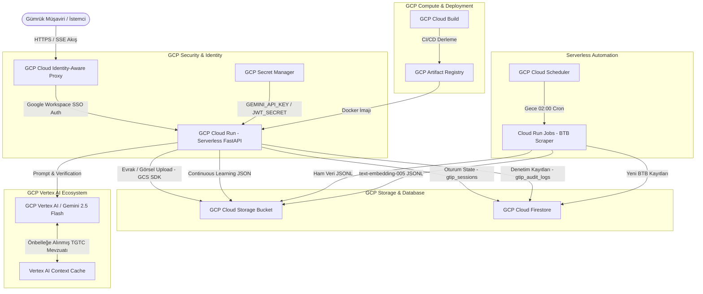

# GCP (Google Cloud Platform) Bulut Servisleri ve Mimari Raporu

**GTİP Tespit ve Karar Destek Sistemi**, %100 Google Cloud Platform (GCP) native ve Serverless prensipleriyle tasarlanmıştır. Sistemde toplam **9 adet kritik GCP servisi ve bulut teknolojisi** entegre olarak çalışmaktadır.

---

## 📊 GCP Servisleri ve Teknoloji Özet Tablosu

| # | GCP Servisi | Kategorisi | Projedeki Kullanım Amacı ve Metodolojisi | İlgili Dosya / Modül |
| :-: | :--- | :--- | :--- | :--- |
| **1** | **GCP Cloud Run** | Serverless Compute | Containerize FastAPI backend uygulamasının otomatik ölçeklenen (0-to-N autoscaling) HTTP mikroservisi olarak çalıştırılması. Memory: 2Gi, CPU: 2, concurrency: 80, max-instances: 100. | [deploy_gcp.sh](file:///c:/Users/yusuf/Github/yapay-zeka-gtip-tespiti/scripts/deploy_gcp.sh), [Dockerfile](file:///c:/Users/yusuf/Github/yapay-zeka-gtip-tespiti/Dockerfile) |
| **2** | **GCP Artifact Registry** | Container Management | Docker konteyner imajlarının (`gtip-repo/backend:latest`) güvenli ve versiyonlu olarak saklandığı merkezi imaj deposu. | [deploy_gcp.sh](file:///c:/Users/yusuf/Github/yapay-zeka-gtip-tespiti/scripts/deploy_gcp.sh) |
| **3** | **GCP Cloud Build** | Serverless CI/CD | Kod değişikliklerinin bulut ortamında otomatik olarak Docker imajına dönüştürülmesi (`gcloud builds submit`). | [deploy_gcp.sh](file:///c:/Users/yusuf/Github/yapay-zeka-gtip-tespiti/scripts/deploy_gcp.sh) |
| **4** | **GCP Vertex AI / Google GenAI SDK** | Foundation Models / AI | Gemini 2.5 Flash modelleri ve `text-embedding-005` ile metin işleme, multimodal özellik çıkarımı ve vektörleştirme. | [config.py](file:///c:/Users/yusuf/Github/yapay-zeka-gtip-tespiti/api/config.py), [feature_extractor.py](file:///c:/Users/yusuf/Github/yapay-zeka-gtip-tespiti/api/modules/feature_extractor.py) |
| **5** | **Vertex AI Context Caching** | AI Performance / Memory | TGTC 99 Fasıl izahnameleri ve GİR kurallarının Vertex AI belleğinde saklanarak yanıt süresinin **%60-70 düşürülmesi** ve token maliyetinin **%80 azaltılması**. | [context_cache_manager.py](file:///c:/Users/yusuf/Github/yapay-zeka-gtip-tespiti/api/modules/context_cache_manager.py) |
| **6** | **GCP Cloud Storage (GCS)** | Object Storage | Yüklenen ürün görselleri, faturalar ve resmi evrakların saklandığı yüksek erişilebilirlikli bucket. Production'da gerçek GCS upload (`google-cloud-storage` SDK). Continuous learning kararları `continuous_learning/` prefix'i ile GCS'e kaydedilir. | [main.py](file:///c:/Users/yusuf/Github/yapay-zeka-gtip-tespiti/api/main.py), [sync_customs_data.py](file:///c:/Users/yusuf/Github/yapay-zeka-gtip-tespiti/scripts/sync_customs_data.py) |
| **7** | **GCP Cloud Firestore** | NoSQL Database | Analiz oturum durumlarının (`gtip_sessions`), denetim kayıtlarının (`gtip_audit_logs`) esnek NoSQL yapısında saklanması. Emülatör modunda SQLite fallback kullanılır. | [audit_logger.py](file:///c:/Users/yusuf/Github/yapay-zeka-gtip-tespiti/api/db/audit_logger.py), [gcp_emulator.py](file:///c:/Users/yusuf/Github/yapay-zeka-gtip-tespiti/api/db/gcp_emulator.py) |
| **8** | **GCP Identity-Aware Proxy (IAP)** | Security / SSO | Gümrük müşavirlerinin kurumsal Google Workspace e-postaları ile Zero-Trust mimarisinde şifresiz ve güvenli giriş yapması. Cloud Run `--no-allow-unauthenticated` ile IAP üzerinden kilitlidir. | [auth.py](file:///c:/Users/yusuf/Github/yapay-zeka-gtip-tespiti/api/security/auth.py) |
| **9** | **GCP Cloud Scheduler & Cloud Run Jobs** | Serverless Cron Tasks | Ticaret Bakanlığı'nın güncel BTB kararlarını her gece otomatik çeken ve vektör veritabanını taze tutan serverless zamanlanmış görev. | [sync_customs_data.py](file:///c:/Users/yusuf/Github/yapay-zeka-gtip-tespiti/scripts/sync_customs_data.py) |
| **10** | **GCP Secret Manager** | Güvenli Yapılandırma | `GEMINI_API_KEY` ve `JWT_SECRET_KEY` gibi kritik sırların kaynak koddan ayrılarak güvenli şekilde yönetilmesi. `config.py`'de önce env var, yoksa Secret Manager'dan okunur. | [config.py](file:///c:/Users/yusuf/Github/yapay-zeka-gtip-tespiti/api/config.py), [deploy_gcp.sh](file:///c:/Users/yusuf/Github/yapay-zeka-gtip-tespiti/scripts/deploy_gcp.sh) |

---

## 🏗️ GCP Mimari Şeması (Cloud Architecture Diagram)

---

## 🛠️ Detaylı GCP Servis Analizleri

### 1. GCP Cloud Run (Serverless Uygulama Sunucusu)
* **Bölge (Region):** `europe-west3` (Frankfurt) - Türkiye erişimlerinde en düşük ağ gecikmesi (low-latency) sağlayan birincil bulut bölgesi.
* **Mimarisi:** Multi-stage Docker imajı. Scale to Zero (kullanım olmadığında sıfır maliyet), yoğun trafikte 100 kopyaya kadar otomatik ölçekleme.
* **Kaynak Yapılandırması:** `--memory 2Gi --cpu 2 --concurrency 80 --max-instances 100`
* **HTTP/2 & Streaming Desteği:** Server-Sent Events (SSE) ile canlı analiz aşamalarını istemciye aktarır.
* **uvicorn Multi-worker:** `WEB_CONCURRENCY` env var ile 4 worker (varsayılan), multi-core kullanımı.

### 2. GCP Secret Manager (Güvenli Yapılandırma)
* `gtip-gemini-api-key` ve `gtip-jwt-secret` secret'ları Cloud Run deploy zamanında `--set-secrets` ile bağlanır.
* `config.py`'de önce ortam değişkeni, yoksa Secret Manager API ile dinamik okuma yapılır.
* Geliştirme ortamında Secret Manager erişimi olmasa bile env var fallback devreye girer.

### 3. GCP Vertex AI & Context Caching (Yapay Zeka Katmanı)
* **Model Çeşitliliği:**
  * `gemini-2.5-flash-lite-preview-06-17`: Hızlı ve hafif multimodal ürün nitelik çıkarımı.
  * `gemini-2.5-flash`: Katı yasal predikat doğrulayıcı (Legal Fact Verifier).
  * `text-embedding-005`: Gümrük mevzuatı ve BTB kararlarının 768-boyutlu vektör temsili.
* **Context Caching Metodolojisi:** Türk Gümrük Tarife Cetveli (TGTC) 99 Fasıl izahnameleri ve GİR 1-6 kuralları `ContextCacheManager` üzerinden Vertex AI önbelleğine (TTL: 86400s) yüklenir.

### 4. GCP Identity-Aware Proxy (IAP) & Google Workspace SSO
* Cloud Run servisi `--no-allow-unauthenticated` ile dağıtılır; tüm istekler IAP üzerinden geçer.
* İsteklerdeki `x-goog-iap-jwt-assertion` ve `x-goog-authenticated-user-email` başlıkları doğrulanarak kullanıcı rolleri (`broker_assistant`, `senior_broker`) atanır.

### 5. GCP Cloud Storage (GCS) & Cloud Firestore
* **GCS:** İthalat faturaları, teknik çizimler ve ürün fotoğrafları `google-cloud-storage` SDK ile gerçek GCS bucket'ına upload edilir. Emülatör modunda `/tmp` dizinine fallback uygulanır.
* **Firestore:** `gtip_sessions` koleksiyonu ile oturum state'i Cloud Run restart'larında korunur. `gtip_audit_logs` koleksiyonu denetim kayıtlarını tutar. Emülatör modunda SQLite fallback devreye girer.

---

## 🎯 Sonuç ve Katma Değer

Sistem, geleneksel sunucu (VM/EC2) yönetim yükünü tamamen ortadan kaldıran **%100 Cloud Native** ve **Serverless** bir mimariye sahiptir. Bu sayede:
1. **Sıfır Sabit Maliyet:** Kullanılmadığı zaman sunucu maliyeti oluşmaz (Scale to Zero).
2. **Yüksek Güvenlik:** GCP IAP (`--no-allow-unauthenticated`) + Secret Manager + Google Workspace SSO ile kurumsal kimlik doğrulaması ve sır yönetimi garanti edilir.
3. **Maksimum Performans:** Vertex AI Context Caching, Cloud Run multi-worker concurrency ve asyncio.gather batch analizi ile analiz yanıt süreleri optimize edilmiştir.
4. **Dayanıklılık:** Firestore persistent state sayesinde Cloud Run instance yeniden başlatmalarında oturum ve audit kayıtları korunur.
