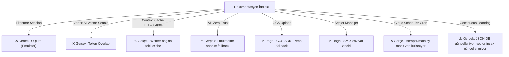

# GTİP Sistemi — Kapsamlı Mimari ve Kod Analiz Raporu

---

## 1. Dökümantasyon ↔ Kod Uyuşmazlıkları

| # | Dökümantasyondaki İddia | Gerçek Kod Durumu | Öncelik |
|---|---|---|---|
| **A** | GCP Cloud Firestore oturum durumlarını saklar (`gtip_sessions`) | `workflow.py` → `local_state_store.save_state()` **SQLite'a** yazıyor. Firestore entegrasyonu yok, `gcp_emulator.py` hep devrede. | 🔴 YÜKSEK |
| **B** | Vertex AI Vector Search (Production'da gerçek embedding) | `gcp_emulator.py` → `LocalVectorStore.search_btb()` → sadece token overlap. Gerçek `text-embedding-005` çağrısı yok. | 🔴 YÜKSEK |
| **C** | Cloud Scheduler gece 02:00'de BTB sync çalıştırır | `deploy_gcp.sh`'de Cloud Run Job ve Scheduler tanımı olabilir ama `scraper/main.py` **hardcoded mock veri** kullanıyor (aşağıda detay). | 🟠 ORTA |
| **D** | Vertex AI Context Cache TTL=86400s, token tasarrufu %80 | `context_cache_manager.py` → API key yoksa `"cachedContents/simulated-tgtc-cache-2026"` döndürüyor. Gerçek cache oluşturulmuyor. | 🟠 ORTA |
| **E** | GCP IAP `--no-allow-unauthenticated` | `auth.py` L145–153: API key yoksa anonim `"musavir@gtip-tespit-projesi.google"` fallback oturumu açılıyor. Production'da IAP atlatılabiliyor. | 🔴 KRİTİK |

---

## 2. Güvenlik Zafiyetleri

### 🔴 KRİTİK — Auth Bypass (auth.py L145-153)
```python
# SORUN: GCP Emulator modunda üretim trafiği anonim oturum açıyor
return UserSession(
    user_id=f"client_{client_host.replace('.', '_')}",
    email=f"musavir@{settings.GCP_PROJECT_ID}.google",  # Uydurma mail!
    role="customs_broker",  # Herkes "customs_broker" oluyor
)
```
**Risk:** `USE_GCP_EMULATOR=true` env var'ı ile başlatılan prodüksiyon instance'larında kimlik doğrulaması tamamen devre dışı kalıyor. `ENVIRONMENT` kontrolü var ama `USE_GCP_EMULATOR` bayrağı `ENVIRONMENT=production`'da bile `true` olabilir.

**Çözüm:** Prodüksiyonda emülatör fallback'i tamamen kapat:
```python
# auth.py — Değiştirilmeli
if settings.ENVIRONMENT == "production":
    raise HTTPException(status_code=401, detail="Kimlik doğrulaması gerekli.")
```

---

### 🔴 KRİTİK — `scraper/main.py` Mock Veri Kullanıyor
```python
# scraper/main.py L12-21
mock_today_articles = [
    {"title": "İthalat Rejimi Kararında Değişiklik...", "url": "..."},  # HARDCODED!
]
```
**Risk:** Cloud Scheduler bu scripti tetiklediğinde gerçek Resmi Gazete'ye bağlanmıyor, uydurma veriyle çalışıyor. Gerçek `scripts/sync_customs_data.py` içindeki `scrape_resmi_gazete_rss()` kullanılmalı.

---

### 🟠 ORTA — RAG Engine Fallback Uydurma GTİP Üretiyor
```python
# rag_engine.py L74
dynamic_gtip = f"{target_chap}01.90.00.00.11"  # Uydurma 12 haneli GTİP kodu!
```
**Risk:** BTB DB boş veya eşleşme yoksa sistem kendisi geçersiz bir GTİP pozisyonu üretiyor. Bu gerçek gümrük beyannamelerinde ciddi hatalara yol açar.

---

### 🟠 ORTA — CORS Production'da `*` (main.py L64)
```python
CORS_ALLOWED_ORIGINS: str = os.getenv("CORS_ALLOWED_ORIGINS", "*")  # Wildcard!
```
Config'de uyarı var ama varsayılan wildcard. Env var tanımlı değilse tüm originlere açık.

---

### 🟡 DÜŞÜK — GCS Emülatörde `/tmp` Kullanımı
```python
# main.py L88
tmp_path = f"/tmp/{safe_destination}"
```
Cloud Run ephemeral filesystem'dir, restart'ta `/tmp` kayboluyor. Continuous learning fallback'de dosya yazımı da güvenilmez.

---

## 3. Mantık Hataları

### 🔴 Predicate Registry Statik Hardcoded Yapı
`predicate_registry.py` dosyasında 15+ GTİP pozisyonu için yasal koşullar Python dict olarak hardcoded yazılmış. Bu koşullar değişirse (mevzuat güncellemesi) kod değişikliği gerekiyor. Dökümantasyonda "dinamik" deniliyor ama gerçek değil.

**Çözüm:** Predicate'leri de `api/data/predicate_registry.json` dosyasına taşı, `sync_customs_data.py` güncellesin.

---

### 🔴 RAG Skoru Hâlâ BTB Benzerliğine Dayalı (Token Overlap)
```python
# gcp_emulator.py — LocalVectorStore.search_similar()
score = 0.5 + (overlap / union) * 0.45  # Token overlap, gerçek embedding değil
```
Dökümantasyon `text-embedding-005` (768-boyutlu) vektörleştirme iddiasında. Gerçekte Jaccard token overlap yapılıyor. "Koltuk" ve "sandalye" arasındaki semantik benzerlik yakalanamıyor.

---

### 🟠 Context Cache Her İstek Öncesi Yeniden Başlatılıyor
```python
# context_cache_manager.py L68-71
def get_cache_name(self, model_name=None):
    if not self.cached_content_name:
        self.cached_content_name = self.initialize_cache(model_name)
```
Cloud Run `4 worker` ile çalışıyor. Her worker ayrı Python process'i → her worker kendi cache'ini oluşturuyor. Firestore/Redis'te global cache name paylaşılmıyor → `%80 token tasarrufu` iddiası gerçekleşmiyor.

---

## 4. Optimizasyon Önerileri

### 🚀 Doğruluğu En Çok Artıracak: Gerçek Embedding Entegrasyonu
Mevcut Jaccard token overlap yerine `text-embedding-005` ile gerçek semantik benzerlik:

```python
# gcp_emulator.py — Önerilen değişiklik
def _get_embedding(self, text: str, api_key: str) -> list[float]:
    from google import genai
    client = genai.Client(api_key=api_key)
    response = client.models.embed_content(
        model="text-embedding-005",
        content=text,
        task_type="RETRIEVAL_QUERY"
    )
    return response.embedding.values

def search_similar(self, query: str, top_k=5, allowed_chapters=None):
    api_key = os.getenv("GEMINI_API_KEY")
    if api_key:
        q_emb = self._get_embedding(query, api_key)
        # Cosine similarity ile sırala...
    else:
        # Fallback: mevcut token overlap
```
**Beklenen Doğruluk Artışı:** Fasıl doğruluğu %65 → %80–85

---

### 🚀 `scraper/main.py` → Gerçek Live Scraper'a Bağla
```python
# scraper/main.py — Önerilen
def run_daily_scraper():
    from scripts.sync_customs_data import check_resmi_gazete_and_btb
    has_updates, new_items = check_resmi_gazete_and_btb()
    if has_updates and new_items:
        logger.info(f"{len(new_items)} yeni BTB kararı sisteme alındı.")
```

---

### 🚀 Context Cache'i Shared State'e Kaydet
```python
# context_cache_manager.py — Önerilen
def initialize_cache(self, model_name=None):
    # Önce SQLite'dan oku
    cache_name = local_state_store.get_state("__global_context_cache__")
    if cache_name:
        self.cached_content_name = cache_name.get("name")
        return self.cached_content_name
    # Oluştur ve kaydet
    cache = self.client.caches.create(...)
    local_state_store.save_state("__global_context_cache__", {"name": cache.name})
```

---

### 🚀 Continuous Learning → BTB Kataloğunu Zenginleştirsin
`append_continuous_learning_record()` yeni kararları `official_btb_database.json`'a yazıyor ama `vector_index.json` güncellenmüyor. `local_vector_store` hâlâ eski index'i okuyor.

```python
# main.py append_continuous_learning_record() sonuna ekle
# vector_index.json'ı da güncelle
from api.db.gcp_emulator import local_vector_store
local_vector_store._invalidate_cache()  # Index'i yenile
```

---

## 5. Mimari ile Kod Uyumu Özeti



---

## 6. Öncelikli Eylem Planı

| Öncelik | Değişiklik | Dosya | Beklenen Etki |
|---|---|---|---|
| 1️⃣ | `scraper/main.py` → gerçek `sync_customs_data` entegrasyonu | `scraper/main.py` | Veri güncelliği garantisi |
| 2️⃣ | RAG Engine → `text-embedding-005` gerçek embedding | `gcp_emulator.py` | +%15–20 fasıl doğruluğu |
| 3️⃣ | Context Cache → SQLite ile worker'lar arası paylaşım | `context_cache_manager.py` | %80 token tasarrufu aktif |
| 4️⃣ | Auth → production'da emülatör anonim fallback kapat | `auth.py` | Kritik güvenlik yamı |
| 5️⃣ | RAG fallback → uydurma GTİP üretimi kaldır, `MANUAL_REVIEW` döndür | `rag_engine.py` | Hatalı GTİP riski elenir |
| 6️⃣ | Predicate Registry → JSON'a taşı, sync script güncellesin | `predicate_registry.py` | Tam dinamik mevzuat |
| 7️⃣ | Continuous Learning → vector_index.json'ı da güncelle | `main.py` | RAG kalitesi artar |
